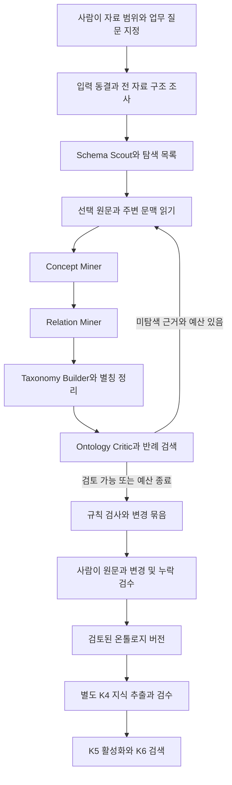

# 자율 탐색 기반 온톨로지 초안 구축 계획

- 작성일: 2026-09-30. 상태: **구현 전 설계안**. 현재 코드 확인과 외부 방법론 조사에 근거하며, 아래 추가 기능과 효과는 아직 구현·측정한 결과가 아님.
- 목표: **허용된 회사 자료를 로컬 LLM이 스스로 선택·탐색·분석하여 근거가 연결된 온톨로지 변경안을 만들고, 사람이 마지막에 의미와 영향을 검수하여 승인.**
- 설계 입력: 사용자가 제공한 `에이전트 기반 온톨로지 초안 구축.md` 전체 24절, [회사 지식 PRD](../../00_overview/company_knowledge_prd.md), 현재 `app/knowledge`와 `/knowledge` 화면.
- 방향: 기존 K2~K6와 이번 입력 도구를 확장. 중앙 직렬 실행기, 역할별 구조화 호출, 기존 SQLite·LinkML·검수 화면 사용. 별도 멀티에이전트 서버·작업 큐·그래프 DB는 추가하지 않음.
- 이번 산출물: 구현 범위·데이터 계약·탐색 알고리즘·가드레일·사람 검수·검증 계획. 코드 구현, 자료 추가 수집, 온톨로지 생성, 커밋·푸시는 수행하지 않음.
- 보완: OntoEKG 제안 검토 결과를 A2~A6의 판단·검수·평가 계약에 반영. A1~A6 순서와 기본 모델 호출 단계 유지. 논문의 방법과 이 프로젝트에서 확인한 성능을 구분.

## 1. 핵심 결정

1. **자율성의 대상은 허용된 자료 안에서의 탐색과 제안.** 회사 네트워크·임의 폴더·계정 탐색이나 운영 지식 쓰기 권한은 부여하지 않음.
2. **발견과 축적을 분리.** 개념 체계를 발견하는 실행은 온톨로지 변경안을 생성. 승인된 체계로 실제 단지·공고 등의 정보를 채우는 실행은 기존 K4를 사용.
3. **전 자료를 프로그램으로 살피고 필요한 부분을 LLM으로 읽음.** 반복 CSV 행은 구조·분포·예외를 먼저 확인하고, 규정의 조건·예외·참조는 원문 문맥과 함께 탐색.
4. **검수 대상을 줄이되 누락을 숨기지 않음.** 사람이 보는 기본 단위는 변경 묶음과 CQ별 누락표. AI의 설명이나 자신감보다 원문·반례·영향을 먼저 제시.
5. **기업 공통 기반은 재사용 가능한 메타모델과 선택형 패턴.** 특정 회사의 조직·용어·정책을 모든 회사에 미리 확정하지 않음.

기존 PRD에서 제외한 ‘무제한 자율 탐색’은 계속 제외. 이번 계획은 승인된 입력 묶음 안에서 예산을 가진 후속 구축 기능이다. K7의 사용자용 종합 검색과 목적·자료 상태가 다르므로 같은 실행기로 합치지 않음. 기존 K1~K6 완료 기록이나 12과제 정답도 변경하지 않음.

## 2. 현재 구현과 정확한 빈틈

2026-09-30 작업 트리의 정적 코드 확인 기준. 이전 문서의 EXAONE·Qwen 3.5 및 K5 미구현 표기는 현재 코드의 기준으로 사용하지 않음.

| 기능 | 현재 구현 | 추가할 것 |
|---|---|---|
| 입력 범위 | `discovery_inputs.py`: manifest 기반 목록·읽기·키워드 검색, 19파일, 자료별 해시 확인 | 실행 단위 동결, 기존 원장 ID 연결, 구조 프로파일, 공정한 자료별 검색 |
| 파싱·근거 | `service.py`, `parsers.py`, `repository.py`: Source/Version/Block/Evidence·위치·직렬 실행 | TXT/MD·CP949 CSV의 입력 도구 결과를 기존 근거 계약에 적재. 질의마다 재파싱하지 않음 |
| 온톨로지 초안 | `ontology_run.py`: 선택된 모든 블록을 분석 후 설계·검토, 필요 시 수정 1회 | Scout의 다음 자료 선택, 개념/관계 분리 분석, 추가 근거 탐색, 계층·별칭 후보 |
| 모델 | 초안 `STRUCTURING_MODEL=gemma4:31b-it-q4_K_M`, 검토 `KNOWLEDGE_REVIEW_MODEL=qwen3.8:27b-q4_K_M`; `call_ollama()` 및 `think=False` | 동일 설정과 호출 경계 재사용. 실제 모델 digest·단계별 입력/시간/출력 절단 기록 |
| 후보 종류·ID | `Candidate`: concept/attribute/relation. 현재 프롬프트가 모델에 영문 ID 작성 요청 | 시스템 발급 ID, 어휘 개념·계층·별칭·병합·폐기, 원문 명시/설계 제안 구분 |
| 정본·결정 | `ontology_schema.py`: LinkML 정본·JSON Schema 파생, 수락/수정/보류/기각·revision 검사 | 변경 전후·의존·영향, 불완전 후보 별도 저장, 새 변경 종류에 맞는 검증 |
| 사람 검수 | `KnowledgeOntology.tsx`: 후보 편집, 원문 조회, 일괄 수락, 접힌 AI 검토 JSON | 반례와 주변 문맥 기본 표시, 위험별 묶음, 누락표, 수정 후 판단 근거 기록 |
| 지식 축적 | K4 근거 정렬·개체 연결·주장 검수 | 새 온톨로지와 매핑 호환성 확인. 기존 LH ID/필드 매핑은 범용 회사 추출기가 아님 |
| 사용 지식 | K5 스냅샷 활성화·되돌리기·사용 상태, K6 Local 검색 | 새로운 정의/병합/폐기가 기존 참조에 주는 직접 영향을 승인 전에 표시 |
| 감독 효과 | 결정 이력은 존재 | 사람이 오류·누락을 실제로 찾아 수정하는지 별도 소규모 사람 시험 필요 |

**최우선 연결 문제:** 입력 도구의 `file_id + block_index`는 K3의 `source_version_id + parse_run_id + evidence_id`가 아니다. 현재 도구를 LLM에 붙이는 것만으로 근거 검토·승인까지 연결됐다고 볼 수 없다.

## 3. 사용할 자료와 완료 범위

- [확정 목록](../../../configs/knowledge/lh_input_bundle_20260930/input_manifest.json)을 실행 입력의 유일한 등록부로 사용.
- `current_discovery`: 현재 업무 9자료원·11파일. 먼저 빈 회사 온톨로지에서 발견.
- `contrast_extension`: 위 결과를 사람이 검토한 버전을 기준으로 2자료원·4파일 추가. 임대 유형별 정의와 적용 범위 차이 검토.
- `historical_change`: 별도 빈 기준에서 2020년 자료를 단계별 추가. 현재 업무 자료·후속 단계의 원문/검색 인덱스/요약/기존 후보를 섞지 않음.
- 법령은 공개 임대업무의 조건·분류 근거, CSV는 실제 필드와 표기·식별 구조, API 명세는 시스템 인터페이스의 필드·코드 설명으로 사용. API 예시 응답값은 실제 업무 사실로 적재하지 않음.
- 권리 미확인 보류 문서는 계속 제외. LH 문의 발송은 이용허락이 아님. [발송 기록](../../../configs/knowledge/lh_input_bundle_20260930/permission_request_draft.md)의 회신 조건에 따라 목록을 별도로 갱신.
- 현재 묶음으로 확인할 것은 공개 임대업무의 개념 발견·구분·변경 검수. 내부 조직 책임·실제 업무 처리·시스템 상태까지 채우려면 해당 권한 있는 자료가 필요하며, 빈 항목은 자료 공백으로 표시.
- 모델에는 원문·출처·버전·자료 역할·질문만 제공. 권리 심사 메모, 이전 평가 정답, 사람이 작성한 예상 개념 목록, 이번 연구 보고서는 생성 입력에서 제외.

## 4. 회사 공통 기반과 회사별 지식

**가능한 공통화:** 같은 회사 지식을 미리 만드는 대신, 지식을 표현하고 검토하는 방식과 반복되는 설계 패턴을 재사용.

| 계층 | 사전 구축 내용 | 회사 적용 방식 |
|---|---|---|
| 공통 메타모델 | SourceVersion, Evidence, Class, VocabularyConcept, Entity, Assertion, ChangeSet, Decision, Run, Snapshot | 코드·계약으로 공통 사용. 업무상 사실은 포함하지 않음 |
| 선택형 패턴 | 조직/조직단위/역할, 문서/정책/절차, 업무 대상/시설, 상태/사건, 조건부 관계·기간 | 작은 로컬 LinkML 패턴 묶음. Scout가 원문과 연결해 ‘재사용 제안’. 선택되지 않은 패턴은 출력하지 않음 |
| 회사별 확장 | 회사 용어·정의·속성·관계·예외·공식 ID·업무 질문 | 회사 원문 근거와 사람이 승인한 변경으로만 추가 |
| 실제 지식 | 특정 공고·시설·조직·시점별 값과 관계 | 승인된 온톨로지를 사용하는 K4 후보·검토 경로 |

- PROV-O의 출처/활동/수행자 구분, SKOS의 대표명·별칭·관련 개념, W3C ORG의 조직/단위/역할 패턴을 참고. 표준 전체와 추론 엔진을 설치하는 요구가 아님 [R3~R5].
- `is_a`는 종류의 포함, `part_of`는 부분 관계, `broader`는 어휘 분류. 조직의 소속·보고 관계를 클래스 상속으로 바꾸지 않음.
- 패턴에는 정의, 허용 관계, 쓰면 안 되는 경우, 출처/라이선스, 버전만 보관. 산업별 정답·회사 원문·기존 회사 별칭을 다른 회사에 복제하지 않음.
- 첫 Scout는 자료 구조를 먼저 설명한 뒤 관련 패턴과 비교. 기본 패턴 밖 표현도 후보로 만들 수 있게 하여 기존 분류에 끼워 맞추는 편향을 줄임.
- baseline 버전과 회사 확장 버전을 각각 고정. 공통 패턴 변경이 기존 회사 버전을 자동 갱신하지 않음.
- 효율화 가설: 반복 스키마 작성과 검수 항목 설계를 줄일 수 있음. 절감 시간과 교차 회사 재사용성은 미측정. LH 성공만으로 모든 회사 적용을 입증하지 않음.

## 5. 중앙 제어형 에이전트 파이프라인



| 역할 | 입력과 실제 작업 | 구조화 출력 |
|---|---|---|
| Schema Scout | 파일별 구조·목차·표헤더·필드·대표 문맥, CQ, 선택형 패턴 | 자료 역할, 자료군, 우선 읽을 unit_id와 이유, 초기 쟁점 |
| Concept Miner | 선택 원문, 승인된 기존 정의·어휘의 관련 부분, 목표 추상화 수준 | 원문 언급·위치, 유형/어휘/개별 대상/속성값/판단 불가 구분, 명시적 정의 또는 사례 기반 제안 |
| Relation Miner | 같은 원문·확정된 임시 참조·개념 후보 | 관계 정의 또는 사실 표본, 주체/대상, 방향, 부정·조건·시점·진술 성격 |
| Taxonomy Builder | 관련 후보 묶음과 승인된 기존 정의 | is_a/broader/part_of 구분, 계층 방향·동치 가능성·판단 불가, 별칭·중복·병합 제안과 근거 |
| Ontology Critic | 후보, CQ, 독립 검색한 관련·상충 문맥 | 구체적인 결함·누락, 반례 ID, 추가 읽기 요청 또는 보류 이유 |
| 결정적 제어기 | 역할 출력과 실제 원장 상태 | 허용 도구 실행, 다음 단위, 예산, 검증, ID 발급, 변경 집합 |

- 다섯 역할은 별도 상주 프로세스가 아닌 프롬프트·스키마·허용 도구가 다른 순차 작업. Critic의 모델이 달라도 독립된 정답 판정으로 해석하지 않음.
- 개념과 관계 분석은 처음에는 별도 호출. 오류가 줄어든다는 주장은 하지 않으며, 반복 비용을 줄여야 할 때만 동일 원문으로 묶음 방식과 좁게 비교.
- Taxonomy/Synonym은 한 역할로 묶고 관련 후보만 비교. 모든 후보 쌍의 LLM 비교를 하지 않음.
- Critic에는 제안자의 ‘자신감’·투표 결과를 주지 않음. 우선 후보·원문·범위를 판단하고 필요할 때 설계 이유를 열람. 지지 근거만 재독하는 현재 검토 입력을 보완.
- 자유 서술 tool call 대신 Pydantic `action`을 받음. `read(unit_id)`, `search(query, filters)`, `lookup_term(label, type, scope)`, `request_evidence(issue_id, query)`, `finish(reason)`만 dispatch.
- shell, SQL, 임의 URL, 파일 경로, 네트워크 다운로드, 승인·활성화 도구는 에이전트에게 제공하지 않음. 공급자 전환용 범용 프레임워크도 추가하지 않음.

### 5.1 개념 발견과 추상화 수준

- Concept Miner의 기존 호출 안에서 원문 언급과 위치를 먼저 기록. 명시적 정의·분류표·필드 명세에서 유형을 직접 발견하는 경로와 개별 사례를 모아 공통 유형을 제안하는 경로 병행. 전체 개체 추출을 온톨로지 구축의 선행 조건으로 만들지 않음.
- 목표는 반복 활용할 업무 유형·조건·관계를 표현하는 것. 특정 대상·문서 버전·날짜·수치는 개체 표본 또는 값으로 구분하되, 역할·유형 여부가 모호하면 판단 불가로 남김.
- 고유명사·날짜·번호 포함, 단일 문서 등장, 사례 부족은 검토 신호. 이를 이유로 클래스 후보를 자동 거절하거나 반복 횟수만으로 클래스로 승격하지 않음.
- 회사별 후보에는 **원문/설계 출처와 CQ/허용 범위 연결을 모두 요구**. CQ만 있는 근거 없는 제안은 수락 불가. CQ 밖의 유효한 지식은 범위 항목에 연결하고, 허용 범위 밖 발견은 별도 기록으로 보존하여 현재 승인 집합에서 제외.
- 같은 실행에서는 승인 기준 버전을 고정. 문서별 관측과 기존 개념 대응을 분리하고, 미승인 후보는 상태를 표시한 비교 대상으로만 사용. 먼저 나온 후보를 후속 문서의 정답으로 취급하지 않음. 관련 후보 묶음을 Builder에서 비교하고 충돌을 보존.

### 5.2 제안된 계층만 양방향 검토

- Builder와 Critic의 기존 호출 안에서 제안된 계층에 한해 같은 범위·시점의 정의로 `모든 A는 B인가`, `모든 B는 A인가`를 검토. 각 방향에 지지·반증·판단 불가와 원문/정의 근거를 기록. 모든 개념 쌍 비교나 방향별 전용 호출은 추가하지 않음.
- A→B 또는 B→A의 근거가 있으면 해당 방향을 제안. 양방향 지지는 동치 검토 후보이며 자동 병합하지 않음. 양방향 부정도 무관·배타 관계를 뜻하지 않으며, 판단 불가인 방향을 부정으로 바꾸지 않음.
- 실제 사례는 반례 탐색에 사용. 관측한 사례의 일치만으로 보편적 포함을 확정하지 않으며 속성값 누락도 비소속의 증거로 취급하지 않음.
- 구조 관계 `is_a/instance_of/broader/part_of`는 종류와 대상 형식을 구분하여 모호한 메타 관계 생성을 막음. 회사별 업무 관계는 근거와 domain/range 검토를 거쳐 새로 제안 가능.
- is_a 순환은 이 제품의 계층 표현 규칙으로 차단. OWL에서 상호 포함이 반드시 모순은 아니라는 점과 구분 [R15]. 구조 검사와 의미 판단 결과를 별도 저장하며 양방향 질문만으로 의미 정확성을 보장하지 않음.

## 6. 구체적인 자료 순회 알고리즘

### 6.1 전체 구조 조사는 결정적 1회 처리

1. 선택 scope/step의 manifest 내용과 파일 해시를 실행에 저장. 파서 버전·옵션·baseline·CQ·기준 온톨로지·모델/프롬프트·예산도 고정.
2. 등록 파일을 한 번 읽어 기존 SourceVersion/ParsedBlock/Evidence로 연결. TXT/MD 위치와 CSV 인코딩은 입력 도구 결과를 보존. PDF의 페이지·행·셀·제목·각주 위치 유지.
3. 모든 파일의 파싱 성공/실패, 절·표 수, 필드명·결측·범주·날짜 표현·참조를 프로그램으로 조사. **전체 조사 = 전체 의미 분석은 아님.**
4. byte hash가 같은 사본은 내용 처리를 재사용하되 출처를 보존. 정정본·유사 문서는 하나로 합치지 않음. 동일 원본의 HTML/PDF/발췌물은 한 출처군으로 묶어 근거 수를 부풀리지 않음.
5. 읽기 단위는 절 또는 표의 문맥 묶음. 긴 표는 제목·다단 헤더·해당 행·단위·각주를 함께 전달. 문자 수로 잘린 마지막 부분을 조용히 버리지 않음.

### 6.2 반드시 읽을 범위와 표본을 구분

- **현재 작은 묶음의 법령 조문·별표·API 설명:** 선택한 원문 범위의 절·표를 모두 읽을 필수 목록으로 구성. 일부만 읽고 문서 전체를 검토했다고 표시하지 않음.
- **CSV:** 모든 행은 프로그램으로 프로파일링. LLM에는 스키마와 각 업무상 범주·결측/형식 변종·혼합 유형의 대표행을 제공. ID·주소 같은 고유값을 전수 개념화하지 않음.
- 선언된 허용 코드와 관측된 값 목록을 구분. 관측값만으로 enum·필수값을 확정하지 않음. 희소값은 확인 대상이지 업무 중요성이 높다는 증거가 아님.
- 범주 후보는 필드 사전·값 분포로 제안하되 어떤 필드의 의미를 아는지는 구분. 범주별 대표는 정렬된 안정 행 ID에서 선택하여 재현 가능하게 함.
- 대표행 집합 선택은 **미충족 특징을 가장 많이 덮는 행을 먼저 고르는 greedy set cover 휴리스틱** 사용. 동점은 희소 특징 포함, 짧은 입력, 안정 ID 순. 의미 완전성 보장 알고리즘으로 부르지 않음.
- 범주 조합을 모두 전개하지 않음. 실제 존재하는 혼합·예외 패턴만 대상으로 하고, 예산 밖 범주·조합은 누락표에 남김.
- 향후 대규모 문서는 자료 유형 × 업무 영역 × 시점의 층화 표본으로 시작. 각 문서군의 목차·구조는 전체 조사하며, 미방문 절 중 결정적으로 고른 감사 표본도 읽어 CQ 밖 지식을 발견. 현재 19파일에 별도 학습형 탐색기를 도입하지 않음.

### 6.3 다음 자료 선택은 설명 가능한 우선순위 큐

```text
우선순위 1: 파싱·문맥 복원이 필요한 필수 근거, 아직 읽지 않은 필수 절/표
우선순위 2: 기존 후보의 모순·예외·정의 범위 또는 미충족 CQ를 해결할 근거
우선순위 3: 아직 다루지 않은 자료군·범주·희소 표현과 명시적 문서 참조
우선순위 4: 이미 다룬 내용의 보강·반복 사례
각 순위 안: 자료군을 번갈아 선택 → 새 구조/미충족 특징 → 입력 비용 → 안정 ID
```

- 점수 가중치를 임의 학습하거나 LLM confidence로 순서를 확정하지 않음. 후보 선택 이유를 큐에 기록.
- 참조 확장은 선택 입력 안의 명시 문서/조문 ID에 한정. 참조 대상이 목록 밖이면 `자료 필요`로 남기고 자동 다운로드하지 않음.
- 특정 CQ가 없는 유효한 개념도 `자료 구조 발견`으로 제안 가능. 기존 K3의 모든 후보 CQ 필수 계약을 discovery 전용 모델에서는 `CQ 또는 범위 항목 연결`로 확장.
- 후보 생성량이 많은 자료에만 계속 예산을 주지 않음. 새 후보 수는 보조 관측값이며 후보의 정확성·유용성 대리 지표로 사용하지 않음.

### 6.4 근거 검색과 반례 수집

- 현재 substring 합산 검색은 CSV 앞부분의 동점 결과가 상위를 채울 수 있음. 기존 K6의 한국어 tokenizer·`bm25s`를 **순위 계산 부분만** 재사용하여 동결 블록을 실행당 한 번 색인.
- 자료군별 상위 결과를 먼저 확보하고, 유사 내용의 반복 결과를 뒤로 배치. 표 헤더만 맞은 결과보다 실제 값/본문의 일치를 구분. 출처 수와 근거 수를 별도 계산.
- 기본 질의: 후보 원문명·기존 별칭·관계 표현. 보완 질의: 범위·부정·예외·시점 차이와 Critic이 특정한 쟁점. `제외/다만/경우/변경` 등은 탐색 신호이며 그 단어가 없다는 이유로 예외가 없다고 판정하지 않음.
- 지지와 반례 검색을 별도 기록하되 키워드 히트는 진위 판정이 아님. 결과 원문을 실제 읽은 뒤 관계 판단.
- 표 셀 히트는 같은 표의 제목·헤더·관련 행·각주로 확장. 앞뒤 문맥을 복원할 수 없으면 후보를 `문맥 미확인`으로 보류 가능하게 함.
- 한국어 동의 표현 미검색이 확인되면 기존 로컬 임베딩과 MMR식 다양성 선택을 해당 경로에 추가 검토 [R8]. 첫 구현의 필수 의존성으로 만들지 않음. K6의 활성 지식 필터나 민원 Chroma collection을 그대로 사용하지 않음.

### 6.5 예산과 종료

- 아래 수치는 **첫 구현의 조정 가능한 실행 예산 제안**이며 실측 결과·산업 기준이 아님.
- 실행당 모델 호출 상한 48회, 검색 요청 상한 24회, 추가 탐색 라운드 최대 2회, 같은 후보 묶음 자동 수정 최대 1회. 역할과 상관없이 실패 호출도 예산에 포함.
- 초기 입력/출력은 기존 K3의 단계별 한도를 출발점으로 사용: 분석 4,000자 묶음·2,048 출력 토큰, 설계 4,096 출력 토큰, 후속 입력 12,000자 점검. 입력 전체와 모델 선언 컨텍스트를 함께 확인하며 문자를 토큰으로 간주하지 않음.
- 구조 조사 후 필수 분석 묶음 m과 Builder/Critic 예약 묶음 g를 산정. `1 + 2m + 2g`의 예상 최소 호출이 상한을 넘으면 시작 화면에 부분 완료 예상과 미처리 가능 범위를 표시. 표 문맥 보존을 위한 분할은 호출량을 늘릴 수 있음. 예산 조정은 운영자 선택이며 실행 중 자동 증액하지 않음.
- 예산이 부족하면 근거를 더 짧게 잘라 억지로 완료하지 않고 묶음을 분리. 설계/검토·결과 저장에 필요한 호출을 먼저 예약하여 발견만 하다 결과가 사라지지 않게 함.
- 호출 수 계산: Scout 1 + 분석 묶음 m당 Concept/Relation 2m + 후보 묶음 g당 Builder/Critic 2g + 수정 r. 추가 탐색의 분석·검토도 m/g/r에 포함. 도구 선택 전용 LLM 호출이 있으면 별도 합산하며 숨기지 않음.
- 범위 상태를 `구조 조사 / 원문 제공 / 분석 성공 / 검수 쟁점 생성`으로 구분. read 응답만으로 분석 완료 처리하지 않음. 필수 처리 수는 Concept/Relation 성공 산출물과 입력 해시·원문 범위가 함께 저장된 단위 기준이며 절단·형식 실패는 제외.
- `review_ready`: 필수 목록 처리, 모든 CQ/범위 항목에 근거 연결 또는 자료 공백/미해결 사유 존재, 제안 후보의 검증 상태 표시 완료.
- `partial`: 필수 미처리·파싱 실패·예산 종료. 확보된 유효 후보는 검수 가능하지만 전체 범위 완료로 표시하지 않음.
- 반복 질의와 동일 근거를 소비하는 요청은 재사용. 남은 자료 없이 같은 주장을 반복하면 종료하고 미해결로 남김. ‘새 후보가 안 나옴’만으로 완전 구축 판정하지 않음.

### 6.6 새 자료와 변경분의 증분 탐색

- 파일 해시가 같으면 기존 파싱 블록을 재사용. 파서 recipe가 바뀌면 새 parse Run으로 구분.
- 새 버전은 같은 공식 문서 계열에서 절/표 위치와 블록 내용의 diff로 대응. CSV는 확인된 키 열로 행을 대응하고 키가 없으면 임의 동일 행을 추정하지 않음.
- 변경된 단위, 그 단위를 인용한 후보/정의, 범위/시점상 영향을 받는 직접 참조를 다음 실행의 우선 큐에 넣음. 새 자료군은 구조 조사와 필수 문맥 탐색부터 수행.
- 기존 의미 분석 결과는 입력/모델/프롬프트/기준 온톨로지가 동일한 재개에서만 그대로 사용. 기준 정의가 바뀐 증분 실행에서는 기존 결과를 비교 자료로 쓰되 검토 완료로 자동 재사용하지 않음.
- 초기 판정은 정확한 파일/블록 대응과 직접 의존 중심. 의미만으로 추정한 변경 대응과 간접 영향은 검토 후보로 표시. 자료가 사라졌다고 그 내용이 거짓이거나 공식 철회됐다고 단정하지 않음.
- 전체 프로파일링은 입력 크기만큼 한 번 순회. CSV 대표행의 greedy 선택은 선택행 수에 따라 추가 비용 발생. LLM 비용은 전체 CSV 행 수가 아닌 분석/후보 묶음과 보완 횟수로 관리.

## 7. 저장과 식별 계약

### 7.1 입력 도구와 K2 원장 연결

- 기존 `sources/versions/blocks/evidence/runs` 재사용. `bundle_id, manifest_hash, source_id, file_hash, parser_version, locator`로 수입 결과를 대응.
- `file_id`의 배열 순서와 `block_index`만 장기 근거 ID로 쓰지 않음. 수입 시 기존 서버 발급 ID를 부여하고 실행 안에 대응표 저장.
- 실행 시작 후 read/search는 저장된 version/block을 사용. manifest 파일을 매 호출 다시 읽어 최신 자료로 바꾸지 않음. 새 해시·다른 입력·프롬프트·모델이면 새 실행.
- A1의 등록·수입은 `kind=parse` Run을 만들어 unit_id/block_order를 갖는 블록과 근거를 저장. 성공한 parse Run이 자신이 처리한 source version의 파싱 포인터만 갱신. 같은 파일의 파서 recipe 변경도 새 parse Run으로 처리하며 기존 실행이 고정한 parse/block 참조는 유지. 동일 파일/파서 recipe의 완료된 기존 parse는 재사용. discovery Run은 이 source/version/parse/block 대응표만 동결. 기존 행별 CSV 재파싱 루프는 사용하지 않음.
- 기존 parse run만 `latest_parse_run_id`를 갱신. discovery 작업이나 재시작이 기존 파싱 포인터를 변경하지 않도록 유지.
- 파싱 결과의 저장/중복 재사용은 서비스 계층이 담당. 입력 도구 전용 별도 DB나 원문 사본 저장 체계는 만들지 않음.

### 7.2 온톨로지와 어휘와 사실의 정본 분리

| 정보 | 정본 | 파생물 |
|---|---|---|
| 클래스·속성·관계·is_a·클래스 정의/별칭 | 기존 `ontology_versions.linkml_yaml`, 필요한 표준 필드와 annotation 확장 | JSON Schema, 추출 프롬프트, 화면 카드 |
| 클래스와 다른 통제 어휘·범위별 용어 별칭·broader/related·대체 ID | 같은 ontology version payload의 `vocabulary_registry` | 검색용 ID/별칭 인덱스 |
| 실제 대상과 사실 | 기존 entities/entity_links/assertions/evidence | 스냅샷 조회와 검색 문맥 |
| 실행·검토 | runs/changesets/decisions | 진행 화면·검수 지표 |

- 어휘를 모두 클래스로 변환하거나 모든 사실을 LinkML annotation에 넣지 않음. 하나의 정의를 YAML과 registry 양쪽에 중복 편집하지 않음. 클래스는 YAML, 어휘 개념은 registry가 소유.
- 둘을 하나의 불변 ontology version으로 트랜잭션 저장. 스키마 해시 외 registry 해시와 합성 version 해시를 기록하여 이름/별칭 변경도 추적.
- v2 조회는 저장된 LinkML 정본을 그대로 SchemaView·JsonSchemaGenerator에 전달. 현재 `_from_schema → build_schema`의 v1 후보 재구성 경로를 통과시키지 않아 is_a·새 annotation이 사라지지 않게 함.
- 기존 버전은 registry가 빈 값인 v1으로 읽고 기존 ID·LinkML을 보존. 일괄 재발급·기존 운영 데이터 마이그레이션을 선행하지 않음.

### 7.3 새 변경 후보 계약

```text
OntologyChangeV2
  change_id, target_id, operation(add/update/merge/deprecate)
  target_kind(class/attribute/relation/vocabulary_concept/hierarchy/alias)
  before, after, dependency_ids, affected_reference_ids
  support_type(explicit/design_proposal/unresolved)
  evidence_refs(source_version_id, parse_run_id, evidence_id, span, quote)
  counter_evidence_refs, qualifiers(scope, time, negation, statement_type)
  cq_ids, scope_item_ids, rationale, unresolved_issues
  # 계층 후보에만 양방향 판단·근거·반례 기록
  hierarchy_review(a_to_b, b_to_a, evidence_refs, counter_evidence_refs)
  validation, review_status
```

- LLM은 한 응답 안에서만 쓰는 `local_ref`와 기존 ID 후보를 반환. 서버가 UUID 기반 ID와 LinkML 호환 symbol을 부여하고 domain/range/local_ref를 함께 변환. 이름 변경으로 ID를 재발급하지 않음.
- 기존 K3 영문 ID는 유지. 기존 ID 재사용은 종류·존재·폐기 여부 확인과 의미 검수 대상. 공식 ID는 등록부에서 확인한 값만 사용.
- 병합은 삭제가 아니라 이전 ID→새 정본의 명시적 대응. 이름만 같거나 embedding이 비슷하다는 이유로 자동 병합하지 않음.
- `design_proposal`은 인용문과 일치하는 정의를 강제하지 않음. 설계에 사용한 원문과 이유를 요구. 원문에 없는 법적 의무·업무 사실은 설계 제안으로 포장하지 않음.
- 역할별 원출력은 Run에, 정규화한 v2 후보와 후보별 검증/미해결 상태는 **LinkML 생성 전에 changeset payload에 저장**. v1과 `payload_version=2`로 구분. 잘못된 참조 하나 때문에 정상 산출물까지 유실하지 않음. 정본은 참조가 닫힌 수락 집합으로만 생성하며 검증 실패 후보는 조회·수정·보류는 가능하되 수락 불가. 별도 후보 테이블은 추가하지 않음.
- 개체 표본은 개념 발견의 참고 자료로 보존하되 승인된 사실로 쓰지 않음. 온톨로지 승인 후 K4의 별도 사실 검수를 거침.

## 8. 실행 상태와 API

- 기존 직렬 executor와 Run 저장을 사용. 새 `kind=discovery` 경로만 추가. 기존 `kind=ontology` 수동 선택 흐름은 유지.
- Run payload: 동결 입력·profile·frontier·visited units·역할별 units·후보 local_ref 대응·CQ coverage·미해결·호출 지표·종료 이유.
- units는 `queued/running/succeeded/failed`와 입력 해시·출력·의존 unit ID를 저장. 성공한 단위는 동일 실행 재개 시 재호출하지 않음.
- 취소는 현재 모델 호출 종료 후. 결과 저장 이전에 프로세스가 죽은 호출은 성공으로 간주할 수 없으므로 재호출 가능성을 로그에 구분. ‘정확히 한 번 모델 호출’ 보장으로 표현하지 않음.
- 재시도는 실패 단계부터. 최종 사람 검수의 수정은 결정적 근거/구조 검사·diff·직접 영향·파생 스키마만 재계산. 추가 AI 분석은 자동 실행하지 않고 사람이 재생성을 요청한 경우 새 Run으로 처리. 범용 DAG 실행기로 확장하지 않음.

| API | 최소 추가 계약 |
|---|---|
| `POST /runs` | kind=discovery, bundle_id, manifest_hash, scope, step, cqs, scope_items, baseline_version, lineage_id, base_ontology_version_id, budgets |
| `GET /runs/{id}` | 상태, 동결 자료 범위, 읽은 범위, frontier, 호출/시간, 미해결, 종료 이유, changeset_id |
| `GET /discovery/sources|read|search` | 기존 개발 조회 유지. 실행기용 호출은 run_id로 동결된 범위에 바인딩 |
| `GET /candidates` | 기존 응답 봉투에 v2 변경·위험 사유·의존·반례·누락 상태 추가 |
| `POST /changes/{id}/decisions` | 기존 revision 검사 유지. v2는 expected_ontology_head_id 추가. 새 변경 유형과 수정/수락/보류/기각 지원 |
| `GET /ontologies/{id}` | 기존 LinkML·JSON Schema와 별도 어휘 registry·합성 버전 반환 |

- 역사 실행 시작 시 base version의 lineage·허용 source version·scope/step을 검사. 최초 단계는 빈 회사 기준, 이후는 같은 역사 계보의 현재 또는 이전 단계 head만 허용. `lookup_term`도 해당 기준 registry와 실행 내 후보에만 접근. 공통 baseline에는 회사별 정의·인스턴스가 없어야 함. 현재/미래 회사 registry를 검색하는 fallback은 없음.

초기 지원 bundle은 현재 확정 목록 하나. 다른 회사 자료는 운영자가 등록한 목록을 같은 계약으로 추가하며 API에서 임의 manifest 경로를 받지 않음.

## 9. 가드레일은 실제 실패 경계에 배치

| 경계 | 코드로 확인할 것 | 실패 시 처리 |
|---|---|---|
| 자료 접근 | 실행 목록 포함, 해시, 이용범위, 현재 사용중단 상태, scope/step | 읽기 거절 또는 작업 보류. 다른 자료로 조용히 대체하지 않음 |
| 도구 호출 | 허용 action·실재 ID·인자·예산. 파일/네트워크/SQL 권한 없음 | 잘못된 요청 기록, 무제한 재시도 금지 |
| 로컬 처리 | 모델/임베딩 endpoint가 승인된 처리 경계인지, 외부 fallback 없음 | 초기 모드는 loopback만 허용. 외부 API로 전환하지 않음 |
| 모델 출력 | Pydantic 형식·종류·길이·절단·참조 ID | 해당 단위 실패 또는 보완. 실패 결과를 빈 성공으로 기록하지 않음 |
| 근거 | 파일/버전/구간 존재·원문 인용 일치, 표 문맥 | 불일치 후보를 승인 가능 상태로 올리지 않음 |
| 구조 | domain/range 참조·선언 종류 일치, is_a 자기참조·순환, 폐기 ID 참조 | 해당 의존 묶음 차단. 다른 독립 후보의 검토는 허용 |
| 의미 | 유형/개체 판정, 정의 범위, 계층 방향, 예외·부정·시점, 오병합, 진술 성격 | Critic과 사람 검수. 코드 검증 통과를 의미 정확성으로 표시하지 않음 |
| 승인·반영 | actor, expected_changeset_revision, 기준 버전, 의존 결정, 참조 호환성 | 충돌 409 및 최신 diff 제시. AI는 decisions/activate에 접근 불가 |

- 원문 속 지시는 데이터로 취급. 구분된 prompt·제한된 도구·서버 dispatch로 간접 prompt injection의 실행 권한을 차단. 프롬프트 한 줄로 해결됐다고 주장하지 않음 [R11].
- `call_ollama()`는 이미 외부 fallback이 없지만 URL의 처리 경계 검사는 없음. discovery 시작 시 명시 검사하고 redirect·환경 proxy 우회를 막는 로컬 호출 설정 적용. 기본 모델 파일은 미리 설치하고 실행 중 모델 다운로드/OAK 외부 조회 없음.
- 내부 서버 모델은 향후 운영자가 endpoint와 경계를 승인한 경우에만 확장. 지금 상용 adapter·자동 선택기를 만들지 않음.
- 로그는 ID·해시·동작·시간·오류 중심. 원문·모델 입출력은 승인된 로컬 실행 산출물 영역에만 저장. 범용 로그·외부 telemetry에 원문 복제하지 않음.
- 로컬 사용 기본값은 loopback·신뢰된 단일 운영자. 현재 actor 문자열은 신원 인증이 아님. 기관 다중 사용자 공개 전에는 실제 인증/역할 정책이 필요하며 현재 계획의 파일럿에서 완료됐다고 표시하지 않음.
- 실행 재개·후속 모델 입력·후보 승인 직전에 기존 K5 사용상태를 재확인. 중단된 source/evidence를 쓴 성공 단위·요약·후보도 재사용 입력과 새 승인에서 제외하거나 해당 묶음을 보류. 고정한 입력 내용과 현재 이용 가능 여부는 별개이며 이력 보존은 자료 정책을 따름.
- 지식 접근권한과 자료 재배포 권한은 별개. 원문 전체 내보내기 허용을 발견 도구가 결정하지 않음.

## 10. 사람은 언제 무엇을 검수하는가

| 시점 | 사람의 일 | 시스템이 준비할 것 |
|---|---|---|
| 실행 시작 | 범위·허용 자료·주요 질문·제외 정보를 지정 | 기존 목록과 기본값 제공. 문서별 처리 순서나 개념 전체를 사람에게 설계시키지 않음 |
| 실행 중 예외 | 권리/접근 문제, 필요한 원문 부재, 예산 확장 요청에만 결정 | 나머지는 계속 처리하고 예외만 묶어 표시. 매 단계 승인 요청 없음 |
| 최종 변경 검수 | 원문이 의미를 지지하는지, 포함/제외·계층·병합·누락 확인 | 변경 전후·문맥·반례·영향·CQ 누락표 |
| 수정 후 승인 | 수정한 의미·근거 및 의존 항목 확인 | 구조/근거 검사만 재실행. 자동 AI 재평가를 추가하지 않음 |
| 지식 사용 | 검토된 온톨로지를 추출에 사용할지, 사실 묶음을 활성화할지 결정 | 기존 K4/K5의 별도 검토·사용 상태 유지 |

**‘마지막 변경사항 검수’는 ‘문맥 없이 diff만 보기’가 아님.** 기준 버전의 정의와 변경 주변 관계, 원문의 조건·예외, 바뀌지 않았지만 영향을 받는 참조를 함께 제공.

- 기본 화면은 업무 검토자가 확인할 의미·조건·예외·동일 대상 여부를 질문으로 제시. 클래스·슬롯·계층·ID 호환성은 모델링 담당자용 상세 정보로 구분하며, P0에서는 같은 사람이 두 역할을 겸임 가능. 별도 승인 조직이나 권한 시스템을 추가하는 요구가 아님.
- 반복 제안은 원문 근거와 개별 후보 ID를 보존한 검토 묶음으로 정리. 화면에서 묶는 동작을 개념 자동 병합으로 처리하지 않음. 불확실성·반례·허용 범위 밖 발견을 구분.
- 온톨로지와 사실 결정은 분리 저장하되 관련 항목을 한 문맥에서 볼 수 있도록 구성. A4에 별도 사실 검수 시스템을 다시 만들거나 두 번의 회의를 강제하지 않음.

### 검수 화면 최소 구성

- 상단: 기준 버전, 사용 자료, 미처리 범위, 전체 변경/보류/미해결 수. ‘AI 검증 완료’와 정답 확률 배지 대신 `형식 검사 통과`, `의미 검수 필요`를 구분.
- 왼쪽: 원문 제목·버전·역할, 절/페이지/표헤더, 강조 구간과 앞뒤 문맥. 한 클릭으로 원본 이동. 후보 선택만 해도 관련 문맥을 기본 표시.
- 가운데: 변경 전후의 정의·포함/제외·관계 방향·범위. 원문 명시와 설계 제안을 구별. AI 설명은 근거 아래 보조 정보로 배치.
- 오른쪽: 반례·충돌·중복 후보, 의존 변경, 기존 사실/추출 스키마의 직접 영향. 확인된 직접 참조 수만 표시하고 미탐색 영향은 별도 표기.
- 하단: CQ/범위 항목별 `근거 연결 / 자료 없음 / 미탐색 / 후보 누락 의심 / 보류` 표. 모델이 ‘충족’이라고 쓴 것만으로 질문 해결 판정하지 않음.
- 기본 결정은 미결정. AI 검토 의견에는 대상 후보 revision과 수정 전/후 여부를 표시하여 예전 의견을 최신 판정처럼 보이지 않게 함.
- 행동: 수락, 수정 후 수락, 기존 항목과 병합 제안 검수, 보류, 기각. 실제 저장할 전후 값·의존 항목을 확인하고 결정 이력 기록.

### 자동화 편향을 줄이는 선택적 절차

- 신규 계층, 범위 축소/확대, 병합·폐기, 근거 충돌이 있는 항목은 개별 검수. 핵심 구분 기준이나 반례 처리 사유를 짧게 기록하게 함.
- 표기 수정·근거를 바꾸지 않는 동일 종류 변경만 같은 영향 범위에서 일괄 처리. 현재 ‘모든 후보 수락’은 discovery 묶음에서는 제공하지 않음.
- 필요한 문맥이 없으면 수락 대신 자료 보완·보류가 즉시 가능. 반례를 AI가 기각했어도 사람이 원문과 함께 볼 수 있음.
- 필수 대기시간·모든 후보 장문 설명·화면 열기 횟수로 감독을 인증하지 않음. 이런 마찰이 항상 오류를 줄이는 것은 아니며 실제 사용자 시험으로 판단 [R9~R10].
- 평가용으로 만든 잘못된 후보를 실제 운영 검수에 몰래 넣지 않음. 분리된 검수 시험에서만 사용하고 종료 후 설명.

## 11. 효과적인 감독을 시험하는 최소 계획

**기능 검사와 사람의 감독 효과를 구분.** AI 전문가 검수는 계획의 결함을 찾는 용도이며 실제 사람의 오류 발견률을 대체하지 못함 [R9].

### 11.1 구현 중 필요한 기능 확인

1. 선택 scope/step 밖 원문과 미래 버전이 read/search/요약에 섞이지 않는지, 취소·재개 때 성공 단위가 유지되는지.
2. 없는 ID/인용·잘못된 class range·순환·폐기 참조가 승인/활성화로 들어가지 않는지.
3. 원문 지시가 외부 URL·파일·승인 호출을 유도해도 dispatch되지 않는지.
4. 사람 수정·결정·LinkML/registry·파생 스키마가 같은 버전이고 오래된 요청이 충돌하는지.
5. 예산 종료·자료 공백·잘린 문맥을 완료/정확성으로 표시하지 않는지.

경계별 작은 fixture와 관련 회귀만 실행. 매 단계 전체 민원 테스트나 대규모 모델 비교를 선행하지 않음.

### 11.2 첫 실제 확인

- 현재 업무 묶음으로 탐색→후보→검수 화면→수정/보류→재조회 한 번.
- 대비 자료 추가와 역사 단계 진행은 최초 경로가 연결된 다음 증분 재사용·의미 변경의 좁은 확인에 사용. 19파일을 한 번에 같은 기준 온톨로지에 넣지 않음.
- 기록: 실제 읽은 자료/절·필수 누락, 호출 수·시간·입력량, 후보별 수정/기각 이유, 수동 보정량, 미해결. 승인율만으로 품질 판단하지 않음.
- 같은 시점의 작은 자료 묶음에 한해 처리 순서 2가지를 비교. 입력·CQ·승인 기준·모델·예산은 같게 고정하고, 생성 ID/나열 순서가 아닌 정의·관계·충돌·누락의 차이를 확인. 확률적 변동도 가능하므로 차이를 순서의 인과 효과로 단정하지 않음. 역사 자료의 시간 순서를 뒤집거나 주기적 전체 재정렬을 도입하지 않음.

### 11.3 검수자 시험

- 최초 설계 예산: **8개 변경 카드(원문으로 판정 가능한 정상 4·오류 4)와 그 묶음의 요구 누락 2개**. 실제 선정 전에 원문·정답 근거·오류 유형·심각도·카드 버전 고정. 이 수치는 계획이며 시험 완료 건수가 아님.
- 오류 유형은 범위/시점 오적용, 잘못된 병합·계층, 인용은 존재하나 관계 미지지, 예외 누락으로 구성. 누락 항목은 카드 밖 CQ 표에서 발견해야 함. 오류 삽입 여부를 개별 카드에는 미리 표시하지 않음.
- 기준 CQ는 AI 출력과 별도로 고정. 누락 2개 중 하나는 연결 후보가 없는 공백, 다른 하나는 AI가 무관한 후보를 연결하여 충족했다고 주장한 공백으로 구성.
- 8카드를 A/B 각각 정상 2·오류 2로 나눔. 사람 1은 기존 UI의 A→개선 UI의 B, 사람 2는 개선 UI의 A→기존 UI의 B. 카드 내용·원문은 두 UI에서 같게 유지하되 같은 사람에게 같은 카드를 재노출하지 않음. 각 묶음에 누락 과제 1개 배정.
- UI별·검토자별 건수와 순서를 보고. 카드 수를 독립 검토자 수처럼 계산하지 않음. 인력이 한 명이면 비교 효과 대신 사용성 점검으로 보고.
- 참여자는 교육/시험 목적과 인위적 오류 포함 가능성을 알고 참여. 원문상 판단이 안 되는 항목은 정답에서 제외하고 보류 처리 능력을 별도로 기록.

| 지표 | 실제 산식·관찰 |
|---|---|
| 오류 통과 | 최종 승인 내용에 핵심 오류가 남은 카드 수 / 해당 UI에서 실제 제시한 판정 가능한 오류 카드 수. 잘못 수정한 뒤 승인한 경우도 포함 |
| 올바른 수정 | 오류를 원문에 맞게 고친 수 / 해당 UI에 제시한 판정 가능한 오류 카드 수. 단순 기각·적절한 보류와 구분 |
| 과도한 불신 | 정상 후보 중 잘못 수정·기각한 수 / 해당 UI에 제시한 정상 카드 수 |
| 누락 발견 | 의도한 요구 누락 중 검토자가 찾아 기록한 수 / 고정 누락 수 |
| 문맥 이해 | 적용 범위·시점·예외에 관한 짧은 확인의 정답과 근거 위치. 시험에서만 측정 |
| 총작업 부담 | 자료 준비/검토/수정의 사람 시간, 모델 대기, 전체 경과시간을 각각 기록 |

- critical fixture 오류를 놓치면 해당 화면/문맥 문제만 수정하고 그 항목 재확인. 소표본 통과를 인간 감독 전체의 실효성 입증으로 표현하지 않음.
- 과도한 신뢰와 과도한 기각을 함께 측정. 설명이 그럴듯한 오류를 실제로 반박했는지가 핵심이며, 승인 클릭·열람 로그·검토자 존재 자체는 대체 지표가 아님.
- 실제 현업 검토자가 아직 확보되지 않았다면 구현은 진행하고 사람 시험은 미수행으로 남김. 이를 개발 착수 차단 조건으로 만들지 않음.

### 11.4 작은 의미 회귀 기준과 구축 비용

- A1과 병행해 도메인 하나의 소량 원문·CQ·판정 근거·허용 가능한 대안 구조·금지 관계를 최초 비교 생성 전에 고정. 범위 혼동, 유형/개체 혼동, 계층 역전, 근거 없는 동치, 조건·예외 누락을 포함. 완성된 단일 정답 온톨로지 제작을 A1 착수 조건으로 요구하지 않음.
- 생성기에는 원문·업무 질문·범위만 제공. 평가 정답·금지 관계 목록은 입력에서 분리. 모델 교체 시 이 작은 기준으로 회귀를 확인하고, 이름·ID의 문자열 일치만으로 정오 판정하지 않음.
- CQ는 `표현할 구조 존재 / 필요한 실제 자료 존재 / 조회 결과의 조건·예외·근거 일치`를 각각 평가. 질의를 작성할 수 있다는 사실을 정답 생성으로 계산하지 않음 [R14]. 기존 API 또는 개발자가 작성한 테스트 질의를 사용하며 별도 SPARQL 저장소나 LLM 임의 SQL 실행은 추가하지 않음.
- 현재의 수동 자료 선택·초안 생성 방식과 새 자율 탐색을 작은 동일 자료·필수 산출물·모델·수락 기준으로 비교. 자료 준비·질문 작성·검수·수정의 사람 시간, 모델 대기, 전체 경과시간, 불필요 후보·핵심 오류·누락을 함께 기록. 한 사람이 반복하면 순서·사전 노출을 기록하고 일반적인 효용으로 확대하지 않음.
- 기존 8개 변경 카드 시험은 검수 화면 평가, 위 원문 기반 회귀는 생성 품질 평가로 구분. 가능한 근거를 재사용하되 사람 시험의 오류 카드를 생성기 입력이나 정답 온톨로지로 사용하지 않음.
- K9의 강한 B1 비교는 유지: 동일 자료·모델의 RAG·문서 diff·메타데이터 필터·자료별 요약·수동 관계표 허용. A6 구축 비교만으로 KG 자체의 효과를 주장하지 않음.
- 전체 장치별 제거 실험은 초기 필수에서 제외. 효과가 불분명한 장치만 같은 자료에서 해당 장치의 사용 여부를 좁게 비교. OntoEKG 전체 재현·다중 모델 벤치마크를 착수 조건으로 추가하지 않음.

## 12. 기존 오픈소스와 방법론의 적용

| 자산 | 채택할 기능 | 프로젝트 적용·제외 |
|---|---|---|
| LinkML/runtime 1.11.1 | SchemaView, JsonSchemaGenerator, 클래스 상속/슬롯 정의 | 기존 정본 확장·공개 API 직접 사용. 복잡한 상속 출력은 대표 fixture로 확인. 자체 스키마 컴파일러 없음 [R2] |
| OntoGPT `9224d33…` | 작성 skeleton·root/range/prefix 검사, 스키마 순회와 추출 후 grounding의 분리 | 이미 이식한 부분 유지. 추가 grounding은 로컬 registry로 구현. 전체 SPIRES/OAK·원격 annotator·Python 생성/import는 도입하지 않음 [R1] |
| AutoSchemaKG `d0a1666…` | 개체/관계 표현에서 추상 개념을 유도하는 지침 | Miner/Builder에 적용. 무작위 이웃 표본·빈도 기반 자동 정본 확정·별도 그래프 저장은 가져오지 않음 [R6] |
| LangExtract 1.7.0 | Resolver.align의 원문 구간 대응 | 기존 정확 일치 정렬 재사용. 원문 의미 지지 검증과 구분, 별도 추출 provider 호출 없음 |
| bm25s·기존 한국어 tokenizer | 어휘 기반 근거 순위 | 입력 원문용 실행 내 색인. K6 승인 지식 조회 전체를 호출하지 않음 |
| difflib·설치된 DeepDiff | 원문/ID별 구조 diff | 정의·조건 변경 표시. diff 결과가 업무상 대체/정정 판정은 아님 |
| SKOS·PROV-O·ORG | 어휘/출처/조직 모델링 패턴 | 필요한 의미와 필드를 내부 계약으로 적용. RDF 표준 적합성 인증을 주장하지 않음 [R3~R5] |
| Ontology 101·CQ 기반 설계 | 범위/질문/개념/관계의 반복 구체화 | CQ와 범위 누락표로 연결. 기존 평가 정답을 모델 입력에 넣지 않음 [R7] |
| 층화 표본·greedy coverage·MMR | 대표성과 비중복 선택의 원리 | 전체 구조 조사+필수 절+희소 예외 우선. MMR은 검색 중복이 실제 문제일 때 적용 [R8] |
| NIST·HCI 연구 | 인간 기능과 AI 기능의 별도 평가, 과신 측정 | 변경 카드·반례·누락 및 오류 수정 시험. 경고만 추가하는 것으로 완료하지 않음 [R9~R10] |

- 재사용 결정은 버전 충돌 회피가 아니라 현재 근거/검수/상태 계약에 대한 적합성과 수정량 기준.
- 외부 코드 추가 이식 시 고정 commit·파일·라이선스·변경점을 [기존 재사용 기록](../../third_party/knowledge_k3_reuse.md)에 보충. 직접 라이브러리 호출과 아이디어 재구현을 구분.
- SHACL/pySHACL은 RDF 데이터와 shapes가 제품 출력으로 필요할 때 사용. 현재 JSON/SQLite 위에 SHACL을 이름만 붙여 중복 검증하지 않음 [R12].
- OWL 추론기·OOPS!·전체 OntoClean 체계는 초기 필수에서 제외. LinkML·Pydantic·참조/순환 검사로 현재 계약을 구현. OntoClean은 역할과 본질적 유형의 혼동을 확인하는 검수 지침으로만 참고하며, 반경직성과 일반 비경직성을 같은 것으로 취급하지 않음 [R16]. RDF/OWL 표현과 추가 제약의 실제 필요가 확인되면 도입 범위를 결정.
- Lippolis의 CQ 모델링 평가와 OntoEKG의 한계 분석은 판단·평가 계약에 참고 [R13~R14]. 다중 모델 투표·반복 샘플 합의, 전 개념 쌍 비교, 주기적 전체 재정렬은 기본 흐름에 추가하지 않음. 새 판단은 기존 Miner·Builder·Critic의 입력/출력 안에 포함하고 입력량·시간 변화는 측정.
- LangGraph/CrewAI/AutoGen·GraphRAG 전체 런타임·범용 workflow engine은 현재 직렬 상태 저장과 겹치므로 초기 도입하지 않음.

## 13. 승인과 기존 K4 K5 연결에서 지켜야 할 계약

- 최종 수락은 `reviewed ontology version` 생성. 운영 사실과 활성 스냅샷은 기존 K4/K5 절차를 유지.
- 최소 신규 테이블 `ontology_heads(lineage_id PRIMARY KEY, reviewed_version_id)`로 계보별 검토 head를 관리. current→contrast는 같은 계보, historical은 별도 계보. K5의 active_snapshot_id와 분리. v1 기존 버전은 운영자가 시작 기준으로 선택한 ID를 해당 계보의 첫 head로 등록.
- v2 결정 요청은 expected_changeset_revision과 expected_ontology_head_id를 함께 전달. head는 실행의 base 또는 같은 changeset이 직전에 만든 reviewed 버전이어야 함. 다른 changeset의 head로 바뀌었으면 새 기준으로 재작성해야 하며 단순 expected ID 교체로 우회 불가.
- 수락 집합이 바뀌는 결정에서 head 비교·정본 버전 생성·결정 저장·head 갱신을 하나의 SQLite 트랜잭션으로 수행. 다음 결정은 반환된 새 head를 사용. 보류/기각만으로 수락 집합이 바뀌지 않으면 head 유지.
- 승인 직전 기준 ontology/changeset revision 재확인. 다른 변경이 반영됐으면 같은 의미로 자동 재배치하지 않고 충돌 diff를 제공.
- 병합/정의 수정/폐기는 직접 참조하는 클래스·슬롯·어휘·추출 매핑·사실·snapshot을 역조회. 필요한 의존 변경을 함께 승인하거나 해당 변경 보류.
- 과거 snapshot과 evidence는 재작성하지 않음. 바뀐 정의와 호환되지 않는 기존 주장은 재검토 대상으로 표시하고 새 snapshot에 자동 포함하지 않음. 전체 K8 간접 영향 탐색을 이 기능의 선행 조건으로 요구하지 않음.
- K4의 `LH:complex → CONCEPT_001`, `LH:notice → Notice` 및 `k4_lh_mapping.json`은 현재 전용 매핑. 기존 ID 유지 경로부터 연결하고, 새 ID의 의미 대응은 매핑 검토를 거침. 새 온톨로지가 생겼다는 이유만으로 임의 회사의 자동 사실 추출이 지원된다고 표시하지 않음.
- 계층에 따른 슬롯 상속을 LinkML에서 선언하면 K4 추출 계약도 같은 유효 슬롯 집합을 사용하도록 확인. 신규 타입을 모르는 소비자는 조용히 무시하지 않고 지원 불가 표시.
- 미연결 표기는 `기존 별칭 / 모호함 / 새 하위 유형 / 새 개념 / 파싱 오류 / 근거 부족`으로 분류하여 발견 큐로 전달. UNKNOWN은 새 개념의 증명이 아님.

### 변경 유형별 반영

| 변경 | 반영과 검토 범위 |
|---|---|
| 의미가 같은 이름·별칭 수정 | ID 유지, 새 버전의 표시·검색 색인 갱신. 동음이의·범위 변경은 이 경로에서 제외 |
| 속성·관계 추가 | 기존 사실 보존. 필요한 범위만 추가 추출하며 새 필수값·대상 제한이 생기면 영향 사실의 호환성 검토 |
| 정의·조건·domain/range 변경 | 영향 사실과 추출 매핑을 재검토 대상으로 분리. 필요한 범위만 재추출 후 새 스냅샷 반영 |
| 병합·폐기 | 이전 ID 대응과 직접 참조 처리 후 새 버전 반영. 미해결 의존은 보류, 과거 스냅샷·원문 보존 |

모든 변경을 전체 재추출로 처리하지 않음. 자동 갱신 가능한 표시 변경과 사람의 의미 판단이 필요한 변경을 구분하여 승인 전에 제시.

## 14. 구현 순서와 완료 기준

각 묶음 1~2일은 기존 프로젝트 작업 단위에 맞춘 초기 추정이며 확정 납기가 아님. 후속 범용화 때문에 첫 경로 구현을 지연하지 않음.

| 순서 | 구현 범위·주요 파일 | 완료 기준 |
|---|---|---|
| A1 입력 동결과 근거 연결 | discovery_inputs, service/parsers, runs; 필요 시 discovery_run 신설 | 허용 scope/step만 기존 evidence ID로 조회, 선택 파일의 반복 재파싱 없이 실행 내 읽기, 재개 시 같은 버전 |
| [A2 탐색과 역할 실행](https://github.com/Hangi-n42/Civil-Complaints-System/issues/521) | discovery_run, ontology_run의 호출/예산 재사용, schemas | 기존 직렬 흐름에 명시적 정의·사례 발견 병행. 근거와 범위 연결, 추상화 판정·미승인 후보 구분, 호출/미방문/공백 표시 |
| [A3 온톨로지 변경 모델](https://github.com/Hangi-n42/Civil-Complaints-System/issues/522) | schemas, ontology_schema, ontology_versions payload | 서버 ID·계층·별칭·병합/폐기 diff. 양방향 계층 판단·보류·구조/의미 검사 분리, 기존 버전 조회 유지 |
| [A4 변경 검수 화면](https://github.com/Hangi-n42/Civil-Complaints-System/issues/523) | KnowledgeOntology 및 기존 원문 패널, knowledge API | 업무 질문·전후·문맥·반례·누락표와 위험별 결정. 반복 후보 묶음은 자동 병합과 구분. 수정·보류·재조회 일치 |
| [A5 승인과 소비자 연결](https://github.com/Hangi-n42/Civil-Complaints-System/issues/524) | ontology_schema, extraction_contract, snapshots | 기존 LH 경로의 수락→K4→K5 연결. 변경 유형별 갱신·재검토·부분 재추출, 과거 사실 자동 승격 없음 |
| [A6 제한된 실제 확인](https://github.com/Hangi-n42/Civil-Complaints-System/issues/525) | 현재 묶음 1회, 대비/역사 증분·소규모 순서 비교, 회귀 기준·검수 카드 | CQ 구조·자료·결과 분리, 검수 포함 비용·오류·미해결 기록. 생성 평가와 사람 시험을 구분 |

- A1~A4가 ‘자율 초안 작성과 마지막 변경 검수’의 핵심 제품 경로. A5~A6에서 기존 서비스에 사용할 수 있는지 확인.
- 첫 지원 입력은 기존 PDF/HTML/CSV/HWPX와 이번 TXT/MD. 사내 DB·코드·업무 기록은 소유자가 제공한 읽기 전용 스키마/필드 사전/비식별 내보내기를 이 입력 계약으로 등록하는 후속 어댑터로 확장. 운영 DB 연결·자격증명 발견·코드 실행은 자동 탐색 권한에 포함하지 않음.
- 코어 설계와 다른 회사 데이터 어댑터는 분리. 기업 공통 패턴의 2번째 도메인 적용, 외부 시스템 접속, 상용 LLM, RDF 교환, 대규모 색인은 이후 실제 필요가 확인된 범위만 추가.
- 완료 보고: 실행 범위·실제 호출/시간·오류/수정·검수 결과·다음 작업·사용자 결정 사항. 테스트 통과·AI 검수·사람 실험·실무 효용을 구분.

## 15. 검수 기록과 남은 결정

- 전문가 독립 검수와 반영 결과: [설계 검수 기록](autonomous_ontology_review.md).
- 위 기록은 최초 설계 검수. 이후 OntoEKG 보완 제안의 채택·수정·제외 범위를 이번 계획과 기존 A2~A6 이슈에 반영했으며, 이를 새로운 전문가 재검수나 효과 검증 완료로 표시하지 않음.
- 현재 구현 착수 설계를 위해 사용자 결정이 필요한 사항 없음. 확정 목록과 현재 모델 설정을 기본값으로 사용.
- 실제 사람 감독 시험 단계에서 현업 또는 업무 근거를 판정할 수 있는 검토자 참여가 필요. 검토자가 없으면 기능 확인까지 완료하고 효용 주장은 보류.
- LH 회신이 오면 허용 문서·처리·시연 범위를 확인하여 별도 입력 버전 추가. 회신 전 현재 승인 목록 개발은 진행 가능.

## 16. 근거와 읽는 범위

외부 도구/표준은 기능과 방법의 근거다. 위 통합 아키텍처의 정확도·완전성·비용 우월성이 입증됐다는 근거가 아니다. 웹 확인일 2026-09-30.

- R1 [OntoGPT Operation](https://monarch-initiative.github.io/ontogpt/operation/), [고정 template validator](https://github.com/monarch-initiative/ontogpt/blob/9224d33f84cce7097c3519e1d9f0e2be46cec056/skills/ontogpt-author-template/scripts/validate_template.py): 주어진 데이터 모델에 따른 추출·grounding과 작성 검사. 자율 회사 온톨로지 설계 전체 엔진으로 해석하지 않음.
- R2 [LinkML SchemaView](https://linkml.io/linkml/developers/schemaview.html), [JSON Schema generator](https://linkml.io/linkml/generators/json-schema.html): 선언 스키마 해석·파생. 의미적 진위 확인과 구분.
- R3 [W3C SKOS](https://www.w3.org/TR/skos-reference/): 어휘 체계와 관계 의미.
- R4 [W3C PROV-O](https://www.w3.org/TR/prov-o/): 출처·생성 활동·행위자 표현.
- R5 [W3C ORG](https://www.w3.org/TR/vocab-org/): 도메인별 확장을 전제로 한 조직 구조와 역할 모델. 실제 회사 책임 전체를 미리 정의하지 않음.
- R6 [AutoSchemaKG](https://github.com/HKUST-KnowComp/AutoSchemaKG), [고정 개념화 프롬프트](https://github.com/HKUST-KnowComp/AutoSchemaKG/blob/d0a1666ae6621806faf814504c73678de4e809f2/atlas_rag/llm_generator/prompt/triple_extraction_prompt.py): 개체/관계의 개념화 방법 참고.
- R7 [Ontology Development 101](https://protege.stanford.edu/publications/ontology_development/ontology101-noy-mcguinness.html): 범위·질문·재사용·용어·계층의 반복 설계.
- R8 [Carbonell & Goldstein, MMR 원문](https://www.cs.cmu.edu/~jgc/publication/The_Use_MMR_Diversity_Based_LTMIR_1998.pdf): 관련성과 중복 감소를 함께 고려하는 순위 방법. 회사 지식 누락을 없애는 보장은 아님.
- R9 [NIST AI 600-1](https://nvlpubs.nist.gov/nistpubs/ai/NIST.AI.600-1.pdf): MP-3.4-001/004/005의 출처와 인간 역할/숙련도·인간-AI 결과 추적.
- R10 [Buçinca et al. 2021](https://arxiv.org/abs/2102.09692), [Ashktorab et al.](https://arxiv.org/abs/2409.08937): AI 과의존과 숙고 유도 연구. 실험 과제의 결과를 온톨로지 검수 효과로 일반화하지 않음.
- R11 [OWASP Prompt Injection](https://genai.owasp.org/llmrisk/llm01-prompt-injection/): 외부 문서에서의 간접 주입과 권한 경계.
- R12 [W3C SHACL](https://www.w3.org/TR/shacl/): 데이터 그래프의 제약 검증. 의미적 사실 판정과 구분.
- R13 [OntoEKG](https://arxiv.org/html/2602.01276v1): 범위·클래스/개체·계층 판단의 한계. 이 계획의 개선 효과를 입증하는 자료는 아님.
- R14 [Lippolis et al., Ontology Generation using Large Language Models](https://arxiv.org/html/2503.05388v1): CQ를 표현하는 구조, 불필요 요소, 전문가 평가를 구분. 질의 표현 가능성과 실제 답변 정확성은 별개.
- R15 [OWL 2 Direct Semantics](https://www.w3.org/TR/owl2-direct-semantics/#Class_Expression_Axioms): 하위 포함·동치 의미. 이 제품의 계층 순환 금지와 OWL 불일치 판정을 구분.
- R16 [Guarino & Welty, An Overview of OntoClean](https://www.loa.istc.cnr.it/old/Papers/GuarinoWeltyOntoCleanv3.pdf): 반경직성·경직성 등 메타 속성과 포함 제약. 메타 속성 부여의 정확성까지 자동 보장하지 않음.

첨부 문서 요구 대응: §1~5→본 계획 §4~6, §6~14→§7~9·13, §15~18→§9~11, §19~22→§6·12~13, §23~24→§11·14. 첨부 문서의 상용 모델 경로는 향후 확장으로 유지하고 현재 로컬 전용 구현에 미리 추가하지 않음.
