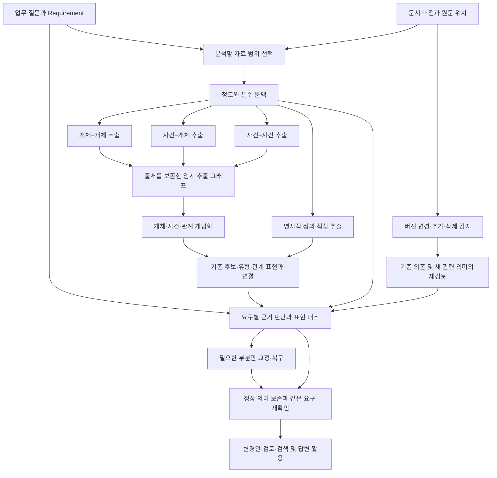

# AutoSchemaKG 기반 업무 지식 구축·충족 확인·변경 대응 구현 계획

- 작성일: 2026-10-06 · 상태: **사용자 합의에 따른 구현 계획. 이 문서 작성으로 구현·모델 평가가 완료된 것은 아니다.**
- 프로젝트: `Hangi-n42/Civil-Complaints-System`
- 실행 조율·평가: **계획 및 구상** 세션. 본격적인 구현·실행: **작업 세션**.
- 전달용 지시: [계획 및 구상 세션용 goal 프롬프트](autoschemakg_business_knowledge_goal_20261006.md).
- 방법론 근거: [논문·공식 코드 대조 문서](../../70_research/company_knowledge/autoschemakg_methodology_20261006.md), [AutoSchemaKG 논문](https://aclanthology.org/2026.acl-long.942/), [공식 코드 고정 버전](https://github.com/HKUST-KnowComp/AutoSchemaKG/tree/d0a1666ae6621806faf814504c73678de4e809f2).
- 실행 중 수정 범위·현재 우선순위: **§8.1~8.4**. 부산 QA v2의 동결 결과를 보존한 뒤 별도 변경 버전에서 수행한다. W0~W7을 새로 시작하는 지시가 아니다.

**2026-10-07 사용자 중단 지시:** 현재 W7 첫 작업인 부산 생성풀의 필수 의미 보조평가까지만 저장·종료하고 구현 및 모델 실행을 중단한다. 후속 실행 연결은 중지했으며 정확 표 행 복구 패치는 준비·검사만 완료한 미적용 상태다. 해당 실제 복구와 나머지 W7 평가는 미실행으로 보존한다. 아래의 기존 실행 순서는 이 중단 지시를 해제하거나 자동 재개하는 권한이 아니다. 전체 목표는 미완료이며, 재개 전에는 최신 사용자 지시와 코드·결과 상태를 다시 확인한다.

## 1. 목적과 확정 사항

**AutoSchemaKG의 원문 추출·개념화를 기반으로, 업무에 필요한 지식의 충족 여부를 확인하고 원문 변경에 따른 재검토를 지원한다.** 업무 질문은 원하는 사실을 만들어내라는 명령이 아니라 필요한 지식과 적용 범위를 명시하는 기준이다.

전체 흐름은 **업무 질문 정의 → 원문 추출·개념화 → 요구별 충족·공백 확인 → 부분 교정·검토·활용 → 변경 감지 → 영향 대상 재검토**다. 지식을 구축하는 흐름과 업무에 사용할 수 있는지 판정하는 흐름을 연결하되, 모든 추출 후보의 엄밀한 온톨로지 승인을 개념화의 선행조건으로 만들지 않는다.

| 사용자 결정 | 구현 계약 |
|---|---|
| 제품 실행은 로컬 모델만 사용 | 제품의 추출·개념화·검색·임베딩·검수·교정·답변은 현재 Gemma·Qwen 및 로컬 구성으로 실행한다. 실제 설치 태그·역할·설정을 기록한다. |
| 평가셋 작성·검토의 외부 처리 허용 | 2026-10-06 사용자 승인에 따라 평가셋 작성·검토에 필요한 원문·공개 업무 범위·평가 문항·정답 초안을 GPT-6 Astra 전문가 에이전트에 제공할 수 있다. 제품 문서 처리의 외부 전송 금지는 유지하며, 제품 생성 결과의 외부 채점이나 외부 모델을 사용한 제품 실행까지 허용한 것은 아니다. |
| 외부 API 교체 가능 | 로컬 어댑터와 외부 API 어댑터를 갖춘 공통 호출 계약을 실제 구현한다. 제품용 외부 어댑터는 로컬 모의 응답으로 계약을 검증하며 실제 외부 호출과 품질 비교는 하지 않는다. 평가셋용 전문가 에이전트 사용과 구분한다. |
| 비용·처리 시간 상한 미지정 | 완성도 우선. 모델의 문맥·출력 한도, 취소, 요청 실패 처리는 유지한다. 실제 입력/출력 잘림이나 정상 요청의 시간 부족이 확인되면 분할·한도·timeout을 조정한다. 원인 확인 없는 상한 확대·동일 실패 재시도를 품질 개선으로 취급하지 않는다. |
| 첫 구현 자료 | 부산 자동차 이전등록 안내·부서 안내. LH는 기존 오류와 복잡한 의미 확인, 버스 전후 자료는 변경 대응 확인에 사용한다. |
| AutoSchemaKG 실질 재사용 | 공개 코드·프롬프트에서 그대로 또는 필요한 만큼 수정해 가져온다. 원리만 인용하고 전부 재작성하거나 기존 흐름의 이름만 바꾸지 않는다. |
| 검증 과잉 방지 | 작업에 직접 필요한 확인만 수행한다. 새 실패·변경이 없으면 통과한 검사와 전체 실행을 반복하지 않는다. 매 단계 새 검수기·승인 관문을 추가하지 않는다. |
| 구현 원칙 | Ponytail을 사용하되 필요한 신규 기능을 회피하지 않는다. 기존 구조·표준 기능을 우선하고, 새 그래프 DB·범용 실행 프레임워크·에이전트 계층을 불필요하게 추가하지 않는다. Windows 호환성을 유지한다. |

문서 등급별 모델 라우팅, 외부/로컬 모델 품질 대결, 실제 사람의 오류·총작업시간 실험, 교통 수요·보행거리·업무 피해의 자동 예측은 이번 구현 범위가 아니다. 기본 검토·승인·수정 기능은 유지하되 이를 새로운 대규모 사용자 연구로 확장하지 않는다.

**완료 기준:** 정상 의미를 유지하며 실제로 수정했고, 같은 업무 요구를 다시 확인했으며, 필요한 후속 단계까지 이어졌다. 오류 보류·후보 삭제·형식 검사 통과·후보 수 증가는 단독 완료 근거가 아니다. 실제 자료 부족의 올바른 진단은 별도 성과이며 업무 해결 성공으로 합산하지 않는다.

**실행 범위:** 계획 정리·코드 작성·단위 테스트에서 종료하지 않는다. W0~W7의 구현, 필요한 통합 검사, 실제 로컬 모델 실행, 원문과 실제 결과 대조, 실패 원인 수정과 관련 재확인, 최종 보고까지 수행한다. 제품용 외부 API 어댑터는 모의 계약 검사만 하고, 평가셋은 §9.0의 GPT-6 Astra 전문가 에이전트가 실제 작성·검토한다. 새 기능은 기존 서비스/API의 선택 가능한 실행 경로에 연결하며, 독립 실험 스크립트만 돌아가는 상태를 제품 구현 완료로 세지 않는다.

## 2. 현재 확인한 상태와 설계의 출발점

작성 시 읽은 구현 checkout은 `/Users/hyeongi/.codex/worktrees/ontology-grounded-recovery/Civil-Complaints-System`, 브랜치는 `feature/ontology-grounded-recovery`, HEAD는 `e7e22ceea73745b9534fe1f96e877799d8376bba`다. 기존 계획·평가 문서에는 미커밋 작업이 있다. 이 계획의 저장 위치인 기본 checkout은 `main`이며 당시 추적된 `origin/main`보다 161커밋 뒤였다. **이는 작성 당시 로컬 관찰이며 새 구현의 기반 브랜치를 지정한 것이 아니다.** 실행 세션이 최신 상태를 다시 확인하고 진행 중인 작업을 보존한다.

- 기존 코드에는 CQ/scope 검수, 원문 문맥 발견, 원명제와 유형 끝점의 분리, 근거/표현/join 판단, 수정 전후 보존, 복구, 이웃 문맥 경로가 이미 있다. 존재 여부와 실제 품질 달성은 다르다.
- 확인된 핵심 실패는 원문이 확정하지 못하는 업무 연결을 생성 누락으로 판단해 복구에 넘기는 것이다. 국소적인 끝점 교정과 의미 보존의 성공 이력도 있으므로 전체 기능 실패를 전제하지 않는다.
- 근거 지지·표현 여부·행동 선택의 혼동, 필수 문맥 누락, 직렬 검수 누적은 확인할 원인이다. 모델 능력·자료 난도·입력 구성 중 하나를 유일한 원인으로 미리 확정하지 않는다.
- 현재 `ontology_quality_v1_20261005.md`는 이전 비교의 중단·폐기 기록이다. P0/P1 비교는 완료되지 않았고 상세 산출 일부는 삭제됐다. **이 실행을 자동 재개하거나 미완료·삭제 결과를 성능 근거로 쓰지 않는다.** 필요한 비교는 새로운 식별자로 작게 구성한다.
- A5/A6 및 후속 작업의 완료 이력은 보존한다. 오래된 상태 파일에 남은 단계만 보고 과거 검수·보완을 다시 지시하지 않는다.

이 문서는 기존 `semantic_context_redesign_20261005.md`의 근거·표현 구분을 폐기하지 않는다. 새 구축 경로를 AutoSchemaKG 기반으로 명확히 하고 업무 요구·변경 대응과 연결한다. 이전 문서의 실행 순서와 충돌하는 부분은 이번 사용자 합의에 맞춰 조정하되 역사 기록은 수정하지 않는다.

## 3. AutoSchemaKG에서 실제로 가져올 것

기준은 **공개 코드 SHA `d0a1666ae6621806faf814504c73678de4e809f2`를 한국어·로컬 환경에 이식하는 것**이다. 논문의 대규모 성능·계산 비용 재현을 이번 완료 조건으로 삼지 않는다. 논문 설정과 공개 코드 기본값이 다른 부분은 구분한다.

### 3.1 유지할 원리

1. 같은 원문 청크에서 개체–개체, 사건–개체, 사건–사건의 세 역할을 분리해 추출한다. 기본 경로에서 세 역할을 유지하며, 앞 호출의 생성물을 다음 추출의 정답으로 주입하지 않는다.
2. 추출 결과로 승인 전 임시 연결 구조를 만든 뒤 개체·사건·관계를 개념화한다. 완성된 온톨로지를 먼저 요구하지 않는다.
3. 개체 개념화는 실제 연결된 이웃과 관계를 사용한다. 사건·관계 개념화는 해당 표현을 입력으로 하는 원형을 유지한다. 추가 문맥이 필요하면 이유를 남긴다.
4. 개념화 결과에는 유형과 관련 개념이 포함될 수 있다. `has_concept`를 자동으로 `is-a`, 법적 포함, 승인된 업무 규칙으로 바꾸지 않는다.
5. 형식 복원과 의미 검토를 구분한다. 원형의 추출·개념화 앞에 기존 모든 Critic을 직렬로 붙이지 않는다.

규정 자료의 후속 적응에서는 원형 세 결과를 보존하면서 주체·조건·양태의 미검증 해석을 연결한다(§8.2). 사건 관계에는 원문과 지역 명제의 대응을 제공할 수 있으나, 앞 추출의 판정을 정답으로 전달하거나 모든 명제의 승인 완료를 기다리게 하지 않는다. 이는 원형 그대로의 동작이 아니라 규정 자료를 위한 변경이며 별도 버전으로 비교한다.

### 3.2 재사용·변형 대응표

아래 경로는 공식 저장소 기준이다. 실제 반입 파일·함수·변경 이유는 구현 시 같은 표에 기록한다. MIT 원본 고지와 출처·커밋을 보존한다.

| 공식 구성 | 반입 방식 | 우리 변경과 원리 보존 기준 |
|---|---|---|
| `llm_generator/format/validate_json_schema.py`의 `ATLAS_SCHEMA` | **기본 세 추출 스키마 직접 재사용** | 기본 Head/Relation/Tail, Event/Entity 계약을 보존. 원문 ID·상태는 외부 레코드에 연결하고 원시 출력도 보존한다. |
| `llm_generator/prompt/triple_extraction_prompt.py` | **추출·개념화 프롬프트 반입 후 한국어 이식** | 역할·출력·독립 사건 표현 원리를 유지. 규정상의 절차·조건을 이미 발생한 사실이나 인과로 바꾸지 않는 지시를 최소 추가한다. |
| `kg_construction/triple_extraction.py`의 메시지 구성·세 역할 실행 | **관련 실행 흐름 수정 재사용** | 입출력·호출 순서를 유지하고 입력 공급·저장·모델 호출을 기존 서비스에 맞춘다. 전체 패키지 의존성을 무조건 설치하지 않는다. |
| 같은 파일의 `TextChunker` | **경계 처리 수정 또는 기존 파서와 연결** | 공개 기본값은 8192자·겹침 0이며 토큰 한도가 아니다. 한국어 제목·표·목록·조건을 보존하는 분할과 실제 문맥 예산을 사용한다. 원문을 나눠 독립 추출한다는 원리는 유지한다. |
| `kg_construction/concept_generation.py` | **대상별 프롬프트 조립·개념화 흐름 수정 재사용** | 개체/사건/관계별 개념화 유지. 실제 predecessor/successor 관계를 사용하되, 이웃 선택은 재현 가능한 방식과 필수 문맥 보존으로 수정한다. |
| `llm_generator/format/validate_json_output.py` | **키 정리·중복 제거의 사용 가능한 부분 반입** | 기존 JSON 처리와 중복되는 부분은 한 경로로 합친다. 파싱 실패를 의미상 빈 결과로 숨기는 동작은 가져오지 않는다. |
| JSON→CSV→DiGraph→개념 연결 | **그래프 구성 원리·필드 대응 재사용, 저장부 수정** | 같은 끝점의 다른 관계·조건·시점과 여러 출처를 보존한다. 기존 SQLite와 인접 목록에 연결하며 GraphML/CSV는 필요할 때 내보내기 형식으로 둔다. |
| `llm_generator/llm_generator.py` | **모델별 호출 분리 원리 참고** | 기존 로컬 호출을 포함한 작은 공통 계약을 구현한다. 여러 추론 런타임과 전체 래퍼를 복제할 필요는 없다. |

프롬프트를 전면적인 규정 검수 지시로 덮어쓰거나, 사건 추출을 전부 삭제하거나, 이웃 대신 검색 문단만 넣거나, 모든 개념을 승인 유형으로 강제하면 이식 목적을 잃는다. 반대로 단일 간선 덮어쓰기·출처 누락 등 업무 추적에 맞지 않는 구현 세부를 그대로 유지할 필요는 없다. **바꾸는 것은 환경·근거 보존·업무 연결의 경계이고, 추출 그래프에서 개념을 유도하는 중심 원리는 유지한다.**

## 4. 목표 호출 흐름

- 업무 질문으로 읽을 자료 범위를 정하되, 청크에서 질문에 맞는 결론을 만들게 하지 않는다. 해당 범위의 조건·예외·반례도 추출한다.
- 원형 세 추출은 청크마다 다른 역할로 같은 원문을 읽는다. 유효한 빈 결과와 실행 실패를 구분한다. 사건이 없는 문서에 사건·인과를 강제로 만들지 않는다.
- 관계 문맥이 필요한 개념화는 추출→개념화 순서로 수행한다. 명시적 정의의 직접 추출은 관계 추출 성공에 종속시키지 않는다.
- 원시 추출과 개념화 결과는 후보 상태로 저장 가능하다. 엄밀한 승인 유형·활성 지식·공식 답변으로 사용하는 경계에서는 필요한 의미 검토를 적용한다.
- 원시 추출 항목에는 서버가 실행·문서 버전·청크·역할·항목 ID를 붙인다. 정확한 근거 구간이 아직 없으면 청크 수준 출처임을 표시하고, 기존 근거 판단에서 실제 인용 구간을 확정한다. 청크 주소만으로 주장별 지지를 확정하지 않으며 이를 위해 별도 전수 인용 생성 호출을 추가하지 않는다.
- 기존 원명제·끝점·보존 검수를 재사용하되 동일 의미를 동일 입력으로 중복 검수하지 않는다. 실제 후보·원문·요구가 바뀐 부분만 다시 판단한다.
- 형식 처리·인접 목록 구성·저장·상태 집계는 코드가 담당한다. 이를 위한 새 LLM 역할을 추가하지 않는다.

### 4.1 이웃 문맥 선택

입력은 `개념화 대상의 원문 언급/추출 ID`, `현재 추출 관계`, `원문 근거·범위·상태`, `문맥 예산`이다. 출력은 선택 관계 ID·방향·상대 대상, 필수 원문 구간, 제외·추가 읽기 이유다.

1. 대상에 직접 연결된 1-hop 관계만 후보로 삼는다. 승인 KG 없이 현재 추출 결과와 원문 위치로 작동한다. 이름이 비슷하다는 이유로 개체를 합치지 않는다.
2. 같은 대상의 역할·행위·조건을 설명하는 직접 연결을 우선한다. 현재 추출의 관계 종류·범위와 정확한 대상 연결을 사용하고, 동률은 원문 순서와 안정 ID로 정렬한다. 선택을 위한 새 모델 호출·학습된 랭커는 추가하지 않는다.
3. 같은 명제·같은 근거의 중복 표현을 제거하되, 다른 조건·시점·반대 근거는 보존한다. 원형 코드의 무작위 1+1은 조사 기준이며 우리 선택 개수의 정답은 아니다.
4. 대상의 원명제와 의미를 결정하는 조건·예외·기간·명시적 참조를 **필수 묶음**으로 먼저 배정하고 남은 입력에 선택 이웃을 넣는다. 필수 묶음이 넘치면 원문 연결을 유지한 입력 분할/추가 읽기로 처리한다. 조용히 자르지 않는다.
5. `graph_neighbor`, `document_adjacent`, `retrieved_context`를 구분한다. 추출 상태와 검토 상태를 전달하며 선택됐다는 이유로 지지 판정을 부여하지 않는다.
6. 제공됐지만 미선택인 자료는 추가 읽기로 연결하고, 제공되지 않은 참조는 구체 공백으로 남긴다. 이웃 선택은 개념화 입력 개선이며 최종 의미 검토를 대신하지 않는다.

## 5. 데이터 계약과 판단 책임

### 5.1 논리 객체와 저장 원칙

| 객체 | 최소 내용 | 기존 구현과의 연결 |
|---|---|---|
| BusinessQuestion | 안정 ID·질문·업무 대상·상황·시점·버전 | 기존 CQ와 scope 항목을 출발점으로 사용 |
| Requirement | ID·버전·검증할 요구·범위·필수 여부·충족 기준·질문 연결 | 기존 requirement/meaning 식별자를 점검해 지속 저장·재사용을 확장 |
| KnowledgeClaim | 원문에서 추출한 주장·관계·사건, 끝점·한정·후보 상태 | 원명제·assertions·후보 기록에 대응. 후보를 확정 사실로 부르지 않음 |
| Concept | 개념 표현·종류·대상 연결·검색 개념/승인 유형의 구분 | 기존 Concept/Builder 및 ontology 후보에 대응 |
| Evidence | 문서 버전·파싱 버전·블록·구간·원문 대응 | 기존 evidence와 원문 참조 재사용 |
| Scope/Condition | 대상·역할·절차·조건·예외·기간·명시 참조 | 독립 노드가 꼭 필요한지 판단하고 기본은 주장/요구의 구조화 필드 |
| DocumentVersion | 출처 ID·버전·원문 해시·전후 계보 | 기존 sources/versions/snapshots 재사용 |

논리 객체 수가 새 테이블 수를 뜻하지 않는다. 기존 SQLite JSON payload와 ID를 우선 사용한다. Requirement는 특정 실행에 묶이지 않는 지속 ID와 버전을 갖고, 질문 연결과 주장 연결은 다대다로 보존한다. 현재 저장 구조가 이를 지원하지 못하면 필요한 저장 기능은 새로 구현한다. 일반적인 개념이나 모든 일회성 검색 질문을 Requirement로 영구 생성하지 않는다.

`Question→Requirement`는 무엇을 확인해야 하는지, `Requirement→Claim`은 어떤 지식이 충족에 사용됐는지를 나타낸다. 단순 관련 후보 연결을 `satisfied_by`로 확정하지 않는다. 판정에는 근거·범위·버전·실제 표현 위치·사유를 남긴다. 요구 문구가 비슷해도 대상·상황·시점이 다르면 자동 병합하지 않는다.

### 5.2 근거와 표현을 분리한 행동

| 근거 판단 | 표현 판단 | 행동 |
|---|---|---|
| 제공 자료에 있지만 아직 읽지 않음 | 판단 전 | 자료 읽기/분할. 자료 부재나 추출 누락으로 단정하지 않음 |
| 원문이 해당 의미·범위를 지지 | 정확하게 표현 | 해당 의미 충족. 여러 의미의 결합 조건은 별도 확인 |
| 원문이 지지 | 빠짐 | 같은 의미 ID로 해당 추출·관계·유형 연결 복구 |
| 원문이 지지 | 잘못된 역할·끝점·범위 | 해당 표현을 교정하고 정상 부분 보존 |
| 원문과의 모순 또는 원문보다 강한 효과·범위 추가가 확인됨 | 잘못된 주장이 존재 | 해당 주장만 정정·제거. 필요한 정상 지식까지 삭제하면 교정 성공 아님 |
| 해석 미확정·근거 충돌 | 어느 상태든 | 충돌 내용·필요 전제 기록. 새로운 근거가 오면 해당 판정 정정 |
| 확인한 자료 범위에서 필요한 근거 미확보 | 빠짐 | 조사 범위·미제공/미확인 참조 기록. 생성 명령으로 바꾸지 않음 |

`Evidence 없음`은 자료 자체의 부재 증명이 아니며, 미확인 주장에 대한 반증도 아니다. 미확인 주장을 확정 사실로 사용하지 않되 자동으로 거짓이라고 판정하거나 삭제하지 않는다. 확인한 파일·절·검색/읽기 범위와 미처리 부분을 남긴다. 반대로 근거 주소가 있어도 실제로 의미를 지지하는지는 별도 판단한다. 서버는 판정 조합과 행동을 일관되게 연결할 수 있지만 의미의 진위를 자동 보장하지 않는다.

### 5.3 충족·교정·전체 요구 재확인

- Requirement는 `필요서류` 같은 분류명만 저장하지 않는다. 대상 상황에서 확인할 목록·조건의 범위와 완료 기준을 갖는다. 모든 질문에 자격·기관·비용·예외를 일괄 추가하지 않는다.
- 생성 입력의 업무 요구와 평가용 정답을 구분한다. 조율 세션이 사용자 합의와 실제 원문을 대조해 핵심 요구의 범위를 정하고, §9.0에 따라 작업 세션의 GPT-6 Astra 작성 에이전트가 평가 문항·정답·기대 주장·근거 대응을 만들며 별도 검토 에이전트가 원문과 대조한다. 평가 정답은 별도 자료로 보관하고 생성 모델이 자기 출력에 맞춰 요구를 바꾸지 못하게 한다. 사람의 전수 정답 작성·사용자 항목별 사전 승인·실제 사람 시험을 선행조건으로 추가하지 않는다.
- 공통 의미 ID로 생성·근거 판단·표현·교정을 연결한다. 기존 의미키와 원문/후보 지문을 재사용하며 동일 목적의 새 레지스트리를 중복 구축하지 않는다.
- 교정은 before/after·수정 대상·보존할 의미·정정 사유를 남긴다. 표현 변경이나 필드 이동은 허용하며, 과거 supported 의미도 새 근거로 정정할 수 있다.
- 각 요구의 목록·조건 누락을 확인한 뒤 문서 간 연결의 주체·대상·전제·적용 시점이 함께 성립하는지 재확인한다. 부분 성공의 개수 합산이나 원문 전체 재투입으로 이를 대체하지 않는다.
- 변경된 원문/요구/후보의 판정만 갱신한다. 의미 판단이 수정되면 영향을 받는 표현·복구 요청을 함께 재검토한다. 과거 판정은 삭제하지 않는다.

## 6. 모델 호출 계약

기존 `GenerationService.call_ollama`, `discovery_analysis`와 `ontology_run`의 호출 지점을 확인해 지식 파이프라인이 공통 호출부를 쓰도록 연결한다. 다른 제품 영역의 모든 호출부를 전면 교체하는 작업으로 확장하지 않는다.

| 항목 | 계약 |
|---|---|
| 요청 | 역할/stage, messages, 출력 schema 또는 text, model, 생성 설정, 문맥·출력 한도, timeout·취소, request ID |
| 응답 | 원시 출력, 파싱 결과, finish reason, 실제/추정 구분이 있는 usage, 경과시간, 모델 식별, 실패 종류 |
| 로컬 어댑터 | 현행 Ollama/Gemma/Qwen 호출과 설치 모델 식별을 보존. 실패 시 원격으로 전환하지 않음 |
| 외부 어댑터 | OpenAI-compatible Chat Completions를 첫 지원 규격으로 명시. endpoint/model/auth 설정을 교체하고 provider별 응답을 공통 계약으로 변환 |
| 기능 차이 | 지원되는 schema·출력 한도 등을 어댑터에서 처리. 지원 불가능한 요청을 조용히 무시하지 않음. 모든 API 제공자 호환을 주장하지 않음 |
| 테스트 | 로컬 실제 실행 + 제품용 외부 어댑터의 로컬 모의 transport/응답 테스트. 이 어댑터로 문서를 외부 전송하거나 외부 품질을 비교하지 않음. §9.0의 평가셋 작성·검토는 별도 허용 범위 |

핵심 파이프라인이 `/api/tags`, `/api/show`, Ollama 옵션을 직접 전제하지 않도록 모델 식별·호출 가능성 확인도 어댑터 책임으로 옮긴다. 이는 단순 URL 교체보다 필요한 작업이다. 같은 출력 계약은 모델 간 의미 품질 동등성을 보장하지 않는다. 외부 임베딩 교체는 이번 생성 호출 어댑터의 범위와 구분한다.

추출 역할별 입력을 공유하더라도 개별 생성 요청 수는 별도 계측한다. 원형 기준의 일회 생성 수는 `3×청크 수 + 개념화 대상 개체 수 + 사건 수 + 관계 표현 수`이며, 복구·검수·답변·재시도는 추가다. 배치 수를 호출 수로 보고하지 않는다. 실제 설치 모델 한도를 확인해 작업별 입력을 배분하고, 비용·시간을 제한하지 않는다는 이유로 추론 길이·재시도만 늘리지 않는다.

청크의 원문 예산은 실제 실행 문맥에서 지시문·스키마·필수 문맥·출력 예약을 제외해 정한다. 정확한 토큰 계수가 없으면 추정 방식임을 표시하고 실제 usage와 대조한다. 우선 제목/절/목록/표 행 경계에서 나누고, 상위 조건·표 머리글은 같은 원문 ID를 참조해 필요한 하위 입력에 제공한다. 하나의 필수 묶음도 넘치면 묶음 ID와 원문 연결을 유지해 분할하며, 뒤의 요구 검수에서 결합을 확인한다. 고정 문자 수를 모든 모델에 통용되는 토큰 안전값으로 사용하지 않는다.

**후속 변경:** 위 최대 입력 예산과 추출 작업의 목표 크기를 분리한다. 목표 크기는 추출 대상 원문의 크기를 제어하고, 최대 입력 예산에는 참고 문맥·지시·출력 예약까지 포함한다. 작은 목표에 도달한 입력을 여유 문맥에 맞춰 다시 합치지 않는다. 구체 변경·비교 조건은 §8.2 U1을 따른다.

## 7. 자료와 활용 범위

| 묶음 | 원문과 목적 | 주의할 경계 |
|---|---|---|
| 부산 최초 구현 | `data/knowledge/raw/demo_selection_20260929/busan_transfer.html`, `busan_departments.html` | 자가용 매매 이전등록의 본인/대리 신청·서류·처리 기관을 첫 범위로 사용. 해당 조건·예외·센터 제한을 임의로 제외하지 않음 |
| LH 복잡성·회귀 | 기존 원본·동결 실패·정상 대조에서 현재 존재하고 근거를 확인할 수 있는 사례 선정 | 과거 검수 결과를 정답으로 복사하지 않음. 문서 시점·공급 유형·지역을 구분. 개발 노출 사례임을 표시 |
| 버스 변경 | 같은 폴더의 `dobong_proposal.html`, `dobong_approved.html`, `1127_before.json`, `1127_after.json` 및 대응 2025-05-13/06-24 원본 XLSX | 실제 전후 정차 변경과 관련 지식·질문 재검토. 구조화 표 연결 성과를 비정형 추출 성과로 세지 않음 |

부산 두 문서는 로컬 원문이 존재하며 역할·조건·업무 제한이 명시돼 있다. **첫 구현에 적합하다는 판단은 자료 구조에 근거한 것이고 모델 성능 비교 결과가 아니다.** 안내문의 수수료 항목도 존재한다. 상속 항목의 기본증명서·가족관계증명서 등을 다른 서류로 바꾸거나 설명용 가정을 실제 정답으로 사용하지 않는다.

제공 자료에서 답할 수 있는 부산 질문과 필요한 명제·정상 대조를 먼저 작게 고정한다. 역할·서류 조건·기관 제한·문서 간 연결이 드러나는 항목을 포함한다. 자료 부족 사례는 원문을 인위적으로 삭제해 만들지 않고 현재 자료의 실제 공백이나 LH의 확인 가능한 실패에서 고른다. 자연 오류가 없을 때의 교정 시험은 기존 실제 오류를 복제한 재현으로 표시하며 자연 생성 오류 개선과 분리한다.

원문은 기본 checkout의 로컬 데이터에 있고 구현 worktree에 없을 수 있다. 기존 반입 기능으로 필요한 자료만 로컬 복사/연결하고 원본·기존 평가 DB를 덮어쓰지 않는다. 기업 실자료 도입·실제 사람 시험은 이번 공개 자료 실험의 성공으로 대신하지 않는다.

## 8. 작업 단위와 구현 순서

아래 모듈은 작성 시 확인한 기존 코드의 책임 위치다. 새 파일명은 구현자가 최소 변경으로 결정한다. 작업마다 별도 승인·전체 재평가를 요구하지 않는다.

| 작업 | 문제·기존 동작과 변경 | 수정 위치·입출력·저장 | 선행·완료 기준 |
|---|---|---|---|
| **W0 범위·기존 구현 대응** | 같은 기능 재구현과 과거 중단 작업 재개 위험. 현재 코드/이슈/작업 결과를 확인하고 부산 요구를 고정 | 기존 계획·자료 manifest → 재사용/변경표, 질문·요구·평가 기준. 작업 세션의 GPT-6 Astra 작성 에이전트→별도 검토 에이전트의 원문 대조→§9.0의 평가셋 버전 저장 | 범위와 구현 위치가 정해지면 W1/W2로 진행. 정답셋 구축은 제품 호출부 구현과 독립적으로 병행하며 해당 비교 실행 전에 고정. 긴 조사·수작업 전수 라벨링으로 만들지 않음 |
| **W1 공통 호출부** | Ollama 전용 모델 식별·호출을 파이프라인이 직접 전제 → 로컬/외부 호환 계약 | `app/generation/service.py`, `discovery_analysis`의 호출·모델 식별, `ontology_run.model_call`. 요청/응답/usage 변환, 외부 어댑터 최소 추가 | W0. 로컬 기존 역할이 유지되고 외부 모의 응답이 같은 계약으로 처리됨. 실제 외부 연결 성공은 미검증으로 표시 |
| **W2 원문·요구·추출 저장 연결** | 실행별 요구와 근거가 지속 추적에 충분한지 확인 → 안정 Requirement와 버전 연결 | `repository`, `service`, `schemas`, `discovery_inputs/run/segments/meanings`. 문서·요구→원문 위치·추출 레코드·판정 버전 | W0. 원시 추출을 승인 전 저장하고 여러 출처·같은 끝점의 다른 주장을 잃지 않음. W1과 독립적으로 설계 가능 |
| **W3 AutoSchemaKG 추출·개념화 이식** | 기존 Concept/Relation 경로를 단순 재명명하지 않음 → 원형 세 추출·임시 그래프·후개념화 | 공식 스키마/프롬프트/메시지·개념화 코드 반입, `discovery_analysis/models/segments`와 연결. 청크→원시 세 결과→임시 인접 목록→개념 후보 저장 | W1/W2의 필요한 계약. 부산에서 세 역할의 실행 상태·개념화 산출·출처가 저장됨. 이웃 효과 판정은 W7. 직접 정의 경로도 유지 |
| **W4 Requirement 판정·교정** | 관련 후보 존재·근거 주소로 충족 추정 → 근거/표현/전체 연결과 행동 구분 | `discovery_grounding/meanings/requirements/scope/synthesis/binding/recovery/review`. 요구+원문+후보→판정→targeted repair→before/after·같은 요구 재확인 | W2, 통합은 W3 출력 사용. 저장된 기존 오류로는 W3 전체 성공 전에도 개발 가능. 실제 누락 복구와 정상 의미 보존 교정이 필요 |
| **W5 변경안·검토·활용 연결** | 단계 결과가 최종 사용에 연결되지 않는 문제 → 후보 검토와 필요한 A3/검색·답변 산출까지 연결 | `ontology_changes._convert/preview`, `ontology_consumer`, `extraction_contract/store`, `snapshots`, `search_answer`, 관련 기존 API/화면. 검토된 표현→변경안·요구 상태·답변 근거 | W3/W4. 의미상 필요한 유형·관계·계층이 실제 산출에 포함됨. 계층이 불필요한 과제에 억지 생성하지 않음. 기존 UI로 요구 상태·수정·근거를 확인하는 최소 통합 |
| **W6 변경 감지·재검토** | 기존 연결만 추적하면 신규 예외를 놓침 → 직접 의존+새 의미 관련성 확인 | `versions/snapshots`, `ontology_changes._impact/_consumer_impact`, `ontology_consumer`, W2 요구 연결. 전후 원문→영향 후보·이유→재판정·업데이트 이력 | W2 의존 구조, W4/W5 재사용. 버스 실제 변경과 정상 대조에서 영향을 확인. 신규 예외 경로는 실제 전후 근거가 있는 사례 또는 명시된 단위 입력으로 따로 확인 |
| **W7 작은 비교·종합 보고** | 보류·검사 통과를 성공으로 세거나 이웃 효과를 다른 변경과 혼동 → 추출 품질/업무 완료/이웃 효과 분리 | 기존 평가 계약·실행 기록 재사용. 새 최소 runner가 필요할 때만 추가. 원문/설정/출력→대조 결과·실패 원인·비용 | 단계별로 필요한 확인을 시작하고 W5/W6 이후 종합. 아래 평가·완료표에 실제 결과 연결 |

주 실행 순서는 `W0 → W1/W2 → W3 → W4/W5 → W6 → W7 종합`이다. W4의 판단 규칙과 회귀 재현, W6의 변경 연결은 필요한 계약이 있으면 병행 준비할 수 있다. **근거 판단의 성공은 이웃 구현·개념화 제한 비교의 선행조건이 아니다.** 동일 파일 충돌은 작업 세션의 편집 순서를 조정해 해결한다.

### 8.1 실행 중 확인한 결함·가설·완료 항목

이번 절은 사용자의 네 가지 제안을 실제 구현과 대조한 후속 범위다. 아래 결함 표는 **제안 수신 당시의 변경 전 동작**이며, 이후 구현 상태는 표 다음의 진행 기록과 구분한다. 확인 checkout은 `feature/ontology-grounded-recovery`, HEAD `94fee1161e34f3d462e9d5da2ea9dd4ff7403fc7`와 그 위의 미커밋 구현이다. **HEAD만으로 실행 코드를 식별할 수 없으므로 파일 해시와 실행 manifest를 함께 보존한다.** 제품 구현·검사·모델 실행은 작업 세션이 담당한다.

| 구분 | 확인한 내용 | 해석과 남은 확인 |
|---|---|---|
| 확인: 청크 작업량 | `autoschema.chunks()`는 `(context_tokens-output_tokens-2500)*2`의 추정 바이트 예산까지 묶음을 합친다. 별도 추출 목표 크기가 없다. `context_only`와 span은 있지만 초과 분할의 `continuation_bundle`은 모델 입력 `source_packet()`에 전달되지 않는다. | 큰 입력 용량과 큰 추출 작업이 결합돼 있다. 작게 나누면 실제 정확성이 좋아진다는 것은 아직 가설이다. 반복 참고 구간의 생성 억제와 연결 보존도 함께 확인해야 한다. |
| 확인: 항목 식별 한계 | 초기 claim 근거는 청크 전체이고 노드는 `chunk_id+kind+label`로 식별한다. | 청크 변경 시 연결이 흩어질 수 있다. 같은 블록·이름만으로 병합하면 다른 대상·조건을 섞는다. 항목별 실제 원문 위치가 없으면 동일 항목임을 확정하지 않는다. |
| 확인: LH 의미 오류 | `event_relation_scope_diagnosis.json`의 c68은 일반 선정과 별도 기준 설정을 동시성으로 연결했고, 주체별 권한 대응도 OR로 평탄화했다. 같은 풀의 c65/c66에는 정상 권한 대응이 있다. | 시간 관계 제거만으로 완료되지 않는다. 원형 시간·인과 중심 과제가 오류를 유도했다는 것은 원인 가설이다. 한국어의 발명 금지 지시는 이미 있었으며, 지침 부재만이 원인은 아니다. |
| 확인: 범위 기록 단절 | `autoschema.graph_record()`는 원형 raw를 보존하지만 conditions/exceptions/period 등을 비워 둔다. 새 `business_models.MeaningCheck`에는 주체별 적용 대상·양태·전제의 연결이 충분하지 않다. | 빈 필드를 무조건 무조건부 의미로 읽으면 안 된다. 기존 `discovery_meanings.SourceMeaning`의 구분은 있으나 새 추출 경로와 연결되지 않았다. 뒷단 재해석이 모든 오류의 유일 원인이라는 주장은 아직 가설이다. |
| 확인: 검수·교정 영향 범위 | `business_run.assess()`는 출처별 원문 묶음과 전체 run 후보를 전달한다. 재판정은 이전 의미 묶음을 다시 다루며, `repair()`는 평가에 오류/이의가 하나라도 있으면 전체 교정을 차단한다. fingerprint도 전체 후보 풀을 포함한다. | 코드의 과도한 결합은 확인됐다. 현재 실제 repair 호출이 0인 이유를 이 차단 하나로 설명할 수는 없다. 유효한 correct/recover 대상 자체가 나오지 않은 실행도 구분한다. |
| 확인: 부산 R06 출력 범위 실패 | `busan_remaining_v4/r06_repeated_capacity_failure.json`에 24,576 출력 한도에서도 요구 밖 항목 열거와 length 종료가 저장됐다. | 출력 크기와 요구 범위 선정 모두 문제다. 무한 루프나 더 큰 한도에서도 불가능함을 입증한 것은 아니다. 같은 용량 확대 반복은 중단하고 처리 범위를 바꾼다. |
| 확인: 정상 후보의 동반 제외 | 부산 Q9의 c31은 필요한 15일 의미가 정상으로 대조됐지만, 같은 R04의 다른 기간 이의 때문에 활용 후보가 되지 못했다. c62는 빈 Entity 오류가 있어 같은 정상 대조로 세지 않는다. | 전체 평가의 이의를 의미·후보·의존 단위로 귀속하는 U4에 통합한다. Q9만을 위한 별도 예외나 정답 맞춤 필터를 만들지 않는다. |
| 이미 수정: 완료·답변 계약 | 비필수 표현 누락의 완료 차단은 `required-meaning-completion-v1`로 수정·확인했다. QA v2는 제공 문맥의 고유 인용과 비어 있지 않은 답변 계약을 사용한다. | 재구현하지 않는다. QA 계약 통과는 의미 지지나 전체 업무 완료의 증명이 아니다. |
| 이미 존재: 변화·개념 연결 | `business_changes.differences()`는 정확한 행 차이와 비변경 행을 계산한다. 변경 claim에 의존한 개념 무효화도 있다. | 표 차이 계산기를 다시 만들지 않는다. 남은 것은 결과의 요구 검수 재사용, 세밀한 요구/답변 의존 추적이다. |

후속 구현·실행: U1의 목표 크기 분리, 필수 묶음 전달, target/context 구분과 U2의 첫 범위 계약을 `u1_chunk_size_v1`에서 비교해 양군 모두 종료했다. 코드 53개와 원본 DB는 불변이다. 큰/작은 묶음의 원형 추출은 각각 25/33개지만 모든 부가 범위 기록에 오류가 있었고 상태값/본문과 의미키/원문 주소 혼동이 반복됐다. 작은 군에는 참고 구간에서 생성해 차단한 3개도 있다. 실제 호출은 5/13회, 호출 경과 합계는 약 1,213/1,520초였다. 양군의 표현 검수는 서버 추정 입력 예산 초과로 모델 호출 전에 중단됐으며 실제 모델 문맥 초과와 구분한다. 개념화를 생략한 제한 비교이고 실제 교정도 수행하지 않아 후보 수·형식 저장·차단을 전체 성공으로 세지 않는다. 계약 단순화·언급 식별 수정·국소 검수는 별도 버전에서 이어간다.

동결 입력에서 추가 확인한 결함: `chunks.unique()`가 참고 블록의 최초 삽입 순서를 유지해 기본 서류 뒤의 법인 조건·생략 예외를 앞에 배치했다. 작은 중간 청크에는 해당 주석을 넣고 선행 기본 서류를 빼기도 했다. 이는 원문 순서·필수 문맥 구성 결함이며 법인 면제 오판의 유일 원인이라는 증거는 아니다. 원래 블록/span 순서를 복원하고 같은 하위 목록의 기본 항목과 주석/예외를 필요한 묶음으로 보존한다. 범위 계약 단순화와 함께 시험하면 결합 버전으로 표시하며, 계약 회복을 작은 한 구간에서 먼저 확인한 뒤 청킹 양군 재비교의 필요성을 판단한다.

후속 `u2_scope_probe_v2`는 매매 하위 목록 9블록·187자에서 계약/언급 식별/원문 순서/목록 문맥을 함께 변경한 국소 실행이다. 6회 호출·약 486초에 종료했고 코드 53개와 원본 DB는 불변이다. 원형 후보 6개에서 상태/본문·모델 의미 ID 혼용은 줄었지만 참여자 누락·주소 오류와 분류/조건 귀속의 확인 과제가 남았다. 사건–사건 출력은 빈 배열이며, 이를 정상 시간 관계 대조나 전체 업무 성공으로 확대하지 않는다. 법인 방문 시 생략 불가 의미는 일부 후보의 `local_negation` 또는 `exceptions`에 실제 보존돼 있으므로 특정 필드가 비었다고 소실로 판정하지 않는다. R은 다섯 의미를 모두 represented로 판정했지만 일부 설명이 실제 필드 위치·내용을 잘못 서술했다. 실행 상태는 partial이고 교정/개념화는 이 국소 실행에서 꺼져 있었으므로 실제 교정 능력은 아직 검증하지 않았다. 다음 U4는 같은 저장 후보와 원래 전체 요구를 사용해 실제 수정·보존·재확인·후속 활용을 확인한다.

종료된 `u34_lh_v1`(run `32264f4e6dc14a8c853dad7ec0a24d30`)의 실행 중간 기록: 첫 E 구간은 건설/매입 정의를 정확 인용했지만, 다음 E 구간은 자기 입력에 없는 정의를 제2조 전체에 없는 것으로 서술해 공백을 만들었다. 국소 미발견과 전체 자료 부족을 혼동한 출력을 확인했다. 과거 요구 판정 이력은 실제 호출에서 제외되어 공개 질문·기준만 전달된 것도 확인했다. 별도로 TXT의 빈 `element_path`를 동일 부모로 취급해 본문 전체(1,974자)를 제목/날짜의 참고 구간으로 붙이는 `chunks()` 경로가 실제 첫 입력에서 확인됐다. HTML의 실제 목록 부모와 TXT의 구간/참조를 구분해야 하며, 이 중복 입력을 모델 오판의 유일 원인으로 단정하지 않는다. 해당 실행의 코드·설정은 종료까지 동결했고, 후속 수정은 별도 변경 버전에 적용했다.

같은 실행의 R01 첫 전체 판정(`52b0aafc615547db96685017c89dd85e`)은 c48/c49의 핵심 여섯 의미를 represented로 판정했지만 partial이다. 비필수 항목에 관한 이의를 의미별 기록과 자유 `source_challenges` 양쪽에 반환해 `unscoped_source_challenge`가 15개 의미 전체를 차단했고, 자유 이의 때문에 범위 지정 재판정도 시작하지 못했다. 또한 join 입력에는 국소 의존 판정이 있었으나 join 응답이 `dependencies`를 생략하면서 그 판정이 assessment로 전달되지 않았다. 행 생략 때 기존 국소 판정을 보존하는 것과 명시적 null/새 근거에 따른 정정을 구분한다. 자유 gaps를 이전+새 합집합으로만 갱신하면 반증된 공백도 제거할 수 없으므로, 실제 재조사한 범위·의미·이력을 근거로 해당 공백만 대체해야 한다. 당시 실행은 수정하지 않았고, 종료 후에도 정상 후보 회복이나 실제 교정 성공은 확인되지 않았다.

기준 결과: 부산 QA v2는 원문 검색 17/18, 지식 활용 17/18이며 전자는 Q10, 후자는 Q9에서 보류했다. 두 군 모두 실행 실패/빈 답변/형식·인용 주소 오류는 없었다. Q10의 차이는 현재 표 문맥의 구성·검색 차이를 포함하므로 이웃 구조화의 단독 효과로 해석하지 않는다. LH QA v2는 원문 검색 8/8, 지식 활용 6/8이며 후자는 Q2/Q3에서 보류했다. 같은 run의 원시 후보에는 건설임대/매입임대의 직접 정의(c48/c49)가 존재한다. 후속 확인에서 요구 재판정이 여러 원문 구간을 한 블록 인용으로 제출해 근거 검증에 실패했고, 활용 자격→snapshot→검색에 두 정의가 전달되지 않은 경로를 확인했다. 이는 추출 누락/검색 순위 실패와 구분한다. U4에서 실제 인용·근거 판정을 고쳐야 하며 해당 의미 자체의 인용 오류까지 단순 허용하는 우회로 해결하지 않는다. 버스 QA v2와 상세 실행 수치는 실행 보고서에 계속 기록한다.

버스 후속 준비의 모델 호출 없는 입력 점검(`u4_bus_header_prepare/chunk_preflight.json`)에서는 새 회의 제목을 저장해도 제안 발언 5묶음 중 첫 묶음에만 제목이 전달됐고, 승인 보고의 제목과 본문은 별도 묶음으로 나뉘었다. 두 HTML root의 실제 태그 대신 같은 복합 selector가 `element_path`로 저장되어 제목을 식별하지 못한 경로를 확인했다. 첫 제안 묶음에는 본문 전체가 참고 구간으로 중복되기도 했다. 파싱 성공과 필수 문맥 전달 성공을 구분하며, 당시 LH 코드를 바꾸지 않고 종료 후 별도 버전에서 TXT 부모 판정과 HTML 제목 전달을 수정했다. `corrected_header_preflight.json`과 실제 직렬화 입력에서 모든 본문 묶음의 제목·날짜 전달 및 전체 본문 중복 제거를 확인했으나, BUS-R03 의미 재검토는 아직 별도 실행이 필요하다. 이미 확인한 정확한 표 차이와 비영향 대조는 다시 계산하지 않는다.

R02의 다른 원인도 구분한다. 제2조를 받은 국소 E가 “이 조사 단위에는 제15조가 없다”고 한 것은 해당 입력에 대한 사실이며, 제15조 자체가 없다는 판정이 아니다. 기존 `SOURCE_PROMPT`의 completeness는 전체 요구의 필수 조사 상태인데 국소 호출이 이 계약을 그대로 사용하고 `source()`가 partial/gaps를 전체에 누적한다. 국소 조사 완료·미발견과 전체 의미 공백·충족의 책임을 분리해야 한다. 배치 조사 완료만으로 요구 충족을 선언하거나 공백을 모두 지우지 않는다. 또한 R02의 필수 의미 의존이 미확정인데 join의 원문/후보가 빈 배열인 입력을 확인했다. 전제 기록 부재를 독립성 확인으로 취급하지 말고, 해당 필수 의미군의 관련 원문과 실제 후보를 기존 join에 제공한다. 국소 판정 전체 전문이나 전체 문서를 다시 넣는 변경은 아니다.

2026-10-06 후속 종료 확인과 변경 버전:

- `u34_lh_v1`은 세 요구 모두 partial, 실제 교정 0으로 종료했다. 후속 LH02/LH03은 0/2·보류 2이며 정상 c48/c49와 c65/c66의 활용 회복 및 c68 교정은 달성하지 못했다. 검수 59회와 QA 4회는 별도 기록했다. 위 중간 관찰을 미완료 실행의 재개 지시로 사용하지 않는다.
- `u4_bus_numeric_qa_v1`은 동일한 검토 snapshot·120개 표 후보에서 BUS01~04만 재질의해 0/4·보류 4에서 4/4로 회복했다. 새 추출/근거/표현 호출은 0이고 실제 QA는 4회다. 숫자 식별 검색의 국소 개선이며 전체 8문항의 새 점수, 의미 교정 또는 일반 정확성으로 확대하지 않는다. BUS03의 불필요한 추가 인용은 남은 한계다.
- `u3_temporal_control_v1`(run `7a10e41b7711448f979c170021e88aae`)은 원문 7단계의 before 관계 6개를 추출했지만 모든 후보 20개에 Scope 기록 오류가 남았다. 한 국소 R은 before 2개만 받은 상태에서 부분 표현과 전체 충족을 반복 비교하다 출력 8,192토큰에서 잘렸다. 최종 partial·실제 교정 0·적격 후보 0·QA `no_reviewed_claims`로, 정상 시간관계의 활용 완료는 실패했다. 9회 호출, 입력 30,468/출력 23,494토큰, 모델 1,545.505093초이며 QA 모델 호출은 0이다. 코드 55개·원본 DB·부모 실행은 종료까지 불변이었다.
- 시간 대조 종료 후 U4 v3의 국소 발견/전체 공백 판정 분리, 요구 관련 원문 선정, 부분 표현 전달과 Scope v3의 조건 상태/본문 계약·상위 근거 안의 유일한 언급 연결을 적용했다. 관련 코드 검사 90개 통과·기존 로컬 HWPX 자료 검사 1개 건너뜀은 모델 효과의 증거가 아니다. 다음은 저장된 부산 119후보의 R04/Q9·R06부터 원인이 달라진 경계를 확인하며, 기준 QA·정답셋·표 차이·이웃 A/B를 재실행하지 않는다.
- `u4_busan_v1`의 첫 R04 결합 판정은 국소 미발견 11건을 다른 제공 근거와 연결하고 정상 c31의 15일 의미를 유지했다. 그러나 실제 c115/c116에는 없는 당일/2~3일을 있다고 읽은 국소 오판도 그대로 유지했다. 이는 중간 결과이며 최종 적격성·교정·QA 성공이 아니다. c62의 빈 Entity는 서버 적격성에서 별도 제외하므로, 모델이 원시 문장의 의미를 인정한 것을 구조 결함 해결로 세지 않는다. `first_join_observation.json`과 `interim_plate_claim_misread.json`에 대조를 보존했다.
- 같은 실행의 R04 재판정은 실제 후보 교정 없이 partial로 끝났다. 마지막 join은 입력·출력 예약의 추정치 50,017이 설정 49,152를 넘어 모델 호출 전에 차단됐으며, 실제 출력 잘림이나 timeout이 아니다. 해소 판정을 얻지 못한 발견이 다시 미해소로 처리되고 키 없는 이의가 전체 9의미를 차단했다. c31/c62의 결합 표현 상태도 partial·hold여서 첫 판정의 정상 후보 유지가 최종 활용 회복으로 이어지지 않았다. `r04_capacity_failure_observation.json`에 근거를 보존하며 R06과 후속 QA의 결과는 별도로 확인한다. 동일 부산 실행을 바로 반복하지 않고, 다음 예정 제품 실행은 실제 입력을 사전 확인해 필요하면 native 한도 안에서 문맥을 조정한다. 한도 조정은 의미 품질 개선으로 세지 않는다.
- 같은 실행의 R06은 초기 원문 판단 5호출을 출력 잘림 없이 마쳤지만, 국소 표현 판단에서 이미 제공한 c108의 `Event`에 있는 “동부산센터의 이전등록(자가용)” 범위를 명시되지 않았다고 설명하며 partial로 판정했다. `r06_c108_partial_misread.json`에 실제 입력과 판정의 불일치를 보존했다. 이 판단 때문에 남은 후보 풀 대조가 이어졌으므로 후보의 실제 누락과 검수 오판이 유발한 추가 처리를 구분한다. partial을 자동으로 정상 승격하거나 이 사례만을 위한 예외를 추가하지 않고, 기존 결합 판정·최종 적격성·같은 요구의 QA에서 정정 여부를 확인한다. 초기 출력 완료는 요구 충족이나 실제 교정 성공이 아니며, 이 관찰 시점의 R06 최종 결과는 미확정이다.
- R06 첫 join `2f5a3c063ba245089ffe9da84d51516e`은 c108을 포함한 9의미의 표현을 인정했으나, c116의 후보 관계 오류를 `meaning_challenges`에 실제 후보 ID 없이 기록했다. 이는 원문 의미 이의 경로와 후보 교정 경로의 책임 혼동이며, 이미 구현한 typed 후보 ID 전달 기능의 부재와는 다르다. 또한 빈 국소 배치의 미발견을 `not_required`로 판단한 6건은 정확 인용이 없다는 이유로 서버에서 미귀속 이의로 바뀌어 전체가 차단됐다. 원문 명제의 지지와 조사 기록의 관련성 판단에 같은 인용 계약을 적용한 결과다. `r06_first_join_observation.json`에 실제 결과를 보존하며 최종 결과와 구분한다.
- `u4_busan_v1` 최종 종료: R04·R06 모두 partial, 실제 교정/적용 변경 0, 활용 적격 후보 0이다. R06 최종 표현 판정은 9의미를 represented로 인정했지만 국소 미발견 8건의 `resolution_without_actual_source`와 기간 이의가 남았다. 최종 변경안에는 후보 18개의 `meaning_dependency_blocked`가 기록됐다. BUSAN-09와 원래 R04/R06 질문은 모두 `no_reviewed_claims`이며 QA 모델 호출은 0이다. 실제 검수 78호출·모델 7,899.074607초·전체 8,044.171841초, 코드 55파일·원본 DB·부모 실행 불변은 `terminal.json` 및 저장 DB에서 확인했다. 위 중간 정상 판정은 최종 활용 성공으로 계산하지 않는다. 이 동결 실행은 종료됐으며 후속 수정은 별도 버전과 새 실행으로 진행한다.
- 2026-10-06 보완 지시의 원인 분류: 입력 구성은 개수 중심 분할·광범위 join, 판단 오류는 실제 문구/범위 오독, 전달 누락은 국소 오류 이유의 일반 문구 치환과 교정 요청의 사유 누락, 행동 결정은 후보 이의의 원문 재판정 전용 및 요구 간 전역 거부, 출력 계약은 국소 호출의 전체 판정 의무·조사 기록의 긍정 인용 요구다. Scope v3의 본문/상태·유일 주소 수정과 준비된 입력 순서/의미키 재판정/필수 join 항목/정확 요청 재사용은 재사용한다. 과거 Scope 오류가 현행에도 모두 남았거나, 이 준비만으로 실제 의미 문제가 해결됐다고 단정하지 않는다.
- 적용 후 `u34_lh_v2`(run `8d57d5b86d8c48429df6b10434982b59`)의 R01 첫 join `b075428460b841a3bbcd637de1f358c0`에서 새 기록 경계 결함을 확인했다. 7개 발견 해소에 사용한 동일 140자 인용은 제품 canonical 원문의 `[487,627)`에 문자 그대로 있고, 실제 제공한 `[135,549)`·`[549,820)`의 연속 범위 안에 있다. 그러나 `exact_evidence`가 단일 view 안의 포함 여부만 검사해 거부했다. 반면 `e2:1`의 생략부호 `...`가 들어간 인용은 canonical 원문에도 없으므로 거부가 타당하다. 같은 원문·블록의 실제 제공된 연속/중첩 범위만 연결하는 기록 보완과 의미 판단을 구분한다. 미제공 간격·상이 출처·재작성 인용을 허용하거나 전체 원문에 있다는 이유로 통과시키지 않는다.
- 같은 R01에서는 자유 문자열 이의가 `reassess_source`를 조기 종료시켜, 의미키가 있는 `meaning_outside_local_target` 기록 오류 3개도 재판정에 전달되지 않았다. 해당 자유 이의는 위 정확 연속 인용의 거부에서 생겼으므로 인용 기록을 먼저 고치고 기존 국소 재판정 연결을 확인한다. 별도 분기 일반화를 선행하지 않으며, 실제 남는 미귀속 이의를 임의로 삭제하거나 관련 없음으로 간주하지 않는다. 보완은 실행 중인 55개 동결 코드 밖에서 준비하고 terminal·QA 후 적용한다. 현재 R01은 partial이고 실제 교정·활용 성공이 아니다. R02/R03의 허위 동시성 교정과 후속 QA 결과는 아직 별도로 확인해야 한다.
- `u34_lh_v2` 최종 종료: 24회 실제 검수·모델 2,209.624657초·전체 2,249.410003초, 세 요구 모두 partial, 실제 교정/변경 0, 활용 적격 후보 0이다. LH02/03과 공개 요구 R01/R02/R03의 답변은 모두 `no_reviewed_claims`이며 QA 모델 호출은 0이다. 코드 55파일·원본 DB·부모 실행은 불변이다. R03에서도 정상 권한 대응은 유지됐지만 잘못된 해소 인용에서 미귀속 이의가 남았고, c68은 끝내 교정 대상으로 연결되지 않았다. 호출 감소를 교정·활용 품질 개선으로 계산하지 않는다. 기존 실패 전체를 재실행하지 않고 아래 U4의 근거 참조 선택과 오류 ID 명시 계약을 같은 저장 입력에서 분리 확인한다. 그 비교도 실제 교정·같은 요구·후속 답변 완료와 구분한다.
- 같은 실행에서 `meaning_outside_local_target`는 실제 제공된 참고 구간에서 의미를 기록한 경계 위반이었다. `source()`의 의미별 오류가 `resolve_findings()`에서 의미 키 없는 전체 공백으로 바뀌어 기존 발견 해소·원문 재판정에 연결되지 않는 경로를 확인했다. 원문 부재·반증과 구분하며, 다른 E가 해당 구간을 대상으로 읽었다는 사실만으로 두 의미의 동등성까지 확정하지 않는다. 첫 join 뒤 추가 E는 새 의미 0개였으나 동일 메시지·스키마·한도의 국소 R을 다시 호출했다. 현재 실행은 고정한 채 완료하고, 준비된 추가 읽기→첫 R 순서 변경은 종료·QA 후 적용한다. 관련 기록은 `target_scope_static_trace.json`에 있으며, 요구 완료 차단과 후보 전체 적격성 차단은 구분한다.

- `u34_lh_partial_v3`(run `8cb5fed1c45e44b88419ef63edce0af1`)은 원래 추출 풀에서 필요한 기록만 재판정해 R01/R02를 satisfied로 바꾸고 정상 후보 16개를 평가용 snapshot으로 연결했다. LH02/03은 0/2에서 2/2로 회복됐으며 R01 답변은 건설 여부·취득 방식·부정 조건을 보존했다. 재판정 중 생긴 허위 자료 부재도 후속 join이 실제 원문으로 해소했다. 다만 c68은 미교정·미승인이고 실제 후보 교정/변경은 0건이다. 넓은 원문 view를 선택한 뒤 인용 중첩 규칙이 네 의미를 합쳤으며, 4의미/20후보의 국소 R은 c68을 제공받고도 오류 목록을 비웠다. 단일 의미 진단의 발견 성과가 그대로 전이되지 않았다. R02 답변은 정상 권한 대응을 보존했지만 원문에 없는 제4항을 추가하고 별표4 준수를 누락했다. 정상 c63은 승인됐으나 검색 입력 12개에서 빠졌다. 검수 9회·입력 60,322/출력 12,807토큰·모델 1,074.517211초, QA 4회·입력 13,597/출력 818토큰·모델 119.724678초이며 코드 46파일·원본·부모 실행은 불변이다. 기존 `extraction_complete=false`도 남아 실행 상태는 partial이다. 정상 활용 회복, 오류 발견 실패, 검색 입력 누락, 답변의 추가 주장을 구분하며 전체 완료로 계산하지 않는다.

### 8.2 수정 단위·실제 의존성

U1~U5는 기존 W3~W7의 후속 변경 식별자이며 새 프로젝트·새 검수 계층이 아니다. 기존 이슈·결과에 대응하고 중복 이슈를 만들지 않는다. vendor 원본과 MIT 고지는 유지하고 한국어/규정 적응은 별도 래퍼·계약 버전으로 남긴다.

**U1. 추출 작업 크기와 용량 분리 — W3**

- 위치: `autoschema.chunks/source_packet/graph_record/graph`, `business_models.BusinessRunRequest`, 해당 서비스/API·실행 기록. 입력은 원문 블록·추출 목표 크기·최대 입력 예산이며 출력은 target/context 구간·필수 문맥·연속 묶음·분할 이유다. 표는 행/상위 셀/헤더를 유지하고 조항·목록의 적용 조건을 분리하지 않는다.
- 추출 대상의 유니코드 문자 수를 목표 작업량으로 시작하되 이것을 토큰 한도라고 표시하지 않는다. 첫 비교값은 원문 단위 분포를 확인해 실행 전에 고정한다. 필수 문맥은 목표 크기에서 제외할 수 있으나 전체 호출 예산에는 포함한다. 필수 묶음이 목표보다 크면 이유를 기록하고 허용하며, 실제 용량도 넘으면 같은 규칙의 연결된 하위 작업으로 나눈다. 모델 입력에도 묶음 연결을 전달한다.
- target에서 새 항목을 만들고 context는 해석에 쓰도록 입력을 명확히 한다. 인접 문서·표 문맥을 그래프 이웃이라고 바꾸어 부르지 않는다. 같은 의미를 여러 target이 공유하면 원본 출력은 남기고 동일 근거의 중복 표현만 연결한다.
- 노드가 원문 언급을 나타내는 이 경로에서 동일성은 **문서 버전·실제 언급 위치·종류**와 필요한 사건 끝점 표현으로 확인한다. 같은 이름/블록/넓은 인용문만으로 합치지 않는다. 같은 실제 언급에 서로 다른 정상 의무가 연결됐다는 이유로 노드까지 나누지 않고, 의무별 조건·예외·양태는 claim/edge에 별도로 보존한다. 청크 전체 근거나 반복 라벨만으로 항목 주소가 확정되지 않는 경우는 unresolved로 남긴다. 정확한 위치가 필요한 U2 추출 부가 계약은 큰/작은 청크 양군에 동일하게 적용한다. 위치가 없는 상태로 작은 청크 연결 품질의 완료를 선언하지 않는다.
- 선행: 용량 분리 자체는 독립 구현 가능. 연결 보존의 완료에는 U2의 항목별 위치 계약이 필요할 수 있다. 이 경우 입력 계약 의존성을 명시하고 비교 양군을 같은 계약으로 맞춘다. U3/U4의 품질 성공을 기다리지 않는다.
- 완료: 조건·예외·표 헤더 보존, 추출 누락/잘못된 관계, 중복/연결 단절, 실제 입출력·호출·시간을 큰/작은 묶음에서 대조한다. 작은 청크 수 증가 자체는 성과가 아니다.

**U2. 원형 추출과 연결된 최소 범위 기록 — W2/W3/W4 공통**

- 위치: `business_models`, `autoschema` 추출 메시지·정규화·저장, `business_run` 근거/표현 입력, 기존 `discovery_meanings/models`의 의미 구분·근거 헬퍼. 원형 Head/Relation/Tail, Event/Entity raw와 기존 실행을 보존하고, 같은 지역 추출 호출의 부가 계약으로 미검증 해석을 연결한다. 부족한 기능은 새로 구현하되 별도 전수 해석 모델 단계를 추가하지 않는다.
- 부가 기록은 추출 항목 ID·원문 위치와 주체/행위/대상, `statement_type`, `relation_kind`, 의무/허용/발생 양태, 조건의 적용 대상, 예외가 제한하는 규칙, 기간의 대상, 명시 참조와 전제 연결을 담는다. 복잡한 AND/OR는 원래 복합문과 묶음별 적용 대상을 보존하며 임의 논리식으로 단순화하지 않는다. 없음/미확인/확인 불가를 구분한다.
- 모델이 같은 내용을 여러 관리 필드에 반복 작성하게 하지 않는다. 실제 v1 비교에서 본문/상태값과 의미키/원문 ID 혼동이 관찰돼, 후속 계약은 상태와 nullable 본문을 같은 항목에 두고 의미별 참여 끝점을 직접 귀속하는 방향으로 단순화한다. 안정 ID는 서버가 부여하고 필요한 전제 연결만 검증해 ID로 변환한다. 명시 조문명과 근거 블록 주소를 구분하며 과거 잘못된 상태 문자열을 임의로 빈 본문으로 바꿔 성공 처리하지 않는다. 진행 중인 동결 비교에는 소급 적용하지 않는다.
- 기존 의미키·전제·인용 검증을 활용하되, 요구별 applicability와 supported 판정까지 포함한 옛 SourceMeaning 전체를 추출 결과의 정답으로 복제하지 않는다. 원형 항목→미검증 해석→Requirement별 독립 근거 판단→표현/교정의 대응을 저장한다. 의미가 바뀌면 이전 버전과 정정 이유를 남긴다.
- 개념화는 부가 해석을 출처·미승인 상태와 함께 받는다. 근거 판단에는 해당 지역에서 이미 확보한 주체·행위·대상·조건·권한 대응의 의미 참조를 연결하되, 원문으로 지지를 다시 확인하고 필요한 정정/새 의미만 기록한다. 해석을 정답으로 상속하거나 매 단계 전체 의미 목록을 새로 작성하지 않는다. 모델은 의미와 모호한 대응을 판단하고 서버는 기존 기능으로 ID·원문 주소·유일한 끝점 연결을 처리한다. 의미를 바꾸는 조건 누락과 주소/선택자 기록 오류를 나눠, 확인 가능한 기록만 정정하고 내용 미확정을 승인하지 않는다. Scope v3의 이미 구현된 상태/본문·주소 처리는 재사용하며 추출 필수 필드를 계속 늘리지 않는다. 수정으로 무효화할 개념·요구·답변은 해당 의미와 의존 부분으로 한정한다. 누락 검색처럼 전체 후보 집합에 의존하는 판정은 집합 변경도 의존성으로 보존한다.
- 교정 후 옛 interpretation과 관련 concept를 `needs_review`로 표시하는 현재 동작은 무효화이며 갱신 완료가 아니다. 옛 해석은 이력으로 보존하고 기존 교정 응답/정정된 근거 기록을 통해 변경 부분의 주체·조건 대응·주소·의존성을 갱신한다. 필요한 개념만 기존 개념화 API로 재확인해 같은 요구와 후속 활용에 연결한다. 별도 전수 해석 생성 단계를 추가하거나 옛 Scope를 새 raw의 유효한 해석으로 재사용하지 않는다.
- 완료: LH의 서로 다른 주체/권한/조건이 추출→개념화→부분 교정→같은 질문의 답변까지 유지된다. 필드 채움·인용 주소 일치만으로 의미 보존을 인정하지 않는다. U2 자체가 잘못된 해석을 만들 수 있으므로 원문 대조와 상태 정정 경로를 유지한다.

**U3. 규칙과 사건 관계의 표현 교정 — W3/W4**

- 위치: 세 추출의 규정용 어댑터·메시지, 사건 끝점/관계의 부가 기록, `ClaimPatch` 및 실제 repair/recheck 경로. 세 추출 역할·후개념화·명시적 정의 경로는 유지한다. 규정에서 시간 관계가 없으면 사건–사건 결과는 빈 배열일 수 있으나 정상 권한·조건은 다른 원형 표현/연결 기록에 남긴다.
- 사건 관계 입력에 원문과 U2의 지역 명제·주체별 조건 묶음을 제공한다. 선행 출력은 unverified로 표시하고 원문으로 수정할 수 있게 한다. 같은 호출에서 끝점 부가 해석을 얻는 방식과 앞 지역 명제를 재사용하는 방식 중 중복 호출이 적은 방법을 택하고 실제 순서를 기록한다. 어떤 방식도 끝점 두 개의 존재를 관계 근거로 대신하지 않는다.
- 규칙의 예외/참조/권한과 실제 발생·명시된 절차 순서/시간을 구분한다. “동시에” 같은 단어 금지나 사건 추출 폐지로 해결하지 않는다. c68을 정상 c65/c66과 함께 대조해 기존 정상 표현을 재사용하고 불필요한 중복을 만들지 않는다.
- 한 잘못된 복합 후보를 여러 정상 표현으로 바꿔야 한다면 before→replacement IDs와 보존 의미를 기록한다. 현재 같은 target의 여러 patch를 막는 계약은 실제 필요가 확인된 범위에서 확장한다. 모든 후보를 다대다 변환 프레임워크로 일반화하지 않는다.
- 선행: U2의 주체·조건·양태 계약. U4의 부분 교정 구현은 U3 의미 품질 성공과 독립적이다. 완료는 근거 없는 동시성과 잘못된 권한 대응의 실제 교정, 정상 의미 보존, 같은 요구·검토·답변 연결이다. 명시된 시간/인과 정상 대조도 보존해야 한다.

정상 절차 저장풀 재검수 `u3_temporal_reassessment_v2`(run `e03843537701459f8cdc59d67d489fc7`)는 검수·QA까지 종료됐으며 코드 55파일·원본·부모는 불변이다. 원래 before 관계 6개는 저장돼 있으나, 고지서 수령→자진납부 관계가 국소·종합 입력에서 빠져 5개만 검토·승인에 연결됐다. 해당 후보의 기존 Scope v2 오류로 정확 근거가 없고 청크 근거만 남은 상태에서 근거 기반 선정과 검색이 이를 선택하지 않았다. 국소·종합 모델은 빠진 연결을 인정하면서도 원문에 순서가 있다는 이유로 전체 표현을 충족으로 판정했다. 입력 선정 누락과 근거/표현의 판단 혼동을 구분하며, 제품의 `satisfied`를 이 사례의 완료로 인정하지 않는다. 기존 후보를 해당 순서 검수에 연결해야 하며 새 관계 생성, 전체 원문 조사·개별 7단계 검수의 반복은 필요하지 않다.

후속 QA는 이전의 `no_reviewed_claims`에서 7단계 답변으로 회복됐고 수수료 납부 주체도 단정하지 않았다. 그러나 제목·본문 두 블록 때문에 순서의 연속 근거가 부족하다는 제한은 전체 화살표가 있는 실제 본문과 맞지 않는다. 옛 Scope 기록 오류와 실제 원문의 의미를 구분해야 한다. 검수 10회·모델 1,190.834729초, QA 1회·입력 18,812/출력 352토큰·모델 133.326085초이며 실제 후보 교정은 0건이다. 이 결과는 저장풀 활용의 일부 회복이며, 정상 관계 6개 전체 보존이나 최신 Scope v3의 신규 추출·개념화 성공으로 계산하지 않는다. 최신 계약의 실제 새 생성 근거는 아직 확인되지 않아 같은 작은 원문의 별도 최소 실행을 유지한다.

후속 `u3_temporal_targeted_v3`(run `6c1d066039454a9cbbe442522ed33a96`)는 같은 출처·parse·겹친 구간에서 선택된 두 Event 문장과 양 끝점이 정확히 대응하는 관계를 검수 후보에 포함했다. 노드 병합이나 자동 정상 판정 없이 같은 원문·20후보를 유지했으며, 7개 단계 응답을 정확히 재사용하고 순서 의미·join·같은 질문만 실제 확인했다. 여섯 before 모두 검수·승인·답변에 연결돼 선정 누락은 해소됐다. 그러나 QA가 원문 미명시 납부 주체를 ‘신청자’로 단정해 역할의 엄밀성은 미달이다. 원문 전체 순서의 근거가 부족하다는 이전 QA 제한은 사라졌다. 관계 선정 개선, 역할 추정의 미구분, 기존 v2 Scope 오류를 분리하며, 이 결과를 누락된 연결의 일반적 탐지 능력이나 최신 추출 품질 개선으로 확대하지 않는다. 동일 정상 전체 실행의 반복은 중단하고 나머지 독립 과제를 이어간다.

최신 계약의 실제 신규 실행 `u3_scope_v3_generation_v1`(run `3b79670edeff4d488b83eaae759312d1`)은 같은 두 원문 블록에서 세 추출·직접 정의 확인·후개념화 46회·업무 검수·QA까지 완료했다. 20후보와 before 6개를 생성했지만, 관계 여섯 개의 Scope가 모두 Tail 선택자를 누락했고 인접 관계 다섯 쌍이 같은 사건 문구에도 서로 다른 노드로 저장됐다. 사건 전제 인덱스를 같은 Scope 안에서 해석하지 못한 기록 오류와, 원문 미명시 수수료 납부자를 신청자로 둔 추가 해석도 남았다. 주소 형식 검사와 의미 정확성은 별개다. 마지막 순서 검수와 join은 before 5개만 받고 빠진 4→5를 원문 화살표로 대체해 `represented/satisfied`로 판정했다. 저장된 나머지 관계의 추가 탐색·교정은 0이며, 19후보 승인과 QA도 이 오류를 해소하지 못했다. QA는 납부자를 단정하고 before 5개 인용으로 전체 연결을 주장했다. 총 61회·입력 217,115/출력 20,691토큰·모델 3,012.573873초이며 55코드·원본·부모·초기 후보는 불변이다. 신규 추출·개념화의 실행 증거는 확보했지만 핵심 완료 기준은 미달이다. 같은 Scope/순서 재시도는 중단하고 예정된 R04 제한 비교와 독립 과제를 이어간다.

이 실행의 읽기 전용 대조에서는 누락된 관계 끝점 6개 중 5개에 대해, 동일 전체 사건 문장·같은 출처/parse·유일한 정확 위치·해당 관계의 유효한 인용 범위 안이라는 조건으로 다른 기존 끝점의 주소를 재사용할 여지가 확인됐다. 제안 위치는 `autoschema.graph()`의 미확정 끝점 식별 분기이며 아직 구현하지 않았다. 원문 주소 연결만 다루고 raw·Scope 오류 이력·의미/승인 상태를 보존해야 한다. 무효한 관계 인용, 모호한 위치, Head 의무만 기록한 Scope, 미명시 주체 추정, 검수의 근거/표현 혼동까지 이 변경으로 해결됐다고 하지 않는다. 이름 유사도나 같은 청크라는 이유로 병합하지 않는다.

후속 준비본 `u3_graph_address_reuse_prepare`는 위 주소 연결 경계를 구현했다. 기존 코드에서 연결 실패를 재현했고, 준비본의 관련 검사 15개에서 동일 위치 연결과 모호한 출처·위치·기존 충돌 주소 등의 거부를 확인했다. 저장된 실제 20개 후보를 모델 없이 재구성하면 노드는 37→32개, 인접 관계 5쌍 중 연결은 0→4쌍이며 5개 Tail 주소가 재사용된다. 31개 관계의 ID·내용·상태와 이미 확정된 주소 기반 노드 ID, 원본 후보·Scope 오류는 그대로다. 인용이 잘못된 c18은 연결하지 않는다. 원본 DB/그래프/snapshot은 덮어쓰지 않으며, 부산 R04 종료·무결성 확인 후 적용했고, 적용 후 재구성 결과가 준비본과 정확히 일치했다(`application.json`, 2026-10-06T19:17:13Z). 실제 새 개념화나 의미 교정의 성공, 모델 비용 절감으로 계산하지 않고 같은 Scope 전체 실행은 반복하지 않는다.

**U4. 요구 범위·의미별 판정과 국소 교정 — W4/W5/W6**

- 위치: `business_run.assess/repair/assessment_fingerprint/execute`, `business_models`, `business_use.eligibility`, `business_store`, `business_changes`의 후속 연결. 부산 Q9의 후보 활용 문제도 이 변경에 통합한다. 완료 조건 v1과 QA 답변 계약 v2는 재사용한다.
- 같은 저장 후보 비교에는 기존 서비스/API에 **기존 실행의 후보를 재검토하는 명시적 모드**를 연결한다. 현재 resume/reuse는 빈 claims에서 추출 응답으로 재구성하므로 이를 후보풀 재사용이라고 간주하지 않는다. 종료된 parent의 원문·파싱 동일성을 확인하고 실제 claims/graph/concepts와 원래 추출 계약·후보풀 해시를 새 run에 기록한 뒤, 신규 검수 계약으로 근거/표현/필요 교정/재확인을 실행한다. 기존 승인·assessment를 새 성공으로 상속하지 않으며 교정된 claim의 개념·그래프 의존 부분은 갱신한다. 원본과 과거 snapshot은 보존하고 resume/reuse와 중복 지정하지 않는다. 선언 누락 평가도 이 제품 경로를 사용하며 평가 runner에 별도 교정 로직을 만들지 않는다.
- 공개 질문·대상·상황·완료 기준에서 **검토 항목**을 고정한다. 정답/기대 관계를 입력하지 않는다. 원문에서 새 필수 전제가 발견되면 이유·근거와 함께 항목을 확장할 수 있지만 무관한 의미의 전수 열거는 분리한다. 전체 정답셋이나 모든 요구의 세부 설계를 매번 다시 만들지 않는다.
- 호출은 `요구 항목+관련 원문/필수 문맥 → 작은 근거 판단 묶음 → 각 의미와 관련 후보의 표현 대조 → 필요한 지역 재읽기/교정 → 변경 의미 재판정 → 요구 연결 전제 확인`으로 바꾼다. 같은 절차·권한 대응·명시 전제와 실제 후보 연결을 먼저 묶고 입력 예산에 맞춰 나눈다. 4의미/8후보 같은 개수만으로 필수 대응을 끊지 않는다. 큰 의미는 부분별 표현 위치를 보존하고 다음 판단에는 부분 사이의 실제 연결을 제공한다. 국소 응답 계약에서는 전체 `satisfied/conjunctions_satisfied` 판단 의무를 제거하고, 지정 부분의 근거·표현·의존·보존에 필요한 항목만 요청한다. 첫 R 전부터 추가 읽기가 필요한 일반 원문은 먼저 읽으며, 정확한 표 행 제외처럼 join 판단이 필요한 경계는 구분한다. 단계명을 늘리는 대신 현재 호출의 입력 단위를 바꾼다. 전체 원문·모든 후보·모든 이전 의미를 각 호출에 반복하지 않는다. 재판정 뒤에도 메시지·스키마·ID 대응·모델/설정·한도가 완전히 같은 정상 완료 응답은 기존 정확 일치 재사용 경계를 활용한다. 실패·잘림·취소·변경 입력은 재사용하지 않고 원래 사용량과 새 호출을 구분한다.
- 관련 후보 선정에는 ID/출처/관계/검색을 사용하되, 후보가 안 잡힌 것을 생성 누락으로 확정하지 않는다. 전체 목록은 서버에 보존하고 평상시 R에는 해당 의미와 관련 후보만 제공한다. 누락 요청 전에 미대조 후보와 다른 제공 구간을 필요한 묶음으로 실제 추가 확인하고 읽은 범위·미읽기·자료 부재를 남긴다. 전체 raw 목록을 간결하게 만들었다는 이유로 모든 지역 R에 반복 투입하지 않는다. 이미 표현된 후보는 재사용한다.
- 공백·인용 오류·근거 이의에는 의미키, 관련 claim/필드, 전제 의존을 붙인다. 국소 오류를 요약할 때 일반 문구로 사유를 덮지 않고 기존 batch/unit의 실제 원문·의미·문제 후보·오류 이유를 참조한다. 이 기록을 action/repair target과 수정 후 `repair_context`까지 전달한다. 제공됐으나 미선택이면 추가 읽기, 자료 자체가 없으면 공백, supported+missing이면 복구, 근거 없는 기존 주장이면 해당 부분 교정으로 보낸다. 후보 표현 오류는 기존 `incorrect/incorrect_claim_ids` 경로로 처리하며 원문 의미 재판정으로 대신하지 않는다. 자유 이유를 서버가 추측 분류하거나 실제 문제 후보를 다른 정상 후보로 대체하지 않는다. 의미키가 있는 국소 배치 기록 오류는 준비된 `source_record_challenges`와 제한된 원문 재판정을 재사용한다. 실제 재판정이 끝난 키만 현재 오류에서 해소하고 과거 오류·미확정·키 없는 호출 실패는 보존한다. 새 근거로 앞 판정·그에 의존한 교정 요청을 정정할 수 있다.
- 국소 E는 해당 target의 조사 상태와 범위가 있는 발견을 `source_batches`에 남기고 전체 요구의 completeness를 대신 판정하지 않는다. 기존 R join은 발견 요약과 정정에 필요한 실제 원문을 받아 필수 공백·다른 제공 근거로 해소·요구 밖·미확정을 구분한다. 전체 조사 판단 `source_completeness`와 미선택 자료의 추가 읽기 필요 여부 `unselected_source_required`는 join에만 명시적으로 요구한다. 전자의 `partial/unknown`과 후자의 `None`은 허용하며, 판단불가를 불필요로 바꾸지 않는다. 필드 생략을 성공으로 채우거나 `satisfied`와 발견 해소 수로 대신 계산하지 않는다. 해소에는 해당 의미와 근거의 실제 대조가 필요하며, 조사 실패/미읽기를 정상적인 무관련 빈 배치로 처리하지 않는다. 이전 발견은 이력으로 보존하고 현재의 미해소 공백만 갱신한다. 새 호출층은 추가하지 않으며, 공백 정정과 실제 후보 교정의 성공은 별도로 확인한다.
- 국소 R도 한 의미의 일부 단계/조건만 제공받은 경우 `partial`과 실제 기여 후보 ID를 유지한다. 기존 join에 전체 연결 판단에 필요한 실제 후보·원문을 전달하고, 부분 표현의 단순 합산이나 후보 목록 순서를 전체 충족의 근거로 삼지 않는다. 필수 미대조 범위를 생략하거나 실패한 묶음을 성공으로 승격하지 않는다. 근거 재판정의 의미별 공백도 현재 발견에 연결해 자유 공백 문자열이 없다는 이유로 집계에서 소실되지 않게 한다.
- 오류 A는 A와 실제 의존 부분만 차단하고 독립 B는 진행한다. 의존 여부를 모르면 기존 국소/연결 판단에서 관련 전제를 확인하며 독립이라고 추정하지 않는다. 식별 불가능한 자유 이의·전체 구조 오류는 해당 요구의 완료를 미확정으로 남기되, 다른 요구의 실제 독립 정상 판정을 자동 거부하는 근거로 쓰지 않는다. 후보 자체의 오류·미확정과 실제 전제 차단은 유지한다. 빈 국소 배치의 미발견 등 조사 기록의 관련성은 실제 조사 receipt·제공 구간·공개 요구·다른 지지 기록을 대조하여 처리하고, 원문에 긍정 인용이 없다는 이유만으로 미귀속 전체 이의를 재생산하지 않는다. 실패/미읽기/미제공 필수 참조를 자동으로 무관련 처리하지 않으며, 단순 기간 상태 표기와 실제 기간 주장을 구별한다. 복합 후보 안의 한 정상 의미만으로 그 후보 전체를 승인하지 않는다.
- 원문 의미의 전제 의존과 후보 표현의 오류 귀속을 구분한다. `오류 의미 → 공유 후보 → 공통 범위 의미 → 그 범위를 공유하는 모든 후보`처럼 단순 참조를 재귀 확장하면 전면 차단이 재발한다. 같은 복합 후보의 오류는 해당 후보와 실제 의존 부분에 적용하되 정상 공통 의미 자체와 독립 후보로 확산하지 않는다. 국소 호출 실패도 그 의미/묶음에 귀속하고 이미 확인한 정상 결과는 보존한다.
- 이 원칙은 교정 요청뿐 아니라 패치 적용에도 유지한다. 현재 `receipt.errors` 하나가 모든 변경을 취소하는 경계를 의미/복합 후보/전제 의존 묶음으로 좁힌다. 보존 대조도 모든 과거 repair를 모든 요구에 넣지 않고 이번 요구·변경 의미의 관련 이력으로 한정하되, 같은 후보 안의 정상 의미는 모두 확인한다. 기존 혼합 정상/오류 대조에서 독립 교정과 의존 차단을 함께 확인한다.
- Q9에서는 서버가 생성한 meaning/field 이의를 정확히 재현해 국소 귀속한다. 자유 이의를 추측으로 해석하거나 c31만 특별 허용하지 않는다. c62의 빈 Entity, 명시적 오류/반증/미확인, 과거 입력, 보존 실패에 대한 차단은 유지한다. 전체 R04는 미완료일 수 있어도 독립적으로 검토된 후보의 사용 여부는 따로 판단한다.
- 교정 뒤 같은 의미·정상 의미·같은 요구를 재확인한다. 최종 join에는 목록의 충족과 문서 간 주체/대상/시점/조건/전제가 들어가며 관련 근거를 읽는다. 부분 결과의 합산이나 모든 원문의 재추출로 대신하지 않는다. 기존 fingerprint는 실제 읽은 의미·후보·검색 범위·전제 버전으로 좁히되 새 후보/새 전제가 기존 누락 판정을 무효화하는 경우를 놓치지 않는다.
- 최종 join에 모든 국소 판정 전문과 후보·원문 전체를 다시 반복하지 않는다. 필수 의미 목록과 판정의 출처/버전 참조는 유지하고, 모델에는 문서 간 대상·조건·시점·전제 연결과 미해결 쟁점의 실제 원문·후보를 제공한다. 출처가 둘 이상이라는 이유나 finding의 제공 구간 합집합만으로 모든 의미/원문을 다시 넣지 않는다. 기존 정상 판정은 서버가 보존하고 join은 실제로 전달한 연결/쟁점의 판단만 갱신한다. 새 모순은 해당 의미/의존 판정을 재검토하며, 안정된 모든 행을 모델에게 다시 작성시키지 않는다. 연결 묶음이 입력 한도를 넘으면 관련 부분의 판단과 연결 확인으로 나누고, 필수 연결을 생략하거나 부분 성공을 합산하지 않는다. 근거 재판정은 의미 본문뿐 아니라 그 의미에 귀속된 공백·전제·읽은 범위를 갱신하며 무관한 공백을 보존한다. 자유 이의가 JSON 형태라는 이유로 서버가 귀속한 이의와 동일하게 취급하지 않는다.
- 표 차이·행 ID·버전 메타데이터는 기존 코드 결과와 출처를 재사용한다. 버스의 누락된 회의 제목은 새 파싱 버전에서 포함하고, 회의 날짜/승인 날짜/시행 예고/실제 발생을 구분한다. 제목 추가를 원문에 없던 사실 생성으로 취급하지 않는다.
- `u34_lh_v2` R02의 종합 판정은 해소 인용 8건을 모두 생략부호가 있는 문자열로 작성했다. 이들은 canonical 원문에도 없으며 연속 view 보완의 대상이 아니다. `business_use.query`의 기존 제공 ID 제한 응답 방식을 재사용해 **join/국소 원문 재판정의 근거를 실제 제공 view 참조로 선택**하는 작은 변경을 비교한다. `business_review`의 요청 구성과 `business_models`의 해당 호출 계약을 바꾸며, 서버가 같은 출처·parse·제공 범위의 실제 본문을 복원한다. target/참고 역할, 원래 모델 응답·선택 ID·복원 근거를 구분해 보존한다. 복수 근거는 각각 연결하고 미제공 부분이나 생략된 문장을 추측 복원하지 않는다. 근거의 의미적 타당성·범위·상태·충족 판단은 여전히 원문 대조가 필요하며, ID 선택으로 정상 판정을 자동 생성하지 않는다. 새 검수 단계는 추가하지 않는다.
- 같은 R02의 국소 응답은 c68의 동시성 문제를 이유에만 적고 기존 `incorrect_claim_ids`를 생략했고, 종합 입력·교정 액션에서 c68이 빠졌다. 해당 기존 항목을 **명시적으로 응답하게 하는 계약**을 별도로 비교한다. 누락을 빈 오류 목록과 동일시하지 않되 자유 이유에서 오류를 추측 확정하지 않는다. 현재 LH terminal·QA 이후, 저장된 `a167987764334baeac551ce759fa7fb1`의 join과 `f41dd3b6922c423292cf7373455a9024`의 국소 R을 각각 변경 전 기준으로 삼아 같은 원문·후보·요구·모델/설정의 해당 경계만 한 번씩 실제 비교한다. 기존 실패의 재실행, 정답/오류 라벨 주입, 새 runner 판정 로직은 추가하지 않는다. 선택 근거의 실제 지지 여부와 정상 권한 후보의 보존을 대조하고, 효과가 확인된 경계만 기존 서비스의 부분 교정·같은 요구·답변으로 연결한다. 주소 기록 성공이나 명시 응답만으로 교정 성공을 선언하지 않으며, 동일 실패가 남으면 무변경 반복을 중단하고 독립 과제를 진행한다.
- 첫 참조 선택 비교 `u34_boundary_evidence_v1`(run `83aded37e7364896af589fe363bb294c`)은 1호출·입력 8,554/출력 3,187토큰·모델 224.816473초로 종료됐다. 기존 동일 join의 비정확 인용 8건이 실제 제공된 제15조 `[0,539)` 선택으로 바뀌어 제품 검사를 통과했고 자유 원문 이의가 해소됐다. 원문과 후보 대조에서도 정상 권한 대응은 유지됐다. 코드·원본·부모 실행은 불변이다. 다만 기존 원문 의미의 `record_error`는 아직 수정되지 않았고 c68은 이 호출에 제공되지 않았으므로, 이를 실제 후보 교정·전체 요구 충족·QA 성공으로 계산하지 않는다.
- 별도 오류 목록 비교 `u34_boundary_incorrect_ids_v1`(unit `765417d3a1714bccb580fb3c93559104`)은 모델 메시지를 그대로 유지하고 기존 오류 목록만 응답 필수로 바꿨다. 1호출·입력 4,304/출력 550토큰·모델 51.945711초이며 정상 c61/c66을 represented로 유지하면서 c68을 오류 후보로 명시했다. 원문도 개별 공급 주체와 권한의 대응을 규정하며 동시 발생을 뒷받침하지 않는다. 이는 오류 발견의 전달 개선이며 c68의 실제 수정은 아직 아니다. 두 비교의 효과를 분리해 보존하고 기존 제품의 기록 재판정·부분 교정·보존 검수·같은 요구 및 답변 확인까지 연결한다.
- 버스 기준 QA의 저장된 BUS01~04 지식 답변은 필요한 순번 13/47의 표 행을 검색 문맥에서 받지 못했다. 이는 비정형 후보의 적격 여부와 다른 조회 경계다. 실제 토큰 진단에서 BUS01 질문/선택지의 노선 1127·순번 13·숫자 NODE/ARS ID가 제거됐고, 서로 다른 순번 13/47의 식별 표현이 모두 `['순번','NODE','ID','ARS','ID']`로 같아졌다. `FrozenIndex`가 재사용하는 한국어 tokenizer는 SN을 포함하지 않는다. 숫자 식별 손실을 확인한 뒤 업무용 숫자 보존 검색을 적용했고, BUS01~04의 실제 행 선택·답변 회복을 위 후속 결과로 확인했다. 업무 query의 식별값을 보존하고 기존 구조화 필드/정확 행 조회를 활용한다. 기준 QA를 바꾸지 않으며, 특정 문항/정답 행 하드코딩이나 상한 확대만으로 해결하지 않는다. 전역 검색 개편 없이 실제 업무 조회 경계를 먼저 고친다.
- 완료: 같은 저장 후보에서 독립 의미의 정상 활용·오류 교정·실제 누락 복구가 가능하고, 관련 없는 의미는 보존된다. R06 범위 제한만으로 필수 항목을 삭제하거나, 전체 복구를 차단해 허위 요청을 줄이는 방식은 실패다.

후속 원인 수정은 같은 넓은 인용 주소를 실제 의미 의존으로 간주하는 묶음 규칙과, 검토한 Requirement의 필수 후보가 QA 검색 입력에서 누락되는 경계를 먼저 확인한다. 명시적 전제·결합 관계와 필요한 원문은 유지하되 주소 중첩만으로 판단 범위를 확대하지 않는 작은 변경을 비교한다. 기존 `BusinessQuery.requirement_ids`와 snapshot의 Requirement-claim 판정 기록은 재사용 대상이며, 평가 정답 매핑이나 특정 후보의 고정 추가는 사용하지 않는다. 묶음 변화가 오류 미발견의 유일 원인이라는 주장이나 이 변경의 성공은 실제 비교 전 확정하지 않는다. 별도 진단의 실제 오류 발견 기록과 제품 경로의 미해결 발견 전달도 구분해 확인하며, 이를 이유로 새 검수 계층·범용 오류 관리 체계를 추가하지 않는다.

그룹화 변경 후 `u34_lh_r02_v4`에서는 두 권한의 정상 후보를 유지하면서 c68을 발견해 실제 correct 액션까지 전달했다. 다만 교정 요청은 입력 추정 50,402가 설정 49,152를 넘어 모델 호출 전에 실패했다. 전체 5회 검수 호출의 성과와 미실행 교정을 구분한다. `business_run.repair`는 대상 의미를 좁히면서도 전체 해소·재판정 이력을 다시 전달했고, source 입력 60,926바이트 중 그 이력·해소 결과가 52,897바이트였다. 모델 입력은 현재 대상 의미·조건·전제·미해결 사항·원문·오류 이유·국소 검수 참조·정상 재사용 후보로 구성하고 전체 이력은 DB에 보존한다. 동일 후보의 여러 의미 오류는 하나의 교정에서 함께 다루며 중복 패치 계약과 입력을 맞춘다. 저장된 실제 assessment에서 교정·재검수를 이어가고 이미 성공한 발견 검수를 반복하지 않는다.

`u34_lh_repair_v5`는 과거 이력을 모델 입력에서만 제외해 교정 호출을 실행했으나, 같은 c68에 의미별 패치 두 개가 반환돼 중복 대상 검사에서 적용이 차단됐다. 실제 교정은 0건이며 수정 후 검수도 실행되지 않았다. 입력의 의미별 액션 두 개와 적용 단위인 후보 하나가 맞지 않는 경계를 보완한다. 기존 액션·이유·국소 검수·의미 기록은 보존하고 모델 입력만 후보별 한 작업으로 묶으며, 누락 복구는 의미별 작업을 유지한다. 기존 응답 계약의 패치 수 상한을 실제 작업 수에 맞춘다. 서버가 두 패치의 의미를 임의로 합치거나 중복 검사를 완화하지 않는다. 준비 변경은 관련 검사 31개를 통과했고, 실제 적용·정상 의미 보존·동일 요구 재확인은 별도 실행 결과로 판정한다.

`u34_lh_repair_v6`는 패치 하나를 반환해 중복 출력은 해소했지만 적용은 0건이다. 적용의 `failed_keys` 계산이 여전히 의미별 패치를 요구해 동일 후보의 다른 의미를 미처리로 계산했고, 네 의미의 미확정 의존 관계를 통해 차단이 확산됐다. 이는 모델 판단과 별개의 코드 계약 불일치다. 후보별 제안 제출 여부와 각 의미의 실제 해결 여부를 분리하고, 후자는 기존 수정 후 검수로 확인해야 한다. 반환된 제안은 c60만 재사용하므로 전체 정상 의미 보존의 증거가 없지만, 기존 다른 정상 후보까지 소실됐다고 단정하지 않는다. 동일 교정 생성의 추가 반복은 중단하고 정상 선후관계 대조를 이어간다. 적용 계약 보완 후 저장된 실제 응답을 재사용할 수 있으면 새 교정 생성 없이 실제 수정 후 검수를 연결하며, 그 전까지 LH 실제 교정은 미완료다.

적용 계약을 보완한 `u34_lh_repair_v7`은 같은 실제 수정 응답을 정확히 재사용해 c68 하나를 정상 c60 참조로 대체했다. 원래 raw와 나머지 후보는 보존됐고 c68은 활성 그래프에서 제외됐으며, 실제 국소 재검수에서 일반 선정·잔여주택·두 권한 의미가 유지됐다. 관련 개념 3개와 답변도 생성됐으나 보존 검사가 없어 최종 상태는 partial이다. 확인된 남은 연결 결함은 종합 검수가 수정 전후 내용 없이 대상 ID만 받고, 기존 보존 응답이 선택 항목인 점이다. 기존 compact 수정 전후·대체 표현·정상 의미·오류 이유와 필요한 원문을 같은 종합 검수에 연결하고 실제 수정 대상별 보존 판정을 명시하도록 한다. 새 검수층이나 전체 이력 재입력은 추가하지 않는다. 성공한 국소 판정과 수정 응답은 정확히 재사용하고 바뀐 종합 판단·필요한 같은 답변만 확인한다. 답변의 정상 의무·권한 대응과 원문 밖의 ‘미분양 처리’ 요약도 분리해 평가한다.

이 연결을 적용한 `u34_lh_preservation_v8`은 국소 4응답을 재사용하고 실제 join 1회를 실행했다. 보존 결과가 이제 반환·저장됐지만, 모델은 정상 권한 의미가 c60/c61/c65/c66에 남았다고 인정하면서 잘못된 동시성·복합 형식이 사라졌다는 이유로 `lost`를 선택했다. 또한 수정 이력에만 있는 대체 전 c68을 현재 오류 후보로 다시 지정했다. 서버는 활성 후보 입력 밖 판정으로 두 권한을 unknown/hold 처리했으며, 최종 표현 상태는 2 represented + 2 unknown이다. 모델의 원시 응답상 네 의미 표현 인정과 이 최종 상태를 혼동하지 않는다. 원문/후보/개념/수정 이력은 불변이며, 요구 partial·활용 후보 0·QA `no_reviewed_claims`(모델 호출 0)로 종료됐다. 입력 전달 보완, 정상 의미와 오류 형식의 보존 혼동, 과거 후보와 현재 판단 대상의 혼동을 구분한다. 같은 LH 재시도는 여기서 중단하고 부산·최신 Scope v3의 작은 신규 생성·선언 누락·버스 제목·W7을 이어간다. 추후 개선 대상은 원문이 지지하는 정상 의미별 보존과 의도된 오류 제거를 복합 후보 하나의 상태에 혼합하는 판단이며, 자유 이유를 서버가 `preserved`로 바꾸거나 검사를 완화해 성공 처리하지 않는다.

부산 `u4_busan_v2` 실행 중 별도 모델 없는 재현에서 발견 키와 의미 키의 계약 불일치를 확인했다. `source()`가 미귀속 발견을 `unresolved:<key>`로 보존하는데 `represent()`는 이를 실제 원문 의미와 함께 표현 검수 행으로 요구했다. 응답이 실제 의미만 반환하면 join 전체가 무효 처리되고, 요청된 미귀속 키까지 반환하면 대응 국소 판정을 찾지 못해 `StopIteration`이 발생했다. `u4_finding_keys_prepared`는 표현 검수 대상을 실제 의미로 제한하고, 미귀속 finding의 ID·미확정 상태·관련 원문 검색·해소 판단은 유지하는 최소 변경이다. 미확정 전제까지 삭제하거나 충족으로 바꾸지 않아야 한다. 현재 부산 동결 실행에는 적용하지 않으며 terminal·QA 이후 필요한 경계만 확인한다. 이 두 코드 재현을 부산 실제 모델 결과나 의미 개선으로 계산하지 않는다. 과거 부산 v1의 다섯 assessment에는 해당 미귀속 키가 없었으므로 당시 실패 원인으로 소급하지 않는다.

같은 부산 v2의 R04 실제 join `fb2a50c5480d4830bd50637c46cbbf70`은 추정 80,066토큰이 해당 실행의 문맥 한도 49,152를 넘어 모델 호출 전에 실패했다. 따라서 이 실제 실패의 직접 원인은 입력 용량이며, 앞의 미귀속 키 응답 오류는 이 join에서 실행되지 않았다. 원문 의미 23개, 검수 키 30개(실제 의미 밖 8개), finding 32개, 후보 18개와 원문 view 193개가 모였다. 필드 JSON 바이트는 국소 판정 38,288, 원문 35,473, finding 21,039, 원문 의미 15,863이었다. 정상 15일·2~3일의 국소 유지 판정이 남아도 fallback의 미귀속 이의가 전체 23개 의미를 차단했다. 이는 분할된 국소 판단이 마지막에 다시 커지는 문제가 이 변경 버전에서도 해결되지 않았다는 증거다. 현재 R06과 QA의 동결은 유지한다. 종료 후에는 안정된 판정·전체 설명을 저장 기록으로 보존하면서 모델 입력에서 중복을 줄이고, 실제 연결·미해결 쟁점의 필수 원문과 이유만 넘기는 최소 변경을 우선 확인한다. 여전히 한 호출에 맞지 않으면 기존 join의 책임을 관련 의미·의존 묶음별 확인과 그 사이의 최종 연결 확인으로 분할한다. 필수 내용을 잘라내거나 부분 결과를 단순 합산하지 않으며, 입력 한도 확대나 키 교집합만으로 의미 품질·단순화 성공을 보고하지 않는다.

동일 저장 국소 응답 25개를 정확 재사용한 모델 없는 입력 대조에서는, 실제 의미 키와 기존 필수 문맥을 갖춘 원문 단위 선택으로 추정 72,788, 같은 출처 블록의 일치하는 연속·중첩 view 통합으로 69,166까지 줄었다. 원문 의미 23개·후보 18개·finding 32개·모든 국소 판정과 이의 이유는 보존한 조건이다. 이유 전체 삭제는 채택하지 않는다. 우선 이 join 전용 최소 변경을 준비하며, 현재 부산 종료 후 R04 제한 비교에서만 문맥 98,304·출력 예약 16,384를 사전 고정한다(해당 예약을 포함한 추정 77,358). 이는 확인된 입력 용량과 반환 항목 수에 대응한 비교 조건이며, 기본 설정 전체의 확대나 의미 품질 향상을 뜻하지 않는다. 국소 R 입력과 정상 응답 재사용 계약은 유지하고 필요한 후속 원문 정정·교정·같은 요구·검토·답변까지 연결한다. Scope v3 신규 추출·후개념화의 독립 시험은 이 join의 품질 성공을 기다리지 않는다.

부산 v2 R06 국소 응답 `a16ad39854e84cc6b3f0bb248aed0be3`은 c105가 정상 업무 범위와 제외 조건을 표현한다고 인정하면서, 원문 의미의 `exceptions` 누락을 이유로 후보 표현을 `partial`로 판정했다. `business_review.represent()`는 이 상태와 원문 필드의 `refuted`를 구별하지 않고 남은 후보 전체 대조로 확장한다. 원문 의미 오류, 후보의 실제 부분 표현, 요구 관련성을 섞은 판단과 그에 따른 행동을 분리해 관찰한다. 현재 실행과 위 R04 비교 조건은 바꾸지 않는다. 최종 재판정에서 해소되지 않으면, 해당 원문 의미를 기존 정정 경로로 먼저 확인한 뒤 같은 후보를 재대조하고 그 후에도 필요한 표현이 없을 때만 추가 후보를 탐색하도록 좁힌다. 원문 반증 판정도 오판일 수 있으므로 정상 후보를 삭제하거나 `partial`을 자동 승격하지 않는다. 독립 의미의 진행과 실제 누락 탐색은 유지하며, 불필요한 탐색 감소와 실제 교정 성공을 별도로 확인한다.

부산 v2는 두 요구 모두 partial로 종료됐다. 실제 호출은 원문 판단 12회·국소 표현 판단 49회이며, R06 join도 추정 75,062 > 한도 49,152로 모델 호출 전에 실패했다. 원문 재판정·교정·승인·QA 모델 호출은 모두 0이다. 정상 c31은 전역 이의와 의미별로 확장된 이의에 함께 막혔으므로 전역 차단만 원인으로 설명하지 않는다. 원문 의미에 대한 반증을 후보 오류로 취급한 기록도 남았지만, c98의 주체 귀속처럼 별도로 지적된 후보 결함은 구별한다. 55개 코드·원본 DB·부모 실행·119개 후보·171개 원문 블록 불변을 보존한 뒤 위 준비 변경을 적용하고 Scope v3 독립 신규 생성부터 이어간다. 같은 R06 전체 실행은 반복하지 않는다. R04의 저장 국소 응답 재사용 비교는 실제 서비스 시작부터 입력 일치와 기존 판정 불변을 확인하며, 용량 해소와 의미 개선을 분리한다.

**U5. 같은 요구와 후속 활용의 결합 확인 — W5/W6/W7**

직전 부산 R04 제한 비교 `u4_busan_r04_join_v3`(run `117299403e204dd1a722d9ca82ee50f1`)는 원문 6회·국소 표현 25회 응답을 정확히 재사용하고 join 1회만 실제 실행했다. 입력 29,887/출력 13,720토큰·모델 1,074.578296초, 동결 코드 55개·원본 DB·부모 실행 불변이며, 요구 partial·교정/승인 0·QA `no_reviewed_claims`로 끝났다. 입력 용량 문제는 해소했지만 의미 품질이나 후속 활용 성공은 아니다.

이 응답은 요청된 22개 검수 의미키 대신 23개 행을 반환했다. 서버의 전체 행 일치 조건이 실패하면서 응답 전체를 국소 결과로 대체했고, 입력과 실제 응답의 ID가 일치하는 finding 해소 32개도 전부 미응답으로 처리했다. 다음 최소 변경은 범위 밖 행을 채택하거나 전체 join을 성공으로 만드는 것이 아니라, 유효한 범위의 판정과 해당 근거·의존성이 확인된 해소를 보존하고 잘못된 행만 해당 의미의 재검토로 연결하는 것이다. 원본 응답을 보존한 저장 응답 재생으로 이 행동 경계를 먼저 확인한다. 별도로 모델은 번호 변경·재발급·재봉인 제외를 해당 센터의 번호판 교부 전체 불가로 확대하고, 미제공 센터 기간까지 요구했다. 정상 15일/2~3일의 인식과 이 오판을 분리하며 서버 연결 수정만으로 전체 요구 성공을 선언하지 않는다. 같은 의미 실패에 대한 부산 전체 재실행은 중단하고 독립 누락 복구·버스 제목·W7을 이어간다. 수정된 항목별 경계로 동일 실제 응답 32개를 메시지/스키마/참조 대응이 같은 조건에서 재생하면 16개 resolved·1개 not_required가 유지되고 15개 unresolved가 남았다. 모델 호출은 0이며 기존 후보·원문·DB는 불변이다. 실제 근거가 없는 해소 14건과 유효 검수 범위 밖 해소 1건은 통과시키지 않았다. 요구 partial·활용 후보 0은 그대로이므로 이는 전달 경계 개선의 증거이며 실제 교정/답변 성공이 아니다. 보존 판정의 전체 join 의존까지 해결한 변경으로 확대하지 않는다.

U1~U4의 채택 변경으로 제품 서비스/API 경로를 연결한다. 부산의 관련 요구와 답변, LH의 실제 의미 교정, 버스 실제 변경·비영향 대조·갱신을 필요한 범위에서 확인한다. 정상 의미 보존·같은 요구 재확인·검토/검색/답변 연결을 모두 충족해야 해당 사례를 완료로 표시한다. 보류/삭제만 늘거나 필수 사례가 남으면 부분 완료다.

선언 누락 시험 `u4_declared_omission_prepare/execution`(run `dadfdd6eb1ef45a3b40995eab96612d1`)은 2026-10-06T19:42:16Z에 실패로 종료됐다. 원본의 순번 12 후보 두 개만 제거한 사본이며 자연 추출 오류의 개선으로 계산하지 않는다. 원문 조사 8회는 두 버전의 실제 ID·명칭·좌표를 5개 의미로 확보했고, 국소 표현 검수 10회는 관련 후보 8개와 남은 78개를 대조해 모두 missing으로 판정했다. 요구의 정확 행 조건과 다른 구조화 행 118개는 기존 코드로 제외했다. 그러나 join은 원문이 지지하고 후보가 없으니 후보 오류도 없다는 이유로 5개를 `represented/claim_ids=[]`, 전체를 satisfied로 반환했다. 서버는 실제 표현 위치가 없다는 오류 5개로 partial을 유지했으나 `maintain []`만 생성돼 복구·승인·QA 모델 호출은 모두 0이었다. 19회 실제 호출·입력 80,286/출력 11,547토큰·모델 1,110.887361초이며, 기존 후보 204개·원문 122블록·동결 코드 55개·원본 DB·부모 실행은 불변이다. 올바른 보류는 실제 누락 복구 성공이 아니다.

이 실패에 같은 E/join 모델 실행을 반복하지 않는다. 버스 제목·날짜 시험은 독립적으로 진행한다. 그 동결 중에는 기존 저장 응답으로 행동 경계만 분석·별도 준비한다. `represented`가 실제 표현 위치 없이 유효한 join 행으로 채택되어 정상 국소 missing을 덮는 경계를 우선 확인한다. 전체 후보 대조와 기존 판정이 실제 누락을 뒷받침하면 그 판정을 보존하고 기존 복구 경로로 연결하되, 국소 불확실성·미읽기를 임의 missing으로 만들지 않는다. 근거 판단·표현 판단·발견 해소를 다시 전체 joined 하나에 묶지 않으며, 표현 행이 잘못됐다는 이유로 유효한 원문 판단까지 없애지 않는다. 실제 전제 미확정에 따른 차단은 별도로 확인한다. 모델 없는 재생에서 복구 요청이 살아나는 것과 새 실제 교정·같은 요구 재검수·답변 완료는 구분하며, 진행 중 제품 코드는 수정하지 않는다.

별도 준비본 `u4_omission_empty_representation_prepare`의 실제 19응답 재생에서는 원문·표현·의존 행을 독립적으로 검증하고, 전체 후보 대조가 확인된 기존 missing만 보존했다. 원문 조사 완료와 12개 발견 해소는 유지되며 `maintain []` 5개가 recover 5개로 바뀌어 기존 repair 요청 1회가 생성됐다(추정 39,834 < 문맥 49,152). 원래 미확정 전제 5개는 모두 null 그대로이며, 독립으로 채워 차단을 해제한 결과가 아니다. 실제 모델 호출·후보 변경은 0이고 전체 partial·승인 0이다. 준비 검토에서 원문 행이 잘못되고 표현 행만 채택될 때 기존 국소 오류 ID가 소실되는 결함을 재현했고, 표현 행의 채택 여부만으로 기존 오류를 합치는 한 줄 변경과 해당 검사 1개로 수정했다. 별도 서비스 시작·실행 대조에서도 원문 8회/국소 10회/join 1회가 정확히 재사용되고 새 repair 요청만 생성됨을 확인했다. 이는 준비 당시 모델 0회 결과다. 이후 버스 실행의 terminal·QA·무결성 확인 뒤 2026-10-07T00:11:41Z에 적용했고, 같은 19응답을 재사용한 실제 복구 결과는 아래 종료 기록에 구분한다. 원본·부모·후보와 과거 실패를 보존하며 같은 E/join 재생성은 하지 않는다.

버스 제목·날짜 실행 `u4_bus_header_v1`(run `42fd4ee0a21e467b890226ad354da005`)은 2026-10-07T00:10:50Z에 partial로 종료됐다. 이전 실행과 비교해 제목뿐 아니라 현행 Scope v3·청크 계약도 함께 바뀌었다(블록 122→124, 청크 4→27: 직접 표 20·본문 7). 실제 첫 변경 본문 입력에 제341회/2024.12.18이 포함된 것은 제목 전달의 증거다. 전체 모델 결과와 비용은 결합 변경의 결과로 해석하며 제목만의 인과 효과로 보고하지 않는다. 이를 분리하기 위한 추가 전면 실행은 만들지 않는다. 아래 중간 관찰은 이 실행의 이력이며 최종 결과는 이어지는 종료 기록을 기준으로 읽는다.

첫 본문 중간 산출물에서는 완료된 협약 체결 사건을 원형 Event 문장이 보존했지만 Scope 해석은 `rule/obligation`으로 분류했다(`claim_77f048e07c5e32275c719a03`). QR 취약성과 세금 손실의 관계도 Scope에서 `rule/inheritance`로 분류됐다(`claim_896f51a50877d3a989c781d4`). 두 값 모두 저장된 모델 원응답 `interpretation.raw.meanings`에 존재하므로 서버 정규화 기본값의 오류로 설명하지 않는다. 원문 인용·주소 확인과 부가 의미 판단의 정확성은 별도로 평가한다. 이 관찰은 아직 BUS-R03의 최종 활용 실패나 Scope 전체의 오류율을 뜻하지 않으며, 제공된 전체 발언 중 비버스 내용이 추출된 사실 자체를 결함으로 세지 않는다. 상세 원응답은 `u4_bus_header_v1/early_scope_semantics_observation.json`에 보존한다.

같은 실행의 첫 세 `event_entity` 성공 응답은 각각 6/11/4항목이다. 각 항목의 값만 공백 없는 유니코드 JSON으로 직렬화해 합산하면 Event+Entity는 466/868/382자, Scope는 6,398/10,491/5,125자다. 부가 기록이 값 직렬화량의 약 92~93%를 차지하며, 실제 전체 출력은 4,503/7,506/3,549토큰, 호출 시간은 308.639468/488.877265/235.716732초다. 이는 현행 출력 계약의 부담 관찰이지 Scope별 토큰 기여도·제거 시 절감량·조건 기록의 무용성을 입증한 비교가 아니다. 필수 원문·조건은 유지하면서 모델의 의미 판단과 서버가 처리할 주소·식별 기록의 책임을 나눈다는 U2 방향의 평가 근거로 사용한다. 현재 동결 실행을 바꾸거나 이를 위한 추가 전면 시험을 만들지 않는다.

이후 승인 보고 본문의 `entity_relation` 응답에서도 원형 관계는 1127번의 ‘이전 승인됨’과 1128번의 ‘이전 계획 승인됨’을 보존했지만, 모델 원응답 Scope는 두 건 모두 `rule/obligation/modality=obligation`으로 바꿨다(`claim_7fac4e81f63a35f9b4ddf05f`, `claim_fc3b8829d03e6a3ced296916`). 주소·전제 기록 오류도 별도로 남는다. `approval_body_early_observation.json`의 원문·응답을 대조한 관찰이며, 최종적으로 이 오류의 교정은 없었고 해당 후보들은 snapshot·QA 입력에 도달하지 않았다. 따라서 답변 오염을 관찰했다고 보고하지 않는다. 회의일·승인 보고·예정 운행일·실제 운행 완료를 서로 대체하지 않는다.

같은 실행의 국소 표현 판정 `632dbf931ebc470c9ee7b736cd2a0367`은 `batch1:contextual_timeline`과 12후보를 대조해 c194를 partial로 선택했다. 실제 Tail 선택자 누락과 함께 ‘이 후보 하나가 제안→승인→시행 예고의 전체 흐름을 표현하지 않는다’는 이유를 들었다. 이어 `8a8a483d981040eba0b3a0b107d44a3d`가 같은 의미에 대해 다른 92후보·82원문 뷰·실제 입력 99,903문자를 다시 탐색했다. 서로 다른 요청이므로 정확 요청 캐시의 중복 호출 문제가 아니다. 개별 의미의 표현·기록 오류와 전체 요구의 결합을 섞은 판정 및 그에 따른 재탐색을 추적한다. 후보가 완전히 정상이라는 주장, 두 이유 중 어느 것이 단독 원인이라는 주장, 최종 교정·활용 실패 확정은 하지 않는다. 근거는 `contextual_timeline_additional_search_observation.json`에 보존한다.

**헤더·실제 누락 복구 종료와 최소 대응(2026-10-07)**

- 헤더 실행은 추출·정의 28회, 원문 검수 27회, 국소 표현 검수 51회로 실제 106호출을 수행했다. 마지막 join `8b085e0cd47d4bcc9e6cbf08a956a44d`는 추정 114,703토큰이 설정 문맥 98,304를 넘어 provider 호출 전에 실패했다. 원문/검수 의미 28개·후보 24개·발견 79개·원문 뷰 10개가 다시 한 입력에 모였다. 모델 join 판정은 없으므로 ‘종합 모델이 정상 판정을 뒤집었다’고 설명하지 않는다. 국소 represented와 partial을 partial로 합친 서버 집계, 빈 기간의 supported/not_applicable 충돌을 unknown으로 합친 집계는 실제 join 입력과 최종 fallback에서 확인됐다.
- 원문 발견 50개와 국소 이의 29개는 미해결로 남았다. 범위 없는 최종 이의 40개는 E의 표 33개·다른 원문 7개에서 나왔으며 전체 요구의 신규 승인 기여를 차단했다. 별도로 의미별 오류와 미확정 의존 경로가 후보 24개를 차단했다. 두 경로를 하나의 직접 인과로 합치거나 표 33개만 없애면 성공한다고 주장하지 않는다. 최종 maintain 9/hold 18, 실제 교정·승인 0, BUS-R03 QA는 no_reviewed_claims로 모델 호출 0이다. 추출 직후 197개 전체 기록·원문·동결 코드 55개·원본 DB·부모 실행은 보존됐다. 이전 206개 풀과의 차이는 제목+Scope+청크 결합 변경이며 헤더 단독 효과가 아니다.
- 헤더의 실제 입력/출력은 1,419,241/93,781토큰, 호출 경과 합계 15,920.441084초다. 요구 밖 종량제봉투 7개에만 14호출·3,161.056599초, 다른 비버스 제안 4개에 8호출·2,013.003293초가 쓰였다. 회의 절차 2개의 4호출·882.505768초는 별도 집계한다. 이는 관찰 비용이며 제거 시 절감량이나 순수 모델 연산 시간이 아니다.
- 적용 후 `u4_declared_omission_recovery_v2`(run `b98497e9d314471da9e13386b53286ac`)는 기존 19응답을 정확히 재사용하고 실제 repair 1회만 실행했다. 원문 ID·명칭·좌표를 담은 5패치를 반환했지만 Head/Tail에 entity_index 0/1을 써 전부 Scope 주소 검증에서 거부됐다. Scope action에 제품 작업인 recover도 들어갔다. 새 호출은 입력 17,357/출력 6,523토큰·524.832189초이며 적용·후속 재검수·승인·QA 모델 호출은 0이다. 기존 204후보/122원문·코드 55개·원본 DB·부모는 불변이다. 요청 연결은 개선됐으나 실제 누락 복구는 미완료다. 같은 자유문 복구 호출을 반복하지 않는다.

이 두 결과로 수정 방향을 판단하며 W7 보조평가 종료를 선행조건으로 두지 않는다. **즉시 구현 범위는 정확 표 행 복구 분기**다. 기존 `business_run.execute`의 `direct_tabular_row` 생성 부분을 작은 공통 함수로 분리해 `repair()`에서 재사용한다. supported/provided/필수/missing과 전체 후보 대조, 공개 row_lookup 및 실제 의미 근거의 정확 행 대응이 확인된 경우만 원래 block.text·locator.fields·주소를 복원한다. 정답/제거 ID를 주입하지 않고 같은 출처·버전·parse·block·span은 중복 방지하며 다른 원본 버전은 보존한다. 5개 의미를 중복 자유문 5개로 재생성하지 않고 복구 행과의 대응을 기존 receipt에 남긴다. 후보는 미검토로 추가하고 같은 요구 재검수·필요 개념/그래프 갱신·QA를 기존 제품 경로로 연결한다. 모호/비표 대상의 자동 복구나 자동 승인으로 확대하지 않는다. 준비본은 현재 W7 동결 코드와 분리하며 해당 개별 실행 종료·무결성 확인 뒤 적용한다. 작은 코드 경계 검사 후 기존 19응답을 재사용하고 새로 필요한 수정 후 검수·QA만 확인한다. 실패하면 같은 조건 재시도 없이 기록한다.

**근거·표현·종합 책임 조정은 읽기 전용 최소안이며 아직 구현하지 않았다.** E가 확인할 원문 의미·범위와 요구 관련성을 맡고, 요구 밖 의미는 원시 기록에 보존하되 요구의 후보 대조로 자동 전파하지 않는 방향이다. 국소 R는 같은 의미의 후보 표현과 실제 오류에 집중하고, 매 후보 묶음마다 원문 지지/필수성을 다시 전수 작성하지 않는다. 새로운 원문 모순은 실제 인용·의미키·변경 필드를 갖춘 기존 재판정 경로로 보낸다. 후보 선택은 넓은 block_id 일치만이 아니라 실제 구간·의미·끝점 연결을 사용하며 필수 조건/참조를 보존한다. 완전 표현의 근거가 하나 있고 다른 묶음은 일부만 표현한 경우, 부분 기여 자체를 반증으로 보아 완전 판정을 낮추지 않는다. 종합 단계는 안정된 국소 판정을 재사용하고 문서 간 대상·시점·전제 연결과 미해결 쟁점에 집중한다. 국소 판정 변경은 관련 새 근거·모순 또는 구체적인 이전 오독을 제시한 항목으로 한정한다. 서버의 계약·행동 제어가 의미의 진위를 보증하는 것은 아니며, 이를 새 필드/프롬프트 추가만으로 해결했다고 보고하지 않는다. 이 방향을 이유로 현재 전체 파이프라인 교체·새 검수층·범용 프레임워크를 추가하지 않는다.

명시적 Requirement 연결 QA 비교 `960eb46f26844530812a91c78129b2a4`는 같은 snapshot의 필수 승인 후보 7개를 입력 12개 안에 보존해 별표4 선정 의무를 복원했다. 그러나 제4항 추가와 잘못된 법령 종류 표현이 남아 답변 전체는 미완료다. 해당 QA는 후보 표현과 영어 파일명만 받고 실제 원문 제목·관련 인용을 받지 않았다. 기존 승인 후보의 출처·위치·관련 원문을 중복 없이 이어 주는 최소 변경을 별도로 비교한다. 전체 문서나 정답을 주입하지 않고, 같은 원문 블록의 다른 미승인 의미를 자동 승인으로 취급하지 않는다. 근거를 제공했다는 사실만으로 답변 정확성을 인정하지 않는다.

그 후 원문 전달 비교 `5e28cd0902c84cb2859d1216d679af4c`는 같은 snapshot·Requirement·후보 12개·모델/설정에서 기존 후보의 인용을 6개 원문 묶음으로 전달했다. 실제 답변은 제1항 별표4 의무, 제2항 잔여주택 조건, 제3항의 공급 주체별 권한과 예외를 유지했고, 이전의 제4항·시행령 추측은 없었다. 이 질문의 관찰된 답변 오류 해소이며 c68 교정이나 전체 QA 정확성의 증거는 아니다. 1호출·입력 8,844/출력 278토큰·모델 64.288110초였고 코드·원본·부모 실행은 불변이다. 기존 청크급 인용 때문에 요구와 무관한 제2조 구간도 포함된 입력량 한계가 남으며, 원문 전달의 의미 품질 효과와 비용은 구분한다.

### 8.3 실행 순서와 중복 평가 축소

1. **변경 전 기준 실행 보존 — 완료:** 부산 QA v2는 원문/지식 활용 각각 17/18, LH는 8/8·6/8, 버스는 4/8·3/8로 답변·채점을 마쳤다. 세 실행 모두 동결 코드 53개 불변이며, 모델 호출 실패와 빈 답변은 없다. 버스의 인용 없는 보류는 기존 답변 계약에 따라 unverified로 남기되 모델 호출 실패로 세지 않고, 유효 문항의 분모에서도 빼지 않는다. Q9 허용 수정, 제목 추가, 청킹/범위 변경은 기준 실행에 섞지 않았다. 각 군의 raw 답변·인용·실패·usage·코드 파일 해시는 실행 디렉터리에 보존됐다.
2. **별도 변경 버전 준비:** 현재 브랜치와 모든 미커밋 작업을 보존한다. 동결 manifest/설정/DB와 새 코드 계약·새 실행 디렉터리를 구분한다. 실행 중 모듈 파일을 수정해 재현성을 깨지 않는다. 별도 버전은 새로운 Git 브랜치나 전체 재실행을 의무화한다는 뜻이 아니다.
3. **U1 + U2 구현:** 크기 분리와 최소 범위 계약을 만들고 실제 의존 부분만 연결한다. U1 단독 비교에 필요한 주소 계약이 U2와 공유되면 큰/작은 양군에 같은 계약을 적용한다. 이미 끝난 이웃 A/B나 정답셋 작성은 반복하지 않는다.
4. **U3와 U4의 필요한 경계 구현·국소 비교:** `u4_busan_v1`의 검수·QA 종료 결과와 동결 코드를 보존했다. 준비된 입력 순서·이의 연결·필수 join 항목·정확 요청 재사용에 위 잔여 원인 변경만 통합해 별도 버전으로 적용한다. 같은 파일 변경은 작업 세션이 직렬화하되 U4가 U3의 의미 품질 성공을 기다리지 않는다. 2026-10-06 보완 지시에 따라 실제 확인은 **LH의 허위 동시성 교정/권한 짝/정상 정의/같은 답변 → 저장된 정상 절차 선후관계 6개의 검수·활용 → 부산의 신청기한/교부기간 구별과 독립 정상 기한 활용**을 우선한다. 각각 원인이 달라진 제품 경계만 실행하고 원인 불변의 전체 실행을 반복하지 않는다. 정상 절차의 저장 후보 재검수와 새 Scope 추출 효과를 구분한다. 선언 누락·버스 제목·W7의 독립 미완료 작업은 유지하며, 새 우선 비교와 합쳐 중복 실행을 줄인다.
5. **U5 결합 확인:** 지역 비교에서 남은 원인만 수정한 뒤 부산/LH/버스의 관련 요구·후속 사용을 실행한다. 버스의 선언된 누락 사본은 U4 복구 경로에 통합하며 원본 표/정답/기존 DB를 보존한다. 자연 생성 누락과 인위적 재현을 별도 집계한다. 원래 후보를 수정해 저장했다고 생성 단계의 재구성이 그 수정 풀을 사용하는 것처럼 가정하지 않는다.

이는 모든 종전 후속 작업을 끝낸 뒤 수정하라는 순서가 아니다. 완료 중인 기준 QA만 보존하고 **종전의 미실행 교정·제목·누락·보조 의미 평가를 새 변경의 비교와 합친다.** LH/버스의 이미 완료된 추출·전후 비교·변경 영향·이웃 A/B·원문 정답셋은 재사용하고, 바뀐 입력/판정 경계만 실제 모델로 다시 확인한다. 한 경로가 새 원인 변경 없이 반복 실패하면 그 경로만 중단하고 독립 비교를 진행한다.

### 8.4 원인별 비교와 채택 판단

| 비교 | 고정/변경 | 먼저 볼 결과와 종료 조건 |
|---|---|---|
| 청킹 | 같은 원문·모델·추출/주소 계약·개념화 방식. 큰 목표/작은 목표만 다르게 실행한다. 과거 원형 schema 결과와 새 schema 결과의 차이를 청킹 단독 효과로 계산하지 않는다. | 조건/예외/표 문맥, 원문 필수 의미 누락, 잘못된 관계, 중복·연결 단절, 실제 usage/시간. 최초는 고정한 작은 자료 범위로 충분하며 모든 문서를 양군으로 반복하지 않는다. |
| 규칙·사건 | 같은 LH 원문·공개 요구·모델에서 기존 c68 및 c65/c66 결과를 기준으로 보존하고 U2/U3 변경 결과와 대조한다. 명시적 시간/인과 정상 대조를 포함한다. | 동시성 오류와 주체별 권한 대응이 함께 교정됐는지, 정상 후보를 보존/재사용했는지, 같은 질문에 답하는지. 복수 변경이 결합되면 결합 효과라고 보고한다. |
| 요구 검수 | 먼저 **동일한 저장 claim 풀**로 기존 판정과 U4를 비교한다. 추출·개념화를 불필요하게 다시 실행하지 않는다. 이미 실패가 저장된 R06/Q9/LH 사례를 재사용한다. | 필수 의미 보존, 이의의 귀속, 독립 후보 사용, 허위 복구 요청, 실제 repair/recover, 수정 전후·같은 요구·후속 사용. Q9만 재질의한 결과를 새로운 전체 18문항 점수로 쓰지 않는다. |
| 버스 변경·복구 | 기존 정확한 행 diff·비영향 대조 재사용. 추가 헤더는 새 파싱 버전으로 보존하고 변경된 요구 입력만 다시 실행한다. 선언 누락은 별도 평가 사본과 manifest로 표시한다. | 실제 변화/비영향 및 새 관련 요구 발견 유지, 메타데이터 전용 오류 교정, 실제 누락 복구와 갱신/답변. 정확한 표 계산 성과를 LLM 의미 추출 개선으로 합산하지 않는다. |
| 제품 결합 | 채택 후보 버전에서 위 관련 원문·요구·후속 산출을 연결한다. 답변 입력이 같고 정답만 정정되면 저장 응답 재채점, 입력이 바뀐 항목만 재질의한다. | 지역 성과가 전체 요구 해결로 이어지는지 확인. 전체 QA 점수 비교가 필요하면 동일 고정 문항을 모두 실행하거나 미실행을 명시한다. 국소 결과를 전체 개선률로 확대하지 않는다. |

기존 원형 결과, 각 변경의 국소 결과, 결합 제품 결과를 구분한다. 호출 수·시간 감소나 품질 향상을 사전 약속하지 않는다. 정상 의미를 잃거나 지원되는 시간 관계를 전부 없애거나 교정을 차단한 경우는 채택 근거가 아니다. 변형이 유효하지 않으면 결과와 원인을 보존하고 적용 범위/기본값을 재판단한다. 제품용 외부 모델 호출·외부 제품 채점, 추가 전수 인간 평가를 이 비교에 도입하지 않는다.

## 9. 평가: 원형의 품질축과 우리의 업무 완료를 구분

### 9.0 GPT-6 Astra 전문가 에이전트로 평가 문항·정답·근거 구성

**원문 → GPT-6 Astra 작성 에이전트의 문제·정답·근거 초안 → 별도 GPT-6 Astra 검토 에이전트의 원문 대조 → 모호한 항목 정리 → 평가셋 고정 → 로컬 제품의 공통 비교 실행**을 사용한다. 작업 세션이 평가셋 구축을 맡기고 계획 및 구상 세션이 범위·근거·고정 상태를 확인한다. 이는 AutoSchemaKG의 LLM 출제·심사 관점을 우리 자료에 적용한 방식이며, 검증된 인간 정답셋이나 논문 평가의 완전 재현으로 부르지 않는다.

**모델 역할과 분리:** 작성·검토 에이전트는 실제 `gpt-6-astra`를 지정하며, 제품 구현 이력·생성 결과를 상속하지 않는 별도 문맥으로 시작한다. Gemma·Qwen은 제품 실행에 사용하고 평가셋 출제·정답 확정에는 사용하지 않는다. 이렇게 제품 모델과 평가셋 작성 모델을 분리해 공통 오류에 의한 편향 위험을 줄이려는 것이며, 편향 제거·Astra의 정답성을 입증한 것은 아니다. 작성·검토가 같은 모델이므로 별도 에이전트라는 이유만으로 서로 다른 모델의 교차 검증이라고 표현하지 않는다. 새 제품 에이전트 계층이나 호출 프레임워크는 추가하지 않는다.

**허용 범위와 기록:** 사용자 승인에 따라 평가셋 작성·검토에 필요한 원문과 평가 자료의 외부 처리를 허용한다. 제품의 외부 API 실행·품질 비교·생성 결과의 외부 채점으로 확대하지 않는다. 실제 사용 모델 식별자, 확인 가능한 설정, 작성/검토 프롬프트·에이전트/실행 ID를 기록한다. 모델 사용을 확인하지 못하면 `GPT-6 Astra 기반`이라고 보고하지 않으며, 해당 모델이 불가하면 로컬 모델로 몰래 대체하지 않고 구축의 미완료 범위를 보고한다. 독립적으로 가능한 구현은 계속한다.

| 산출물 | 구성 방법과 평가 목적 |
|---|---|
| 정보 보존·QA 문항 | 원문만 읽고 사실·정의·역할·관계·조건을 묻는 문제, 선택지 4개, 정답 1개, 근거 구간·해설을 생성. 원형의 구간당 5문항을 출발점으로 쓰되 서로 다른 근거가 부족하면 억지로 채우지 않는다. 논문의 200구간·1,000문항 규모를 필수로 복제하지 않음 |
| 필수 의미·적용 범위 참조 | 같은 원문에서 업무 요구별로 확인해야 할 주장·관계·조건·예외·기간과 근거를 생성. ‘관련 있음’과 ‘요구를 충분히 충족함’을 구분하며 각 기대 의미를 원문에 대응 |
| 교정·정상 대조 | 실제로 보존해야 할 의미와 확인된 기존 오류의 수정 목표를 원문 기준으로 정리. 자연 오류와 오류 재현 사본을 표시하고, 정상 후보도 함께 확인 |
| 변경 영향 참조 | 전후 원문에서 바뀐 의미, 관련 요구·비영향 대조, 기대 재검토 결과를 생성. 버스의 ID·순번·전후 값은 원본 표와 코드 비교로 확인하며 LLM의 추정으로 채우지 않음 |

절차는 다음과 같다.

1. **출제 범위 선택:** 부산의 역할·필요서류·조건·기관 제한·문서 간 연결과 LH 기존 실패/정상 대조, 버스 전후 범위를 선정한다. 원문 위치·버전과 선택 기준을 기록한다. 각 실험에 필요한 작은 묶음부터 만들고 결과가 잘 나오는 구간만 사후 선택하지 않는다.
2. **원문 기반 초안:** 출제 모델에는 원문, 공개 업무 질문·범위, 출제 형식만 제공한다. 평가할 파이프라인의 생성 그래프·답변·A/B 결과는 제공하지 않는다. 문서 연결 문항은 필요한 모든 원문과 시점·조건을 함께 제공한다.
3. **별도 문맥에서 검토:** 검토 에이전트는 작성 과정·초안 정답·해설을 보지 않은 상태에서 원문과 각 문제·선택지를 읽고 답과 근거를 먼저 도출한다. 그 결과를 저장한 뒤 초안의 정답·해설과 대조한다. 정답의 원문 지지, 선택지 중 복수 정답 여부, 빠진 조건, 과도한 일반화, 요구별 필수 의미 누락을 확인한다. 원문 위치·인용 일치는 기존 코드로 검사하며 주소 일치를 의미 지지로 간주하지 않는다.
4. **불일치만 정리:** 틀린 정답·모호한 질문·필수 조건 누락이 발견된 항목만 근거를 갖춰 수정·재검토한다. 반복해도 확정되지 않으면 `unresolved` 또는 사유가 있는 `excluded`로 남긴다. 모델끼리 동의할 때까지 무한 반복하지 않는다. 문항 자체의 결함과 평가 대상 시스템의 오답을 구분하며, 시스템이 틀렸다는 이유로 유효 문항을 제외하지 않는다.
5. **비교 전 고정:** 공통으로 사용할 질문·선택지 순서·정답·기대 의미·허용 표현·근거·검토 상태와 버전/해시를 저장한다. 표본 수와 포함/제외 기준은 결과 확인 전에 확정한다. 제외·미확정 개수와 사유도 보존하며 필수 업무 요구가 미확정 문항 제거로 사라지지 않게 한다.
6. **입력 분리와 채점:** 제품의 지식 구축에는 원문과 공개 업무 질문·범위만 제공한다. QA에는 질문·선택지만 제공하고 정답·해설·평가용 기대 관계·근거 매핑은 숨긴다. 객관식은 고정 답안과 코드로 대조한다. 자유 표현·필수 의미의 로컬 채점은 고정한 기대 의미·근거·허용 표현에 대한 보조 판정으로 사용하며, 로컬 모델이 기대 정답을 바꾸지 못하게 한다. 같은 로컬 모델이 제품에도 참여하므로 이 판정을 모델상 독립 검증으로 부르지 않는다. 서로 다른 표현의 동등 의미는 인정하되 범위 차이는 무시하지 않고, 판정이 불확실한 항목은 미확정으로 보고한다.
7. **오류 발견 시 버전 정정:** 고정 후 정답셋 자체의 오류가 원문으로 확인되면 수정 이유와 이전 버전을 보존하고 관련 비교군을 같은 수정 정답으로 재채점한다. 답안만 바뀌면 저장 응답을 재사용하고, 질문·선택지·입력이 바뀐 경우에만 해당 문항을 모든 관련 비교군에서 다시 실행한다. 유리한 군만 재평가하지 않는다.

저장 항목은 기존 평가 JSON/JSONL에 `item_id`, 평가축, 공개 질문/요구 ID, 원문 버전·구간, 질문·선택지, 기대 답/의미·조건, 작성/검토의 실제 모델·프롬프트·에이전트/실행 ID, 초안 정답 공개 전 검토 답안, 검토 상태·사유, 평가셋 버전/해시를 포함한다. 기존 저장 형식을 확장하며 별도 라벨링 플랫폼을 만들지 않는다. 실제 정답·참조값이 없는 항목은 빈칸을 추정해 채우지 않는다.

실제 모델 사용 기록이 확인되면 **GPT-6 Astra 기반으로 작성·검토한 참조 정답셋**이라는 명칭을 사용한다. AI 전문가 역할은 사람 전문가 검증을 뜻하지 않으며, 같은 모델의 두 에이전트가 합의해도 공통 편향은 남을 수 있다. 핵심 실패는 고정 참조의 원문 근거·실제 수정 결과로 대조한다. 개발 과정에 이미 노출된 LH 사례와 새 평가 항목을 구분하고, 점수는 이 고정 묶음에 대한 결과로 보고한다. 유효 문항에서 발생한 실행 실패·빈 답변을 분모에서 빼지 않으며, 판정 미확정 비율도 별도로 보고한다. 정답셋 작성·검토의 호출/사용량·경과시간은 제품 구축/QA와 분리하고 측정 불가 항목은 그대로 표시한다.

이 절의 구축은 작업 세션의 전문가 에이전트로 구현과 병행하며 제품용 외부 API 어댑터의 완성을 기다리지 않는다. 전체 정답셋의 완성을 W1~W6 모든 구현의 선행 관문으로 만들지 말고, **해당 비교가 시작되기 전에 그 비교 묶음을 고정**한다. 출제·검토를 마쳤다는 사실만으로 제품 평가를 수행했다고 보고하지 않는다.

### 9.1 무엇을 측정하는가

| 평가축 | 방법·분모 | 해석 |
|---|---|---|
| 추출 정확성·누락 | 고정 원문 범위의 평가용 필수 명제와 실제 출력 대조. 출력 주장 중 지지/반박/미확정, 필수 명제 중 표현/누락을 별도 집계 | 인용 존재나 형식 검사만으로 정확하다고 하지 않음. 실패·미처리 입력도 보고 |
| 개념화 | 역할·유형·끝점·범위의 선택을 원문과 대조. 동의 표현은 허용, 관련 개념과 유형을 구분 | 이름의 유사도만으로 업무 의미의 정확성을 판정하지 않음 |
| 정보 보존·QA | §9.0의 동일한 고정 문제·정답으로, 같은 답변 모델에서 원문/기본 문서 검색과 추출 지식 활용을 비교. 객관식 정답률과 실제 업무 답변의 필수 의미 충족을 구분. 동일 원문 접근 허용 여부를 명시 | 필요한 경우에만 무문맥·개체/사건 표현별 비교를 추가. 소규모 한국어 업무 평가이며 논문 수치 재현이 아님 |
| 요구·교정 | 근거 없는 복구 요청, 실제 생성 누락 복구, 교정 성공, 정상 의미 손실, 같은 요구 재확인, 후속 산출 연결을 별도 집계 | 교정 대상이 없으면 교정 성공률을 만들지 않음. 올바른 보류는 진단 성과로 분리 |
| 변경 대응 | 원문 기준으로 정한 영향 대상/비영향 대조에 대해 발견·누락·과잉 포함, 재검토 후 유지/갱신 결과 | 연결 경로 존재만으로 실제 영향 확정하지 않음 |
| 실행량 | 추출·개념화·검수/교정·QA·평가별 실제 호출 수, 입력/출력 토큰, 미측정 항목, 경과시간 | 모델 추론 토큰·추정 토큰을 구분. 비용 절감은 사전 결론이 아님 |

논문의 추출 정확성·정보 보존·개념화·QA 관점을 따르되 논문의 모델·대규모 벤치마크·모든 비교군을 그대로 재현하지 않는다. 평가용 기대 주장과 근거 대응은 생성 입력과 분리한다. §9.0의 제품 모델과 분리된 참조 정답셋, 코드 채점, 원문·출력 대조를 이용하고 로컬 의미 채점의 보조적 성격과 미확정 항목을 보고한다. 같은 모델의 자기평가만으로 결론 내리거나 AI 검토를 실제 사람 참가자 시험으로 보고하지 않는다.

### 9.2 이웃 선택 자체의 비교

연결 문맥을 봐야 역할·범위를 구별할 수 있는 대상을 원문에서 고른다. 선택 조건을 기록하고 결과를 본 뒤 유리한 사례로 바꾸지 않는다.

- 두 조건은 **동일한 Relation→Concept 순서, 원문, 추출 관계 풀, 모델·생성 설정, 핵심 근거/표현 판단**을 사용한다.
- A는 같은 관계 정보를 출처 있는 일반 문맥 형태로 제공하고, B는 대상에 연결된 방향·관계·이웃으로 구조화해 제공한다. 필요한 원문과 기존 유형을 A에서 제거하지 않는다.
- 우선 같은 정보 집합으로 **구조화 효과**를 확인한다. 선택기가 추가로 제거·추가한 정보가 있다면 정보 집합이 달라졌다고 명시한다. 필요할 때만 선택 정책의 효과를 별도 소규모 비교한다.
- 유형·범위 선택, 필수 조건, 중복·근거 없는 연결, 실제 교정/복구, 같은 요구·후속 산출과 호출량을 확인한다. 한 사례 결과를 일반 성능으로 확장하지 않는다.
- 전체 요구 경로가 막혀도 개념화 단계 비교가 가능하면 수행한다. 단계 효과와 전체 제품 성공을 구분한다. 원형 무작위 표본과의 추가 비교는 원인 구분에 필요할 때만 실행한다.
- 이웃 선택이 악화되거나 유효한 개선을 확인하지 못하면 채택을 강행하지 않는다. 구현·비교 결과는 보존하고 기본 활성화 여부와 추가 확인 필요성을 근거로 결정한다. 원형의 추출 후 개념화 흐름과 특정 이웃 선택 정책의 채택은 구분한다.

### 9.3 반복과 범위 통제

작은 실패 재현 → 필요한 수정 → 관련 검사 → 실제 모델의 해당 구간 → 같은 요구/후속 단계 확인 순으로 진행한다. 원형 이식의 동작 확인, 이웃 대조, 업무 종합 평가를 하나의 거대한 전수 실행으로 묶지 않는다. 정상 대조는 삭제·보류만 늘려서 오류가 줄어 보이는 것을 확인하기 위해 함께 사용한다.

같은 원인·같은 입력·같은 설정에서 실패가 반복되고 원인에 대한 새 수정이 없으면 그 실행을 반복하지 않는다. 해당 경로의 한계·근거·다음 수정 판단을 보고하고 독립적으로 가능한 작업은 계속한다. 실제 잘림·용량 부족이 원인이면 분할이나 상한 조정은 허용한다. 과거 실행의 호출 수·시간 상한을 이번 사용자의 완료 목표를 중단시키는 고정 한도로 재사용하지 않는다. 원인과 무관한 상한 확대, 무제한 자기검수, 실패 산출 삭제를 해결책으로 사용하지 않는다. 필요 없는 대규모 검증·보안 체계를 먼저 만드는 것도 금지한다.

### 9.4 반드시 수행할 실행 확인

| 실행 | 필수 확인과 종료 조건 |
|---|---|
| 변경 경계의 코드·통합 검사 | 호출 어댑터, 저장·복원, 근거/표현에 따른 행동, 부분 교정, 변경 의존성의 관련 검사. 외부 어댑터의 모의 검사를 로컬 실제 실행 대신 사용하지 않음 |
| 부산 실제 제품 경로 | 서비스/API에서 시작해 원문 반입→세 추출→개념화→요구 판정→필요한 교정→같은 요구 재확인→변경안/검토→검색·답변까지 연결. 평가용 DB에서 확인하며 runner는 제품 진입점을 호출 |
| 실제 교정·누락 복구 | 자연 발생 오류 또는 기존 실제 오류의 명시된 재현 사본을 같은 제품 복구 경로로 처리. 정상 의미 보존과 요구 재확인 기록을 확보. 재현임을 표시하고 자연 오류 개선과 분리 |
| LH 실패·정상 대조 | 원문과 기존 실패를 확인한 고정 범위에서 실제 모델로 실행. 부산 전 단계 전체를 불필요하게 복제하지 말고 평가하려는 의미·교정·후속 연결을 확인 |
| 이웃 A/B | §9.2 조건으로 실제 개념화 출력 비교. 저장한 동일 추출 풀을 재사용할 수 있으나 새 개념화 결과는 실제 모델에서 얻음 |
| 버스 실제 전후 | 두 버전 반입→변경 감지→관련 요구/비영향 대조→재검토→갱신 결과와 관련 답변 확인. 단위 입력만으로 실제 변경 검증을 대체하지 않음 |

실행마다 코드 식별자·자료/설정 식별자·run ID·출력 위치·판정을 남긴다. 각 행의 결과를 완료/실패/미실행과 이유로 최종 보고에 연결한다. 실행 환경이나 반복되는 의미 실패로 행을 완료하지 못하면 그 범위는 미완료다. 계획상 요구된 실행을 생략한 채 전체 완료로 보고하지 않는다.

## 10. 변경 대응과 활용의 구체 경계

1. 원문 버전 변경을 기존 diff·출처 기록으로 탐지한다. 단순 파일 해시 변경과 의미 변경을 구분한다.
2. 변경 구간에 의존한 주장·개념 연결·요구·답변을 후보로 찾는다. 새로 추가된 규칙·예외는 기존 업무 범위와 대조해 직접 근거 연결이 없던 요구도 찾는다.
3. 조건·전제가 바뀐 관련 부분을 다시 읽고 유지/수정/미확정을 판단한다. 다른 요구의 검토 결과는 유효한 의존성이 유지되는 한 보존한다.
4. 한 필수 요구가 재검토 중이면 해당 요구에 의존하는 최종 답변을 완전히 유효하다고 표시하지 않는다. 바뀌지 않은 지식까지 삭제하지 않는다.
5. 재검토 결과를 기존 변경안·결정·스냅샷·검색 경로에 연결한다. 평가용 복제 DB에서 실제 반영을 확인하고 운영 자료를 자동 활성화하지 않는다.

부산에는 현재 확보한 두 안내문만으로 실개정 전후 효과가 준비돼 있지 않다. 실제 변경 검증은 버스 묶음으로 수행한다. 추가 조건/예외의 변화는 실제 버전 자료가 확보된 범위에서만 실자료 성과로 보고한다. 단위 테스트에서 구성한 변화는 구현 검증이며 실제 변경 사례 성과로 계산하지 않는다.

## 11. 완료 판정과 보고

| 항목 | 필요한 증거 |
|---|---|
| 평가 정답셋 | GPT-6 Astra 작성·별도 검토 에이전트의 실제 모델/실행 기록, 원문 근거, 포함/제외/미확정 내역, 비교 전 고정 버전. 인간 정답셋이나 서로 다른 모델의 교차 검증으로 표시하지 않음 |
| 원형 이식 | 반입한 코드·프롬프트·SHA, 수정 이유, 실제 세 추출과 후개념화 출력 |
| 로컬 실행·호출 교체 | Gemma·Qwen의 실제 역할/설정 기록, 외부 어댑터의 로컬 계약 검사. 외부 실사용 품질은 미검증 명시 |
| 부산 업무 흐름 | 고정 범위의 필수 의미·조건을 포함한 지식, Requirement 판정, 근거 있는 답변/검토 산출 |
| 실제 교정·누락 복구 | before/after·원문·보존 의미·수정 대상·재검수·같은 요구·후속 산출의 연결 |
| LH 회귀·전이 | 이전 실패와 정상 대조의 개선/악화/동일/미확인 구분. 노출 사례임을 표시 |
| 이웃 효과 | 공정한 A/B 입력·실제 출력·독립 의미 대조. 효과 없음/악화도 보존 |
| 변경 대응 | 실제 전후 자료의 영향/비영향 대조, 재검토 이유와 최종 갱신 결과 |

필수 사례가 해결되지 않으면 **부분 구현 완료/전체 완료 기준 미충족**으로 보고한다. 정확한 자료 부족 판정을 전체 실패와 섞지는 않지만 자료가 충분한 과제의 미완성을 가리지도 않는다. 전체 성공을 선언하려면 근거가 충분한 고정 업무 요구가 해결되고 위 후속 연결이 확인돼야 한다.

최종 보고는 ① 실제 바뀐 구조 ② AutoSchemaKG 직접 재사용·변형·우리 신규 기능 ③ 개선/악화/동일/미확인 사례 ④ 교정·보존·같은 요구·후속 단계의 달성 여부 ⑤ 비용·시간 ⑥ 남은 병목의 원인과 근거 ⑦ 이번 변경의 의미와 다음 우선 작업으로 작성한다. 남은 병목을 억지로 만들거나 일반 정확성·사람 시간 절감·업계 우위를 추정하지 않는다.

## 12. 세션 간 실행 방식

- **계획 및 구상:** W0에서 현재 상태를 확인하고 작업 단위·입출력·완료 기준을 작업 세션에 전달한다. 결과를 원문/실행 근거와 대조하고 필요한 원인 수정만 되돌린다. 단순 상태 확인을 반복하거나 같은 지시를 중복 전송하지 않는다.
- **작업 세션:** Ponytail을 적용해 실제 구현·관련 검사·로컬 제품 실행을 수행하고, §9.0의 GPT-6 Astra 전문가 에이전트에게 참조 정답셋 작성·검토를 맡긴다. 변경 파일·코드 식별자·실행 결과·남은 실패를 한 묶음으로 반환한다. 구조 교체가 필요하면 이유와 범위를 설명하고 기존 기록은 보존한다.
- 각 작업의 형식 검사는 작업 세션이 마치고, 조율 세션은 의미 결과와 연결 완료를 확인한다. 단계마다 동일한 독립 검수 체계를 새로 만들지 않는다.
- 조율 세션은 최초 지시를 보낸 뒤 종료하지 않고 구현·실행 결과를 받아 평가하며, 필요한 수정과 관련 재확인을 이어간다. 진행 현황만으로 goal을 완료 처리하지 않는다. 반복 실패로 더 진행할 근거가 없으면 미완료 범위와 다음 판단을 명확히 보고한다.
- 기존 브랜치·worktree·이슈 상태를 확인해 이어서 처리한다. 필요한 이슈/커밋/푸시/PR은 해당 실행 세션에서 유효한 사용자 지시에 따른다. 이 문서는 PR 병합·배포·제3자 메시지 권한을 새로 부여하지 않는다.

## 13. 참고 자료와 작성 범위

- [AutoSchemaKG 논문](https://aclanthology.org/2026.acl-long.942/) 및 [PDF](https://aclanthology.org/2026.acl-long.942.pdf): 방법 §3, Appendix A/B, 평가 §5.
- [고정 코드](https://github.com/HKUST-KnowComp/AutoSchemaKG/tree/d0a1666ae6621806faf814504c73678de4e809f2): §3 표의 경로는 `atlas_rag/` 하위. [라이선스](https://github.com/HKUST-KnowComp/AutoSchemaKG/blob/d0a1666ae6621806faf814504c73678de4e809f2/LICENSE).
- [상세 방법론 대조](../../70_research/company_knowledge/autoschemakg_methodology_20261006.md): 호출 수·청크·개념화·원형 코드의 한계와 고정 소스 링크.
- 현재 작업 checkout의 [기존 설계](/Users/hyeongi/.codex/worktrees/ontology-grounded-recovery/Civil-Complaints-System/docs/05_plans/company_knowledge/semantic_context_redesign_20261005.md), [평가 계약](/Users/hyeongi/.codex/worktrees/ontology-grounded-recovery/Civil-Complaints-System/docs/05_plans/company_knowledge/evaluation_protocol.md), [중단 기록](/Users/hyeongi/.codex/worktrees/ontology-grounded-recovery/Civil-Complaints-System/docs/70_research/company_knowledge/ontology_quality_v1_20261005.md), [PRD](/Users/hyeongi/.codex/worktrees/ontology-grounded-recovery/Civil-Complaints-System/docs/00_overview/company_knowledge_prd.md).
- 자료: [부산 이전등록 원문](/Users/hyeongi/projects/Civil-Complaints-System/data/knowledge/raw/demo_selection_20260929/busan_transfer.html), [부서 안내 원문](/Users/hyeongi/projects/Civil-Complaints-System/data/knowledge/raw/demo_selection_20260929/busan_departments.html), 작업 checkout의 `configs/knowledge/demo_selection_20260929/sources.json`과 관련 자료 검토 기록.

최초 문서 작성 범위는 읽기 전용 코드·문서·원문 확인과 계획 작성이었다. 이후 사용자의 실행 승인으로 작업 세션에서 구현·모델 실행을 진행했고, §8.1~8.4는 그 실행 중 확인한 근거에 따른 후속 계획이다. 해당 절의 계획 기재를 새 변경의 구현·평가 완료로 읽지 않는다. 실제 코드/설정 식별자와 결과는 [실행 보고서](/Users/hyeongi/.codex/worktrees/ontology-grounded-recovery/Civil-Complaints-System/docs/70_research/company_knowledge/autoschemakg_business_20261006.md)에 기록한다. 현재 경로는 작업 이동 시 재확인하고 최초 실패·후속 개선·사용자 중단을 구분한다.
