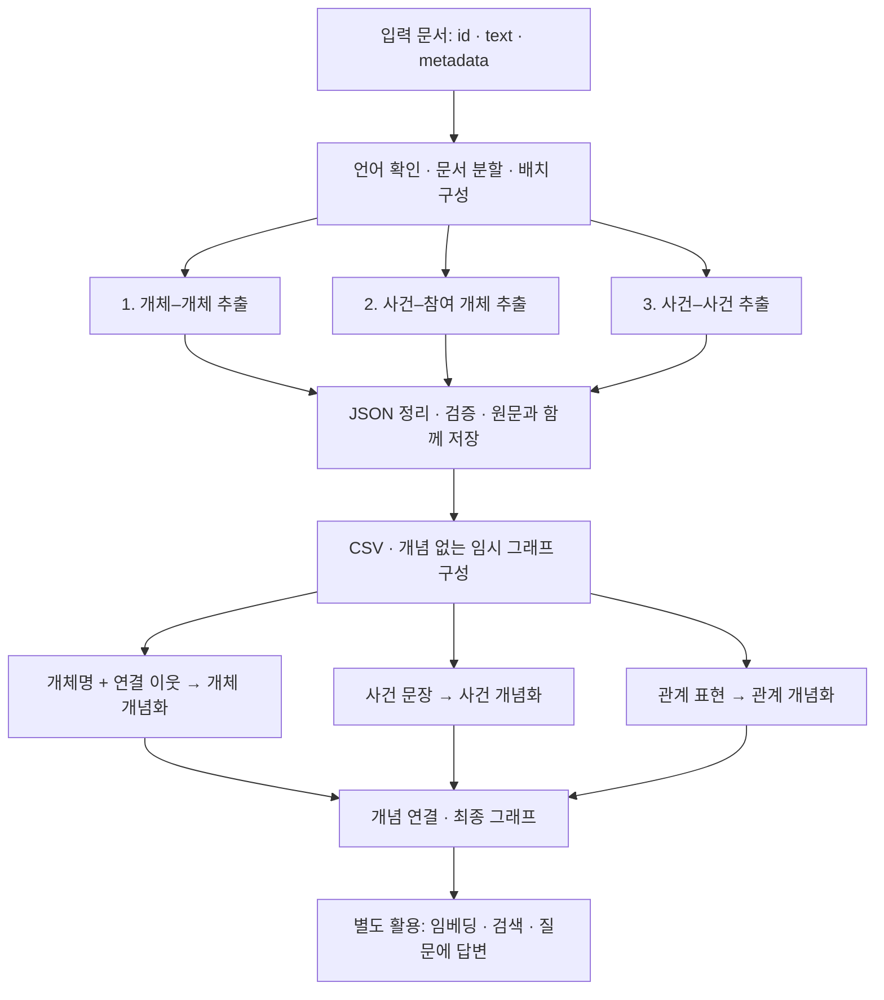

# AutoSchemaKG 추출·개념화 방법론: 논문과 공식 코드 대조

- 작성일: 2026-10-06 (Asia/Seoul)
- 목적: AutoSchemaKG의 원문 추출·개념화를 우리 업무 지식 구축의 기반으로 채택하기 전, 청크·모델·호출·입출력·그래프 구성 방법을 확인한다.
- 논문: *AutoSchemaKG: Autonomous Knowledge Graph Construction through Dynamic Schema Induction from Web-Scale Corpora*, ACL 2026 Long Papers, pp. 20557–20584. 사용자 제공 PDF와 ACL 공식본을 참조한다.
- 코드: `HKUST-KnowComp/AutoSchemaKG`, 조사 시 GitHub `main`의 SHA `d0a1666ae6621806faf814504c73678de4e809f2`. 이하 링크는 이 커밋에 고정했다.
- 확인 범위: 논문 §2–5, Appendix A–E/G, 공식 추출·개념화·변환·호출 코드, 설정과 실행 예제. 모델 추론이나 논문 결과 재현은 수행하지 않았다.
- 표기: **논문**은 저자 보고, **코드**는 고정 SHA의 정적 확인, **해석/제안**은 우리 적용 판단이다. 코드 기본값을 논문 실험값으로 간주하지 않는다.
- 이 문서는 조사 산출물이다. 기존 구현 계획 변경, 이슈 생성, 구현 지시, 모델 실행을 승인하거나 수행한 문서가 아니다.

## 1. 먼저 알아야 할 결론

1. **한 문서를 한 번 호출해 온톨로지 전체를 만드는 방법이 아니다.** 원문을 청크로 나누고, 기본 추출은 청크당 세 종류의 생성 요청을 수행한다.
2. **세 추출 역할에 서로 다른 LLM 세 개가 필수인 구조가 아니다.** 논문은 한 LLM에 다른 프롬프트를 적용한다고 설명하며, 공개 기본 경로도 하나의 모델 객체를 사용한다.
3. **세 추출 단계는 앞 단계의 정답을 전달받는 연쇄 추론이 아니다.** 실행 순서는 있으나 세 프롬프트 모두 같은 원문 청크를 읽는다. 개념화는 그 뒤 추출 그래프를 읽는다.
4. **논문의 토큰 기준과 공개 코드의 문자 기준이 다르다.** 논문은 `C_max = L_max - L_inst`, Appendix D의 `L_max=1024`를 명시한다. 현재 코드 기본값은 `chunk_size=8192`자, `chunk_overlap=0`이다.
5. **이웃 문맥은 개체 개념화에 사용한다.** 주 구축 코드에서는 들어오는 이웃 최대 1개, 나가는 이웃 최대 1개를 무작위 선택한다. 사건·관계 개념화는 각각의 텍스트를 사용한다.
6. **개념화는 짧은 유형명 또는 관련 개념을 생성한다.** 필요충분 정의·법적 적용 범위·업무 요구 충족을 모두 검증한 온톨로지를 생성하는 계약은 아니다.
7. **우리의 근거·조건·변경 영향 기록은 추가 설계가 필요하다.** 공식 코드의 원문 보존은 유용하지만, 주장별 출처 구간·조건·버전 의존성을 완전하게 제공하는 것은 아니다.

근거: [논문][P], [추출][EX], [청크 설정][CFG], [개념화][CG], [그래프 변환][GRAPH].

## 2. 전체 처리 흐름



- 화살표는 데이터 의존성이다. 기본 코드는 배치 안에서 추출 1→2→3을 차례로 실행하지만, 2·3의 입력에 앞 단계 생성 결과를 추가하지 않는다.
- 기본 추출 스키마는 세 종류지만, 사용자 지정 프롬프트와 스키마로 종류를 바꾸는 확장도 있다. 이하 설명과 호출식은 기본 세 종류를 기준으로 한다.
- JSON→CSV, 임시 그래프 작성, 개념 연결, GraphML 변환은 일반 코드 처리다. 각 과정에 별도의 생성 LLM을 호출하는 것은 아니다.
- 전체 그래프 생성과 검색·QA는 구분한다. 검색용 임베딩 모델은 생성 LLM과 다른 역할이다.

근거: 논문 Figure 1, §3, Appendix B; [메시지 구성과 추출 루프][EX], [후처리 호출 순서][PIPE].

## 3. 원문은 어떻게 청크로 나누는가?

### 3.1 논문에서 보고한 방법

Appendix B.1.1은 다음 방법을 설명한다.

1. 영어 문서를 선택한다. 언어 메타데이터가 없으면 영어로 가정한다.
2. LLM 입력 제한을 `L_max`, 지시문 길이를 `L_inst`로 두고, 원문 구간의 토큰 예산을 `C_max = L_max - L_inst`로 계산한다.
3. 이 예산을 넘는 문서를 여러 구간으로 나누며 식별자와 메타데이터를 붙인다.
4. 여러 구간을 배치로 처리한다.

Appendix D의 실험 설정은 `L_max=1024`, 추출 배치 `B=16`, 개념화 배치 `B_s=5`다. 같은 부록의 계산 비용 설명은 1024-token chunks라는 표현도 사용한다.

**확인할 수 없는 부분:** 정확한 `L_inst` 수치, 원문 구간의 실효 토큰 수, 문장·문단 경계를 고르는 알고리즘, 겹침 길이, 단계별 실제 전송 토큰 수는 이 설명만으로 확정할 수 없다. 따라서 “원문을 항상 정확히 1024토큰씩 자른다”거나 “1024토큰 전체가 모델의 컨텍스트 한도다”라고 단정하지 않는다. B.1.1의 예산 식과 D의 청크 표현을 함께 기록한다.

### 3.2 현재 공개 코드의 실제 방법

`TextChunker.split_text()`는 **토크나이저를 사용하지 않는 문자 기준 분할**이다.

| 항목 | 현재 코드 동작 |
|---|---|
| 청크 기준 | Python 문자열 길이 `len(word) + 1`의 누적 |
| 기본 크기 | `chunk_size=8192`자. 바이트나 토큰 수가 아님 |
| 단어 구분 | `text.split(' ')`로 ASCII 공백에서 분리 |
| 경계 선택 | 다음 단어를 넣으면 예산을 넘는 위치에서 현재 청크를 종료 |
| 기본 겹침 | `chunk_overlap=0` |
| 겹침 활성 시 | 직전 청크 끝의 단어들을 설정 길이에 도달할 때까지 역방향으로 가져옴 |
| 공백 정리 | `remove_doc_spaces=True`이면 연속 공백·줄바꿈 등을 공백 하나로 바꿈. 기본값은 False |
| 청크 정보 | 내부 레코드에 원 문서 `id`, `text`, `chunk_id`, `metadata` |
| 중복 청크 제거 | `deduplicate_text=True`일 때 같은 문서 안에서 동일 청크를 제거. 기본 False |

**코드상 경계:** 문장·표·조항·조건과 예외를 보존하는 의미 분할은 아니다. 매우 긴 공백 없는 단어는 크기 제한을 넘을 수 있고, 겹침 길이도 단어 단위여서 정확한 문자 수가 아니다. 겹침 뒤 큰 단어가 붙는 경우도 엄격한 최대 길이를 보장하지 않는다. 따라서 `8192`는 토큰 안전성이나 의미 보존을 보장하는 값이 아니다.

`create_sample_chunks()`의 `chunk_id`는 이후 배치 반환과 `prepare_result_dict()`에서 최종 추출 JSON의 독립 필드로 전달되지 않는다. 최종 JSON은 문서 `id`, `original_text`, `metadata`, 추출 결과와 원시 응답을 기록한다. **청크 생성 단계의 ID 존재와 최종 저장의 정밀한 원문 위치 추적을 동일시하지 않는다.**

근거: [TextChunker 및 DatasetProcessor, L36–193][CHUNK], [배치·출력 저장, L229–245 및 L352–372][EX].

### 3.3 입력 형식·언어·PDF

- 기본 입력은 `id`, `text`, `metadata`를 가진 JSON/JSONL 계열이다. 파일명 접두어와 확장자로 입력 파일을 선택한다.
- 현재 기본 추출 프롬프트의 언어 키는 `en`, `zh-CN`, `zh-HK`다. 언어 필터는 이 키 목록을 사용하며, 메타데이터에 언어가 없으면 `en`으로 처리한다. 영어만 다룬 논문 설정과 현재 다국어 패키지를 구분한다.
- 한국어를 사용하려면 지원 언어·프롬프트·메타데이터를 맞춰야 한다. 한국어 안내 예제가 있다는 이유로 기본 한국어 추출 프롬프트가 내장됐다고 보지 않는다.
- PDF는 핵심 추출기가 직접 읽는 형식이 아니다. 예제는 외부 PDF→Markdown 도구를 거쳐 JSON으로 변환한다. 선택적으로 사용하는 OCR/이미지 설명 LLM 호출은 KG 추출 호출과 별도다.
- 포함된 Markdown 변환 예제는 문서마다 `id="1"`, `lang="en"`을 쓰므로 우리 문서 식별·언어 판정에 그대로 사용하지 않는다.

근거: [입력 로딩][EX], [프롬프트 언어][PROMPT], [PDF 변환 안내][PDF], [Markdown 변환 코드][MD].

## 4. 추출의 세 호출은 각각 무엇을 하는가?

| 순서 | 역할 | 읽는 입력 | 출력 형태 | 후속 처리 |
|---|---|---|---|---|
| 1 | 개체–개체 관계 추출 | 역할 지시문 + 원문 청크 | `[{Head, Relation, Tail}, ...]` | 개체 노드와 관계 간선 |
| 2 | 사건과 참여 개체 추출 | 다른 지시문 + 같은 원문 청크 | `[{Event, Entity: [...]}, ...]` | 사건 노드 및 사건→개체 참여 간선 |
| 3 | 사건–사건 관계 추출 | 다른 지시문 + 같은 원문 청크 | `[{Head, Relation, Tail}, ...]` | 사건 사이의 시간·인과 관계 |

### 4.1 각 프롬프트의 요구

- **개체–개체:** 중요한 대상을 구체적으로 식별하고 관계를 간결하게 표현한다. 대명사를 개체로 삼지 않도록 지시한다.
- **사건–개체:** 사건을 독립적인 문장으로 쓰고 참여 개체를 나열한다. 생략 부호를 쓰지 않도록 지시한다.
- **사건–사건:** 사건을 독립 문장으로 쓰고 `before`, `after`, `at the same time`, `because`, `as a result` 같은 시간·인과 관계를 찾도록 지시한다. 공개 JSON 스키마는 Relation을 문자열로 정의하며, 이 다섯 표현의 enum으로 강제하지 않는다.

### 4.2 순차 실행과 의미 의존성의 차이

`create_batch_instructions()`는 청크마다 세 지시문을 미리 만든다. `run_extraction()`은 이들을 차례로 호출한다. **2번은 1번의 개체 목록을 받아 사건을 붙이는 호출이 아니고, 3번도 2번 사건 목록만을 읽는 호출이 아니다.** 세 결과를 나중에 그래프로 합친다. 따라서 사건 명칭이 서로 다르게 생성되는 문제를 순차 호출 자체가 해결해 주지는 않는다.

논문은 사건 관계 추출에서 출력 한도를 `L_ext = α × L_max`, `α > 1`로 늘리는 방식을 설명하지만, 정확한 α는 제시하지 않는다. 현재 기본 `process_stage()`는 세 단계에 동일한 설정 경로로 출력 한도를 전달한다. 논문의 단계별 확장 설명을 현재 코드에 구현된 고정 배수로 간주하지 않는다.

### 4.3 형식 정리와 의미 검수는 다르다

코드는 JSON 복원, 키 정리, 필수 필드 검사, 같은 응답 안의 중복 제거, JSON Schema 검증을 수행한다. 실패 시 재시도하거나 빈 결과를 반환하는 경로도 있다.

이 처리는 **원문에 없는 사실·조건 누락·잘못된 인과 관계를 전문가처럼 검수하고 정상 의미를 보존해 고치는 절차가 아니다.** 논문의 추출 정확성 평가는 별도 실험이다. 학습·추출·평가 역할을 혼동하지 않는다.

근거: 논문 Appendix A, B.1.2–B.1.4; [기본 프롬프트][PROMPT], [스키마][SCHEMA], [메시지 생성·실행][EX], [JSON 복원·검증][VALID].

## 5. 개념화는 무엇을 입력받고 무엇을 만드는가?

### 5.1 추출이 끝난 뒤 시작한다

추출 JSON을 CSV로 바꾸면서 개체·사건·관계 표현의 목록과 개념 없는 임시 그래프를 만든다. `generate_concept()`는 이 그래프와 개념화 대상 목록을 읽는다. **승인된 온톨로지가 먼저 있어야 작동하는 방식은 아니다.**

현재 코드는 사건 배치 → 개체 배치 → 관계 배치 순으로 처리한다. 각 배치 안에서는 **대상 하나당 별도 프롬프트 하나**를 만든다. 여러 대상을 거대한 한 프롬프트에 넣는 것과 다르다.

| 대상 | 개념화 입력 | 출력 | 이웃 문맥 |
|---|---|---|---|
| 사건 | 추출된 사건 문장 | 짧은 사건 유형·관련 개념 목록 | 사용하지 않음 |
| 개체 | 개체명 + 이웃의 이름·연결 관계 | 짧은 개체 유형·관련 개념 목록 | 사용 |
| 관계 | 관계 표현 | 관계의 추상 표현·관련 개념 목록 | 사용하지 않음 |

프롬프트는 1–2단어 구문을 가능하면 세 개 이상, 서로 다른 추상 수준으로 생성하도록 요청한다. 응답은 쉼표로 분리한 문자열이며, 코드가 공백 제거와 소문자화를 적용한다. “최소 세 개”는 지시문이지 현재 파서가 강제하는 의미·개수 보증이 아니다.

### 5.2 이웃 선택의 정확한 범위

주 구축 코드의 개체 개념화는 다음을 수행한다.

1. 개체의 그래프 ID를 찾는다.
2. 들어오는 간선의 이웃(predecessors), 나가는 간선의 이웃(successors)을 구한다.
3. 들어오는 이웃 중 최대 1개, 나가는 이웃 중 최대 1개를 각각 `random.sample`로 고른다.
4. 이웃의 이름과 방향에 맞는 관계 표현을 문자열로 만들어 개체 프롬프트에 넣는다.

이는 **실제로 추출된 그래프의 1-hop 연결**이다. 유사 문서 검색이나 원문의 인접 문단 선택이 아니다. 표본 개수는 작지만 관련성 점수·업무 질문·조건 중요도에 따른 정렬은 없다. 이 함수 자체는 무작위 시드를 고정하지 않는다.

주의할 차이도 있다. 별도 **유형 정합성 평가 코드**는 제공된 FB15kET/YAGO43kET 관계에서 predecessor 최대 3개 + successor 최대 3개를 선택한다. 이 평가 입력은 주 구축 경로의 1+1 이웃 및 원문에서 새로 추출한 그래프와 다르다. “논문은 모든 곳에서 이웃 두 개를 쓴다” 또는 “여섯 개를 쓴다”는 단일 설명은 부정확하다.

### 5.3 ‘개념’과 ‘엄밀한 유형’의 차이

논문은 대상의 유형뿐 아니라 관련 개념을 허용한다. 개체·사건의 개념은 `has_concept` 연결로 기록하며, 관계의 개념은 해당 관계 간선의 `concepts` 속성으로 붙인다.

따라서 이 결과를 우리 `is-a`·역할 범위·법적 자격의 확정 판정으로 그대로 승격하지 않는다. 관련 개념 발견에는 사용할 수 있지만, 공통 기준으로 승인할 때의 의미는 별도다.

근거: 논문 Appendix B.2, Figures 5–7; [개념화 대상·배치·이웃 선택][CG], [유형 평가의 3+3 선택][ETYPE], [개념 연결 저장][CCSV].

## 6. LLM은 몇 개이며, 어떤 모델을 사용했는가?

**모델 종류, 실행 인스턴스 수, 역할 수, 호출 수는 다른 숫자다.**

| 구분 | 확인한 내용 | 의미 |
|---|---|---|
| 논문 기본 그래프 구축 | Appendix D: LLaMA-3.1-8B-Instruct, bfloat16, Flash Attention 2 | 핵심 구축에 사용한 생성 모델 |
| 공개 코드 기본 구조 | `KnowledgeGraphExtractor.model`을 세 추출과 개념화에 재사용 | 역할별 다른 모델이 필수 아님 |
| 추가 구축 비교 | Appendix E/Table 11: LLaMA-3.3-70B로 구축한 비교 | 기본 8B 실험과 별도 |
| QA 독자/ToG | Appendix D: LLaMA-3.3-70B-Instruct | 추출기가 아니라 질문 해석·경로 평가·답변 역할 |
| 추출 품질 심사 | §5.1: DeepSeek-V3, Appendix E: Kimi-K2-Instruct·GPT-4o 교차 확인 | 평가용 호출이며 기본 구축 루프가 아님 |
| 정보 보존 문제 생성 | §5.1: LLaMA-3.3-70B-Instruct | 평가용 객관식 문항 생성 |
| 임베딩 | Appendix D의 ToG 설정: multi-qa-MiniLM-L6-dot-v1 및 FAISS | 생성 LLM과 구별되는 검색용 표현 |

논문은 다른 모델·크기의 추출/개념화 성능도 비교한다. 이는 해당 모델 전부를 한 문서에 동시에 투입한다는 뜻이 아니다. 공개 예제의 70B·API 설정도 논문 기본 8B 설정과 구분해야 한다.

**대규모 실행에서 실제 몇 개의 모델 인스턴스·GPU를 동시에 띄웠는지, 총 실제 요청 수가 몇 회였는지는 공개된 설정과 비용 수치만으로 확정할 수 없다.** GPU-hours를 호출 수나 동시 모델 수로 환산하지 않는다.

근거: [논문][P] §5.1, Appendix D/E; [공통 모델 객체 전달][PIPE], [모델 래퍼][LLM], [70B 실행 예제][PAR1].

## 7. 호출 수는 어떻게 계산하는가?

### 7.1 기본 생성 요청 수

다음 기호는 **필터·중복 처리·shard 선택을 마친 실제 입력**을 기준으로 한다.

- `C`: 처리할 원문 청크 수
- `N_e`: 개념화할 개체 항목 수
- `N_v`: 개념화할 사건 항목 수
- `N_r`: 개념화할 관계 표현 항목 수. 원시 관계 간선 개수와 다르다.

기본 세 추출과 모든 대상의 개념화를 한 번씩 수행하며, 재시도·재실행·QA·평가·PDF 처리를 제외하면:

```text
추출 요청 수       = 3 × C
개념화 요청 수     = N_e + N_v + N_r
총 생성 요청 수    = 3 × C + N_e + N_v + N_r
```

여기서 “요청”은 독립된 프롬프트/생성 시퀀스 단위다. API 경로에서는 일반적으로 각각 HTTP 요청 하나에 대응한다. 로컬 일괄 추론에서는 한 함수 호출에 여러 생성 시퀀스를 묶을 수 있다.

### 7.2 배치 호출 수와는 다르다

한 shard 안에서 추출 배치가 `B`, 개념화 배치가 `B_s`이면, 재시도 없는 상위 배치 실행 횟수는:

```text
추출 배치 실행     = 3 × ceil(C / B)
개념화 배치 실행   = ceil(N_v / B_s) + ceil(N_e / B_s) + ceil(N_r / B_s)
```

여러 shard이면 shard별로 계산해 합한다. 배치를 키운다고 필요한 개별 생성 시퀀스가 그 비율로 줄어들지는 않는다. API 경로는 배치 안 메시지를 개별 요청으로 분산하며, HuggingFace 경로는 메시지 목록을 pipeline에 넘긴다. 실제 GPU 내부 배치와 처리량은 백엔드 설정에 달려 있다.

실제 총비용에는 실패 재시도, 중복 shard/재실행, 검색 시 필터링·답변, 평가 호출이 추가된다. 논문 Table 1의 최종 노드 수만으로 이러한 실제 요청 수를 복원할 수 없다.

근거: [배치별 세 단계 루프][EX], [대상별 프롬프트 생성][CG], [API/로컬 분기][BATCH].

## 8. 설정값: 논문·코드 기본값·예제를 섞지 말 것

| 설정 | 논문에 명시된 값/방법 | 공개 코드 기본값/동작 |
|---|---|---|
| 원문 분할 | 토큰 예산 `L_max - L_inst`; D의 `L_max=1024` | 8192자, 토큰 계산 없음 |
| 겹침 | 구체 수치 미확인 | 0자 |
| 추출 배치 | 16 | 16 |
| 개념화 배치 | 5 | ProcessingConfig 64; 저수준 함수 직접 호출 기본 인수는 32 |
| 개체 이웃 | B.2.2에 1 predecessor + 1 successor 예시 | 주 구축 1+1 무작위; 별도 유형 평가 3+3 |
| 추출 출력 길이 | 사건 관계 단계 확장식 α를 기술, 정확한 α 미확인 | ProcessingConfig `max_new_tokens=None`이면 모델 설정 사용 |
| 생성 모델 기본 출력 상한 | 전체 실험을 대표하는 고정값 미확인 | GenerationConfig `max_tokens=8192` |
| 샘플링 | 온도·top-p 사용을 설명, 여기 확인한 절에서 정확한 수치 미확인 | temperature 0.7, do_sample True, top_p None, seed None |
| 병렬 작업 | 배치·분산 분할 지원 | 모델 래퍼 `max_workers=8`, shard 기본 1 |
| 빈 추출 허용 | 파싱 실패 시 빈 결과로 진행하는 설명 | `allow_empty=True` |
| 실행 사용량 기록 | 논문 비용 보고 | `record=False` 기본; True일 때 저장 경로 활성 |

README 예제는 추출 배치 3, 개념화 배치 16, 추출 출력 2048을 사용한다. 조사한 70B 병렬 예제는 또 다른 값을 사용한다. **예제값은 권장 최적값이나 논문 전체 실험의 재현값이 아니다.**

추가 구현 주의:

- `generate_concept_csv_temp()`는 처리 설정의 배치 수를 전달하지만, `ProcessingConfig.max_new_tokens`를 개념화 생성에 직접 전달하지 않는다. 개념화 출력 상한은 모델의 GenerationConfig 경로를 확인해야 한다.
- API 병렬 실행에서 실제 사용되는 작업자 수는 `LLMGenerator.self.max_workers`다. ProcessingConfig에 같은 이름이 있다는 이유로 모든 호출에 적용됐다고 간주하지 않는다.
- `include_concept`는 최종 변환 시 개념 포함 여부에 사용된다. 직접 호출하는 개념화 함수를 자동으로 차단하는 전역 실행 스위치로 해석하지 않는다.

근거: [처리 설정][CFG], [생성 설정][GENCFG], [개념화 호출][PIPE], [실제 API 병렬 분기][BATCH], [README 예제][README].

## 9. 그래프 구성·식별·근거 보존

### 9.1 저장 흐름

1. 추출 JSON: 원문 청크, 문서 ID·메타데이터, 세 결과, 원시 응답을 저장한다.
2. CSV: 개체·사건 노드, 관계 간선, 원문 텍스트 노드와 출처 연결을 작성한다.
3. 임시 그래프: 개념화의 이웃 선택을 위해 개념 없는 `NetworkX.DiGraph`를 저장한다.
4. 개념 CSV: 각 대상의 개념 목록을 기록한다.
5. 최종 그래프: 개체·사건→개념 `has_concept` 연결과 관계의 concepts 속성을 통합한다. 원문 연결도 포함한다.
6. 별도 검색 준비: 임베딩과 FAISS 인덱스를 만들 수 있다. Neo4j 사용 예제도 있지만 핵심 방법의 필수 조건은 아니다.

### 9.2 우리 목적에 중요한 코드 경계

| 코드에서 확인한 것 | 우리에게 주는 의미 |
|---|---|
| 개체·사건 식별은 정리한 문자열과 해시를 중심으로 함 | 공식 개체 ID나 문맥별 동명이인 해소와 동일하지 않음 |
| 임시·최종 DiGraph에서 같은 시작/끝 노드의 간선이 이미 있으면 새 관계를 추가하지 않는 경로 | 같은 두 대상 사이의 서로 다른 관계·시점·조건을 모두 보존한다고 가정할 수 없음 |
| 기본 JSON→CSV의 출처 간선 작성이 새 노드 등록 조건 안에 있음 | 같은 노드가 후속 문서에 다시 나와도 모든 출처를 누적하는 보증이 없음 |
| 추출 스키마에는 정확한 인용 구간·조건·예외·유효기간의 별도 필드가 없음 | 자연어 사건·관계나 원문에 남을 수는 있지만, 주장별 구조화 보존과는 다름 |
| 개념화는 개체명+선택 이웃 또는 사건/관계 텍스트를 읽음 | 매 호출이 원문 전체와 모든 필수 조건을 다시 확인하는 구조가 아님 |

위 내용은 해당 코드 경로를 읽은 결과이며, 공개 ATLAS 데이터 전체에서 발생한 오류 비율을 측정한 결과가 아니다. 논문 방법 전체가 무효라는 뜻도 아니다. **업무 변경 추적을 만들 때 원시 결과와 출처 의존성을 최종 그래프의 문자열·간선만으로 대체하면 안 된다는 이식상의 경계다.**

근거: [기본 JSON→CSV][JCSV], [DiGraph 작성][GRAPH], [개념 CSV 변환][CCSV], [추출 출력 스키마][SCHEMA].

## 10. 병렬 처리·재시도·실행 기록

- **추출 shard:** 문서 목록을 먼저 나눈 뒤 각 shard 안에서 청크를 만든다. 같은 길이의 문서가 아니므로 문서 수 균등 분할이 토큰·시간 균등 분할을 보장하지는 않는다.
- **개념화 shard:** 대상 CSV를 읽어 `random.shuffle()` 후 구간을 나눈다. 이 함수 자체에 공통 시드가 없으므로 여러 프로세스가 같은 순서를 공유하는지 별도로 확인해야 한다. 그렇지 않으면 중복/누락 위험이 있다.
- **API 병렬:** ThreadPoolExecutor로 배치의 개별 프롬프트를 전송한다. 작업자 수가 LLM 종류 수를 뜻하지 않는다.
- **로컬 추론:** HuggingFace pipeline에는 배치 목록을 전달한다. 같은 래퍼의 vLLM/SGLang/TensorRT 로컬 분기는 개별 메시지를 순회하는 코드이므로 모든 백엔드가 같은 방식으로 일괄 실행된다고 설명하지 않는다.
- **재시도:** API/로컬 저수준 호출에 최대 5회 또는 경과 120초 기준의 재시도 장치가 있다. 이는 단일 요청의 엄격한 총 실행시간 보장이 아니다. 로컬·pipeline 경로에는 별도의 재시도 루프도 있어 실제 횟수는 실행 기록으로 확인해야 한다.
- **실패 결과:** 일부 API 예외 경로는 `[]`를 반환한다. 형식 실패 후 빈 결과가 생겼다는 것과 원문에 추출할 사실이 없었다는 것을 구분해야 한다.
- **이어서 실행:** `resume_from`은 추출 배치 인덱스로 건너뛰는 방식이다. 원문 변경 감지·주장별 증분 갱신 시스템과 동일하지 않다.
- **사용량:** API 경로는 응답 usage를 기록할 수 있다. HuggingFace 경로의 completion_tokens는 코드상 공백 단어 수로 추산하며, 기록 시간도 최초 배치 시간 배분을 사용한다. 엄밀한 토큰·재시도 포함 비용 비교에 그대로 사용하지 않는다.

병렬 실행 예제 역시 그대로 재현 명령으로 쓰지 않는다. 조사 시 shell은 다른 포트를 넘기지만 Python 예제는 고정 원격 API 주소를 사용한다. `1_slice_kg_extraction.py`는 이름과 달리 후속 개념화·변환까지 호출하고, `2_concept_generation.py`는 실제 개념 생성 줄이 주석 처리돼 있다. 또한 서로 다른 출력 경로를 사용한다. **문서화된 예제 의도와 현재 실행 코드가 같은지 먼저 확인해야 한다.**

근거: [추출 분할][CHUNK], [개념화 분할][CG], [호출·재시도][LLM], [배치 구현][BATCH], [병렬 추출 예제][PAR1], [개념화 예제][PAR2], [shell][SH].

## 11. 검색·QA·평가 호출은 구축 호출과 별도다

논문은 구축한 그래프에 ToG, HippoRAG 계열을 연결해 활용 성능을 평가한다.

- **ToG:** 질문에서 개체를 찾고, 시작 노드를 검색하고, 경로를 탐색·평가한 뒤 답한다. 호출 수는 경로와 탐색 깊이 등에 따라 달라지며 고정 1회가 아니다.
- **HippoRAG2:** 질문과 관련된 간선 후보를 LLM으로 필터링하고, 원문 검색 점수와 그래프 탐색을 결합한다. Appendix D는 상위 30개 간선, MuSiQue는 50개를 필터 대상으로 기록한다. PageRank 감쇠 계수 0.9, 가중치 조정 0.9를 사용한다.
- **원문 활용:** Appendix G Algorithm 2는 그래프 신호와 문서 검색 신호를 결합해 원문 구절을 반환한다. 그래프 후보가 없으면 텍스트 검색 결과를 반환하는 경로가 있다. 모든 답변이 그래프의 짧은 개념명만으로 만들어지는 것은 아니다.
- **추출 평가:** 원문과 출력에 대해 잘못 추출한 내용과 빠진 내용을 별도 모델로 평가한다.
- **정보 보존 평가:** 문서 200개에서 각 5문항, 데이터셋당 1,000문항을 만들고 무문맥·원문·추출 표현별 정답률을 비교한다.
- **개념 평가:** 기준 유형과 생성 개념 사이의 의미 유사도 기반 지표를 사용한다. 우리 한국어 법령의 범위 검수 성공률과 동일한 수치가 아니다.

따라서 우리에서 비용을 기록할 때도 `문서 변환 / 추출 / 개념화 / 검색·답변 / 평가`를 구분해야 한다. 심사 모델까지 상시 생성 단계의 필수 에이전트로 추가하는 것은 논문의 기본 추출 구조를 그대로 따르는 일이 아니다.

근거: 논문 §5, Appendix C/D/E/G, Tables 2–7 및 Algorithm 2. [논문][P]

## 12. 우리에게 가져올 부분과 수정할 부분

이 절은 **적용 제안**이며 아직 구현하거나 비교 실행한 결과가 아니다.

### 12.1 유지할 핵심 원리

1. 원문에서 대상·명제·관계를 먼저 추출하고, 그 결과를 개념화의 입력으로 사용한다.
2. 사건/명제를 문장 단위로 보존해 짧은 개념명에 의미 전체를 떠넘기지 않는다.
3. 연결 이웃을 활용해 대상의 역할을 해석한다. 승인된 온톨로지가 없어도 추출 결과로 시작한다.
4. 호출 역할과 입출력을 작게 분리하고, 배치·병렬은 처리 효율을 위한 장치로 사용한다.
5. 추출·개념화의 성능과 검색·답변의 효용을 분리 측정한다.

### 12.2 우리 목적에 맞춰 바꿔야 하는 경계

| 경계 | 필요한 변형 | 이유 |
|---|---|---|
| 청크 | 기존 절·표·조항 구조와 실제 토큰 계수를 활용하고, 조건·예외·명시 참조를 원문 주소로 연결 | 문자 분할만으로 업무 규칙의 문맥을 보존할 수 없음 |
| 명제 종류 | 사실 발생, 정의, 조건부 규칙, 미확정 해석을 구분 | 규정을 이미 발생한 사건이나 확정 사실로 바꾸면 안 됨 |
| 관계 추출 | 기본 세 역할을 기준으로 하되 규범 관계의 방향·조건 보존을 확인 | 사건 인과 프롬프트가 권한·자격 규칙을 정확히 처리한다는 증거는 없음 |
| 이웃 | 실제 연결만 사용하고, 선택한 관계·방향·조건·출처를 기록 | 유사 이름 오병합과 문맥 재현 불가를 방지 |
| 필수 문맥 | 주명제의 조건·예외·기간·참조는 선택적 이웃 표본과 분리해 보존 | 무작위 1+1로 필수 조건 확보를 보장할 수 없음 |
| 개념의 지위 | 검색용 관련 개념과 승인할 유형·역할을 구분 | `has_concept`를 곧바로 `is-a`나 법적 포함으로 해석하면 안 됨 |
| 저장 | 안정된 문서·명제 ID, 모든 근거 위치, 버전, 조건·상태를 유지하고 관계들을 구별 | 동일 이름·동일 끝점이어도 근거·시점·관계가 다를 수 있음 |
| 업무 질문 | 탐색 우선순위와 충족·공백 판단에 사용하되 원문 증거와 분리 | 업무상 원하는 연결을 사실로 생성하지 않기 위함 |
| 변경 대응 | 변경 원문→의존 명제→개념·답변·업무 대상의 재검토 연결 | 추출 그래프만으로 업무 영향이 확정되지는 않음 |

즉, **AutoSchemaKG의 추출·개념화 흐름을 기반으로 삼는 것과 그 저장·파싱·예제 설정을 전부 그대로 복사하는 것은 다르다.** 원문 위치·조건·버전 기록은 첫 추출부터 있어야 한다. 뒤 단계에 업무 질문만 추가해서 복원할 수 없다.

### 12.3 착수 전 결정해야 할 최소 항목

- 재현할 기준: 논문 설정을 목표로 할지, 공개 패키지를 수정한 경로를 기준으로 할지 명시한다.
- 사용할 한국어 모델·프롬프트와 실제 토크나이저를 정한다. 1024토큰 또는 8192자를 최적값으로 미리 확정하지 않는다.
- 작은 고정 자료에서 청크 경계의 필수 의미 보존, 세 추출 역할, 개념화, 전체 질문 답변을 구분해 확인한다.
- 이웃 효과는 같은 사실 정보를 제공한 조건끼리 비교한다. 무작위 추출을 사용하면 선택 결과와 시드를 보존한다.
- 재시도·빈 결과·미처리 원문을 품질 분모에서 제거하지 않는다. 호출 수·실제 토큰·경과 시간과 의미 품질을 함께 기록한다.
- 기존 실패/정상 대조는 개발 진단으로 표시하고, 별도 자료에서 적용 범위를 확인한다.

## 13. 아직 확정할 수 없는 사항

1. 논문 실험의 정확한 청크 겹침·문장 경계·`L_inst`·α 값.
2. 모든 논문 결과에 대응하는 실행 명령·커밋·시드·샘플링 설정·실제 요청 로그.
3. 논문 전체 실행의 실제 모델 호출 수와 동시 인스턴스 수.
4. 공개 코드 기본값과 논문 실험값의 차이가 각 결과에 미친 영향.
5. 우리 한국어 업무 자료에 가장 적절한 청크·모델·이웃 선택 방식과 그 품질·비용.

확인하지 못한 수치는 문서에 임의로 채우지 않았다. 논문/코드 대조는 완료했지만 실제 재현 성공이나 우리 자료에서의 우수성을 확인한 것은 아니다.

## 14. 근거 자료

아래 코드 링크는 모두 고정 SHA를 사용한다. 논문 쪽의 PDF 페이지 번호는 파일의 첫 페이지를 1로 센 것이며, 핵심 방법론은 PDF 14–19쪽(인쇄면 20570–20575)에 있다.

- [P: ACL 논문][P] — §3, Appendix B: 방법, D: 실험 설정, E: 추가 비교, G: 검색 알고리즘.
- [CFG: ProcessingConfig][CFG] — 처리 기본값.
- [EX: triple_extraction.py][EX] — 청크·배치·세 추출·저장.
- [CHUNK: TextChunker/DatasetProcessor][CHUNK] — 문자 분할과 언어·shard 처리.
- [PIPE: 후처리와 개념화 호출][PIPE] — 같은 모델 재사용, 파라미터 전달.
- [CG: concept_generation.py][CG] — 개념화 대상, 1+1 이웃, 호출·응답 처리.
- [PROMPT: 기본 추출·개념화 프롬프트][PROMPT].
- [SCHEMA: 기본 세 추출 스키마][SCHEMA].
- [VALID: JSON 정리·검증][VALID].
- [LLM: 모델 래퍼][LLM], [BATCH: 백엔드별 배치 처리][BATCH], [GENCFG: 생성 설정][GENCFG].
- [JCSV: JSON→CSV][JCSV], [GRAPH: CSV→그래프][GRAPH], [CCSV: 개념 연결][CCSV].
- [ETYPE: 별도 유형 평가의 문맥 구성][ETYPE].
- [README: 공식 사용 예제][README], [PDF: PDF 변환 안내][PDF], [MD: Markdown 변환][MD].
- [PAR1: 병렬 추출 Python 예제][PAR1], [PAR2: 개념화 Python 예제][PAR2], [SH: 병렬 shell 예제][SH].

[P]: https://aclanthology.org/2026.acl-long.942.pdf
[CFG]: https://github.com/HKUST-KnowComp/AutoSchemaKG/blob/d0a1666ae6621806faf814504c73678de4e809f2/atlas_rag/kg_construction/triple_config.py#L3-L35
[EX]: https://github.com/HKUST-KnowComp/AutoSchemaKG/blob/d0a1666ae6621806faf814504c73678de4e809f2/atlas_rag/kg_construction/triple_extraction.py
[CHUNK]: https://github.com/HKUST-KnowComp/AutoSchemaKG/blob/d0a1666ae6621806faf814504c73678de4e809f2/atlas_rag/kg_construction/triple_extraction.py#L36-L193
[PIPE]: https://github.com/HKUST-KnowComp/AutoSchemaKG/blob/d0a1666ae6621806faf814504c73678de4e809f2/atlas_rag/kg_construction/triple_extraction.py#L454-L515
[CG]: https://github.com/HKUST-KnowComp/AutoSchemaKG/blob/d0a1666ae6621806faf814504c73678de4e809f2/atlas_rag/kg_construction/concept_generation.py#L88-L249
[PROMPT]: https://github.com/HKUST-KnowComp/AutoSchemaKG/blob/d0a1666ae6621806faf814504c73678de4e809f2/atlas_rag/llm_generator/prompt/triple_extraction_prompt.py
[SCHEMA]: https://github.com/HKUST-KnowComp/AutoSchemaKG/blob/d0a1666ae6621806faf814504c73678de4e809f2/atlas_rag/llm_generator/format/validate_json_schema.py#L34-L104
[VALID]: https://github.com/HKUST-KnowComp/AutoSchemaKG/blob/d0a1666ae6621806faf814504c73678de4e809f2/atlas_rag/llm_generator/format/validate_json_output.py#L10-L113
[LLM]: https://github.com/HKUST-KnowComp/AutoSchemaKG/blob/d0a1666ae6621806faf814504c73678de4e809f2/atlas_rag/llm_generator/llm_generator.py
[BATCH]: https://github.com/HKUST-KnowComp/AutoSchemaKG/blob/d0a1666ae6621806faf814504c73678de4e809f2/atlas_rag/llm_generator/llm_generator.py#L410-L544
[GENCFG]: https://github.com/HKUST-KnowComp/AutoSchemaKG/blob/d0a1666ae6621806faf814504c73678de4e809f2/atlas_rag/llm_generator/generation_config.py#L8-L99
[JCSV]: https://github.com/HKUST-KnowComp/AutoSchemaKG/blob/d0a1666ae6621806faf814504c73678de4e809f2/atlas_rag/kg_construction/utils/json_processing/json_to_csv.py#L279-L451
[GRAPH]: https://github.com/HKUST-KnowComp/AutoSchemaKG/blob/d0a1666ae6621806faf814504c73678de4e809f2/atlas_rag/kg_construction/utils/csv_processing/csv_to_graphml.py
[CCSV]: https://github.com/HKUST-KnowComp/AutoSchemaKG/blob/d0a1666ae6621806faf814504c73678de4e809f2/atlas_rag/kg_construction/concept_to_csv.py#L51-L152
[ETYPE]: https://github.com/HKUST-KnowComp/AutoSchemaKG/blob/d0a1666ae6621806faf814504c73678de4e809f2/EvaluateKGC/SchemaQuality/conceptualization_contextulized_api.py#L138-L210
[README]: https://github.com/HKUST-KnowComp/AutoSchemaKG/blob/d0a1666ae6621806faf814504c73678de4e809f2/README.md
[PDF]: https://github.com/HKUST-KnowComp/AutoSchemaKG/blob/d0a1666ae6621806faf814504c73678de4e809f2/example/pdf_md_conversion/readme.md
[MD]: https://github.com/HKUST-KnowComp/AutoSchemaKG/blob/d0a1666ae6621806faf814504c73678de4e809f2/atlas_rag/kg_construction/utils/md_processing/markdown_to_json.py#L36-L57
[PAR1]: https://github.com/HKUST-KnowComp/AutoSchemaKG/blob/d0a1666ae6621806faf814504c73678de4e809f2/example/example_scripts/parallel_generation/1_slice_kg_extraction.py
[PAR2]: https://github.com/HKUST-KnowComp/AutoSchemaKG/blob/d0a1666ae6621806faf814504c73678de4e809f2/example/example_scripts/parallel_generation/2_concept_generation.py
[SH]: https://github.com/HKUST-KnowComp/AutoSchemaKG/blob/d0a1666ae6621806faf814504c73678de4e809f2/example/example_scripts/parallel_generation/1_slice_kg_extraction.sh
